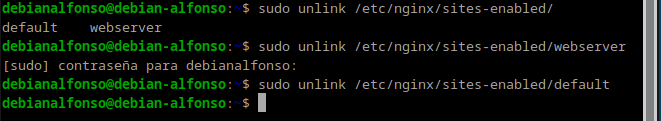
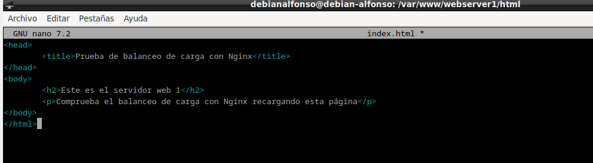
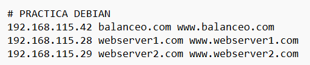
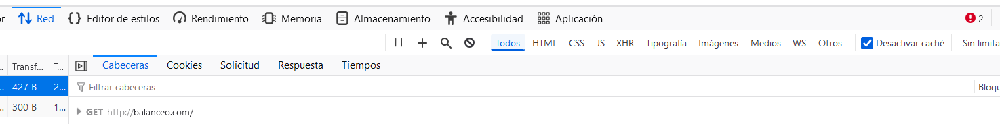
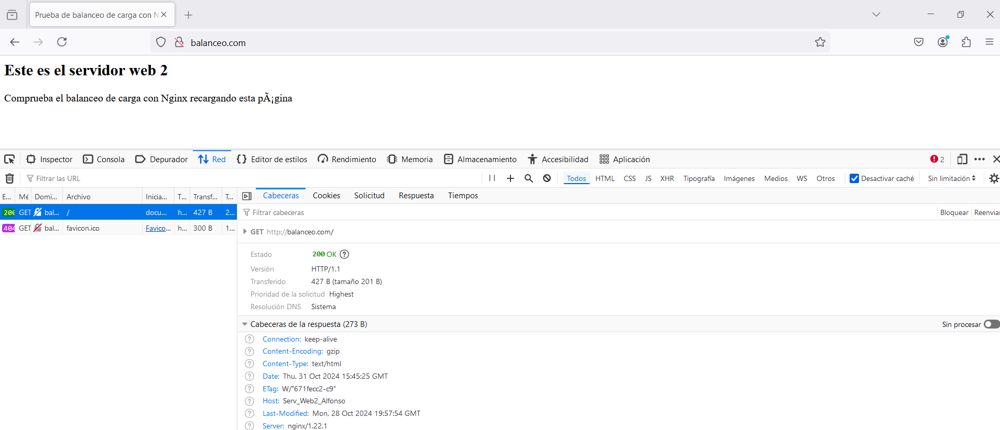

# Práctica 2.4.- Balanceo de carga con proxy inverso en Nginx

## 1.- ¿Qué es un balanceador de carga?

Un **balanceador de carga** distribuye las solicitudes entrantes del cliente entre un grupo de servidores, en cada caso devuelve la respuesta del servidor seleccionado al cliente apropiado.

## 2.- Tarea

El primer paso será configurar **dos** servidores web **Nginx** con dos máquinas **Debian**, además de utilizar el **proxy inverso Nginx** que configuramos en la práctica anterior. A continuación, modificaremos la configuración añadiendo lo necesario:

- Cada servidor web presentará un sitio web específico.
  - El `webserver2` debe tener la **IP** asignada de forma fija mediante **DHCP**.
- El `proxy inverso`, habrá que configurarlo para que realice el balanceo ce carga.
- Realizaremos las peticiones **HTTP** desde el navegador de nuestra máquina anfritiona.

La red quedará de la siguiente manera:

Las peticiones se harán desde el **navegador** al **proxy inverso**, que este las repartirá entre los dos servidores web.

Accederemos a `http://balanceo` yu observaremos que las peticiones se van repartiendo entre el `webserver1` y `webserver2`.

## 3.- Configuraciones

**ATENCIÓN!** Los sitios web configurados anteriormente no se van a utilizar, por ello, recomiendo desactivarlos de la carpeta `/etc/nginx/sites-enabled` con el comando `unlink nombre_archivo`. **si no se hace esto, nos dará error en todas las prácticas restantes**.

**Ejemplo en webserver1**

### 3.1.- Nginx Webserver1

El primer servidor será el servidor **principal** que hemos utilizado desde la primera práctica, es decir, el original.

Debemos configurar este servidor para que sirva el siguiente `index.html` que se debe crear dentro de la carpeta `**/var/www/webserver1/html`:

- El nombre del sitio web que se debe utilizar en los archivos de `sites-available` que se debe crear para Nginx es `webserver1`.
- El sitio web debe escuchar en el puerto 8080.
- Debéis añadir una cabecera que se llame `Serv_Web1_vuestronombre`.
  

  Creamos un enlace simbólico en `sites-enabled` y reiniciamos el servidor:
  

### 3.2.- Nginx Webserver2

Debe ser un clon del **webserver1**.

En este servidor se hace una configuración idéntica al **webserver1** pero poniendo **webserver2** (también en el index.html), así como el nombre de la cabecera añadida, que será `Serv_Web2_vuestronombre`.

### 3.3.- Nginx Proxy Inverso

Ya disponemos de los dos **webservers** ahora configuraremos el **proxy inverso** como el **balanceador de carga**. 

Donde:

- En el bloque `upstream` son los servidores entre los que se va a repartir la carga.
- Le ponemos un nombre, en mi caso: `backend_hosts`;

El último paso será añadir tanto en nuestra máquina como en la que va a realizar de `balanceo` la dirección host de los servidores:

## 4.- Comprobaciones

Ahora accederemos al sitio web `balanceo.com`, donde cada vez que refresquemos nos podrá aparecer el contenido del `webserver1` o de `webserver2`.

**IMPORTANTE!!** Debemos comprobar que en la consola de nuestro navegador, en el apartado de **red**, tenemos activada la opción de `deactivar caché`:

### 4.1.- Comprobación de balanceo de carga

Ahora, comprobaremos que el balanceador funciona correctamente, para ello:

- Paramos el servicio **nginx** del **webserver1** y comprobamos que todas las solicitudes se envían al **webserver2**.
  
  

  - Ahora lo hacemos a la inversa, paramos el **webserver2** y accedemos a `balanceo.com`:

## 5.- Cuestiones

### Cuestión 1.- Busca información de qué otros métodos de balanceo se pueden aplicar con Nginx y describe al menos 3 de ellos.

1. Least Connections: Asigna solicitudes al servidor con menos conexiones activas, evitando sobrecargar aquellos que ya están ocupados. Es ideal para servidores de capacidad similar y para situaciones con conexiones persistentes o largas, ya que distribuye la carga de manera eficiente según la disponibilidad de recursos en cada momento.

2. IP Hash: Dirige cada cliente al mismo servidor según su IP, manteniendo la persistencia de sesión. Esto es útil cuando es importante que el usuario permanezca en el mismo servidor durante toda su sesión, evitando problemas de cambio de servidor.

3. Least Time: Asigna solicitudes al servidor con el tiempo de respuesta más rápido, considerando la cola de espera. Es ideal para aplicaciones de baja latencia, como servicios en tiempo real.

### Cuestión 2.- Si quiero añadir 2 servidores web más al balanceo de carga, describe detalladamente qué configuración habría que añadir y dónde.

Para añadir 2 servidores más al balanceo de carga, deberemos editar el archivo de configuración de nuestro servidor `balanceo` y definir los nuevos servidores. Después, añadimos en el fichero `/etc/hosts` las dos direcciones IP y su respectivo nombre de servidor.
Por último, aplicamos los cambios reiniciando el servidor de **nginx**.

### Cuestión 3.- Describe todos los pasos que deberíamos seguir y configurar para realizar el balanceo de carga con una de las webs de prácticas anteriores. Indicad la configuración de todas las máquinas (webservers, proxy...) y de sus servicios

En los webservers configuraremos el `sites-available` añadiendole cabeceras para poder identificar a cada `webserver` correctamente, modificaremos el atributo `server_name`.
Respecto a la máquina que hace de proxy, modificamos las direcciones IP en el archivo `/etc/hosts` añadiendo la dirección de cada webserver con su respectivo `server_name`, además, añadiremos un bloque `upstream` en el archivo de configuración donde añadiremos los nombres de cada webserver, por último, el nombre de `proxy_pass` será el nombre que hemos asignado en el bloque `upstream`.
