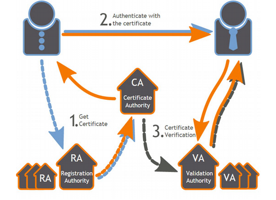
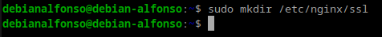
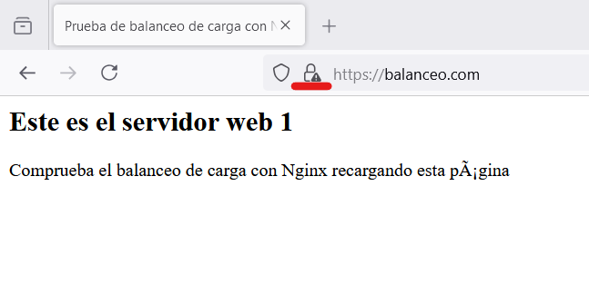
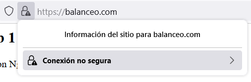
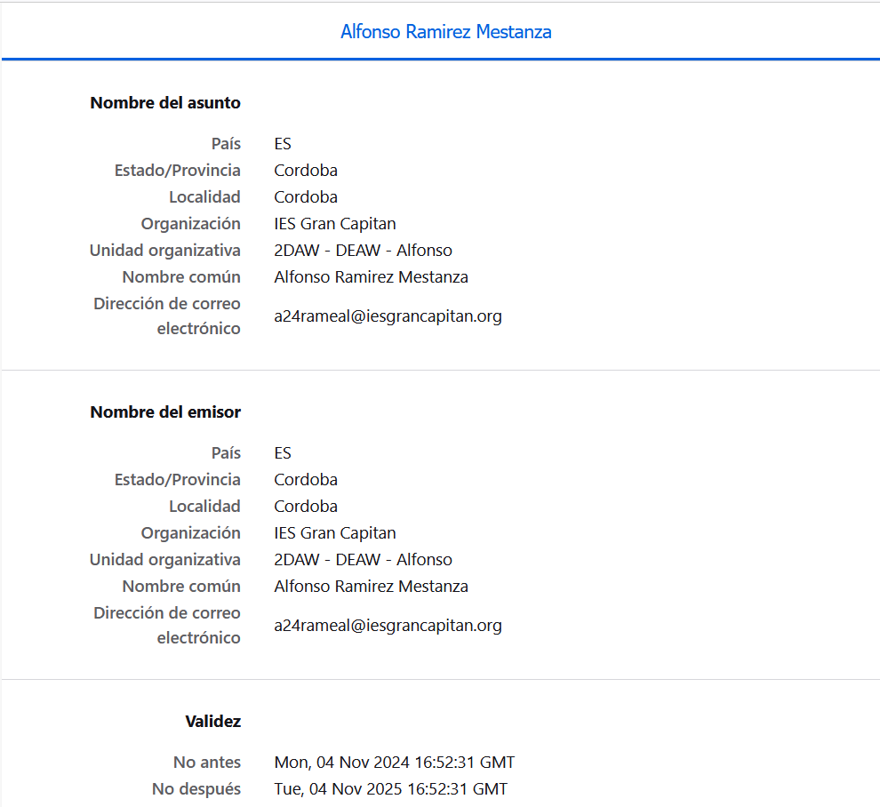
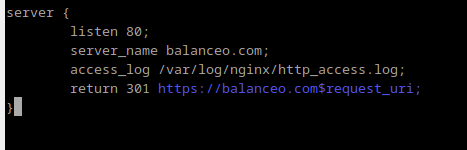
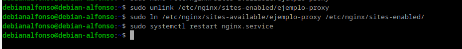
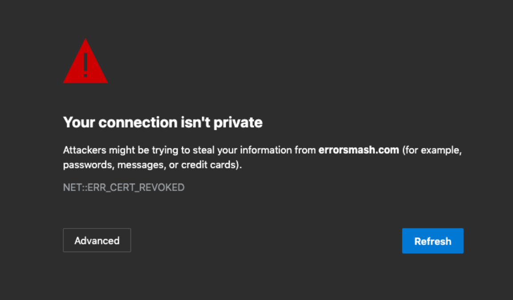

# Práctica2.5.- Proxy Inverso y Balanceo de carga con SSL en NGINX

## 1.- Introducción

En esta práctica usaremos nuestro **balanceador** de la práctica anterior y además le añadiremos cifrado SSL para mayor seguridad y así, asegurarnos que, cuando entramos en el sitio web nos presente un **cértificado digital** para asegurarnos que es quien dice ser.

<center></center>

## 2.- Tarea

## 2.1.- Creación del certificado autofirmado

Para crear nuestro certificado y las claves asociadas a ellos, tanto privada como pública y para ello empezamos creando el directorio `/etc/nginx/ssl`.

<center></center>

Cuando ya hayamos creado el directorio crearemos una clave pública, donde:

- `openssl` es la herramienta para crear y administrar certificados y claves.
- `-req` genera una solicitud de certificados y solicitudes de firma.
- `-x509` modifica el subcomando anterior diciendole que queremos crear un certificado autofirmado en lugar de una solicitud de firma.
- `-nodes` omite la opción de asegurar nuestro certificado con contraseña.
- `-days 365` establece el tiempo durante el cuál el certificado será válido.
- `-newkey rsa: 2048` especifica que queremos generar un nuevo certificado y una nueva clave al mismo tiempo.
- `-keyout` este parámetro le dice a OpenSSL dónde colocar el archivo de clave privada generado que estamos creando.
- `-out` dice dónde se colocará el certificado que estamos creando.

  

En el apartado **Organizational Unit Name**, podremos `2DAW - DEAW - VuestroNombre`.

## 2.2.- Configuración SSL en el proxy inverso

Modificaremos nuestro archivo que hizo de `balanceo` en la práctica anterior, es aquí donde realizaremos la configuración para que el sitio web se conecte mediante SSL.

Dentro del bloque `server {...}` cambiaremos el puerto de escucha `listen 80` por lo siguiente:


# 3.- Comprobaciones

Cuando accedamos ahora a nuestro sitio web `https://balanceo.com`, nos deberá saltar un aviso de seguridad debido a que nuestro certificado es autofirmado.


Clicaremos en avanzado y avanzaremos al sitio web, seguidamente veremos como carga nuestro HTML. Lo siguiente que tendremos que hacer para verificar nuestro certificado es clicar en el candado.

<center></center>

Después clicamos en `Conexión No Segura` y después en `Más Información.`:

<center></center>
<center></center>

Después se abre esta ventana y clicamos en `Ver Certificado`:


Y aquí podremos ver todos los detalles del certificado:



### Si ahora intentáis acceder a http://balanceo, ¿deberíais poder acceder? Comprobadlo y describid qué pasa y por qué.

Accederemos al sitio web por defecto de **Nginx**, ya que http trabaja en el puerto `80` y nosotros no tenemos un bloque creado que responda a esa petición.

# 4.- Redirección forzosa a HTTPS

Para redireccionar "forzosamente" una petición **http** a nuestro servidor **https**, crearemos un bloque `server {...}` adicional en nuestro archivo de configuración de **balanceo**:

<center></center>

Guardamos los cambios y ahora haremos un `sudo unlink /etc/nginx/sites-enabled/archivoBalanceo` y crearemos un nuevo enlace simbólico con `sudo ln /etc/nginx/sites-available/balanceo /etc/nginx/sites-enabled` y por último reiniciamos nuestro servicio de **Nginx**.



Haciendo esto, cuando accedamos a `http://balanceo.com`, automáticamente se redigirá a `https://balanceo.com`.

# 5.- Cuestiones finales

### Cuestión 1.- Hemos configurado nuestro proxy inverso con todo lo que nos hace falta pero no nos funciona y da un error del tipo This site can't provide a secure connection, ERR_SSL_PROTOCOL_ERROR.

Dentro de nuestro server block tenemos esto:

```
server {
listen 443;
ssl_certificate /etc/nginx/ssl/enrico-berlinguer/server.crt;
ssl_certificate_key /etc/nginx/ssl/enrico-berlinguer/server.key;
ssl_protocols TLSv1.3;
ssl_ciphers ECDH+AESGCM:DH+AESGCM:ECDH+AES256:DH+AES256:ECDH+AES128:DH+AES:ECDH+3DES:DH+3DES:RSA+AESGCM:RSA+AES:RSA+3DES:!aNULL:!MD5:!DSS;
server_name enrico-berlinguer;
access_log /var/log/nginx/https_access.log;

    location / {
        proxy_pass http://red-party;
        }
    }
```

### Respuesta

El error se encuentra en el listen, que no está escuchando que sea ssl. Se arreglaría así: <br>
server {<br>
listen 443;<br>
...<br>
}

### Cuestión 2.- Imaginad que intentamos acceder a nuestro sitio web HTTPS y nos encontramos con el siguiente error: Investigad qué está pasando y como se ha de solucionar.



### Respuesta

Esto significa que nuestro certificado SSL ha sido anulado. Para solucionarlo deberemos comprobar lo siguiente:<br>

- Verificar la validez del certificado.
- Reemplazar el certificado SSL.
- Reiniciar el servidor de Nginx.
- Verificar la configuración del certificado.
- Limpiar la caché del navegador.
