# Práctica 3.1.- Instalación de Tomcat

## 1.- Instalación de Tomcat

El primer paso para instalar **Tomcat** será abrir el puerto por defecto usando el comando:<br>
`sudo ufw allow 8080`.<br>
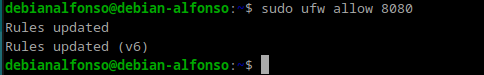

Después ejecutamos un `sudo apt update` para actualizar los paquetes.<br>
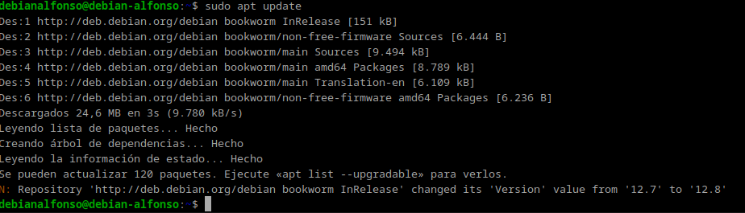

El siguiente paso será instalar Java mediante el comando:<br>
`sudo apt install default-jre`.<br>
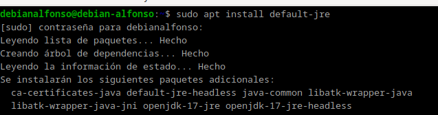

Verificamos la versión instalada de java con `java -version`.<br>


Ahora instalamos **Apache Tomcat** y el **Tomcat-admin** a través del comando<br>
`sudo apt install tomcat10 tomcat10-admin`.<br>
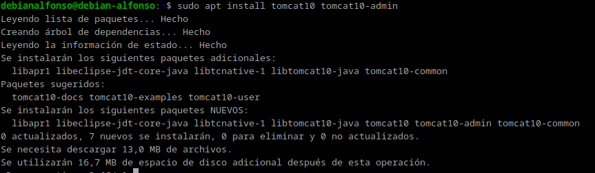

Tras instalar **Tomcat**, modificaremos el archivo **tomcat_users.xml** con el comando: <br>
`sudo nano /etc/tomcat10/tomcat_users.xml` y deberemos añadir: <br>

```
<role username="manager-gui> />
<user username="manager" password="TuContraseña" roles="manager-gui />
```

Tras añadirlo en nuestro fichero, el archivo quedará de la siguiente forma:<br>
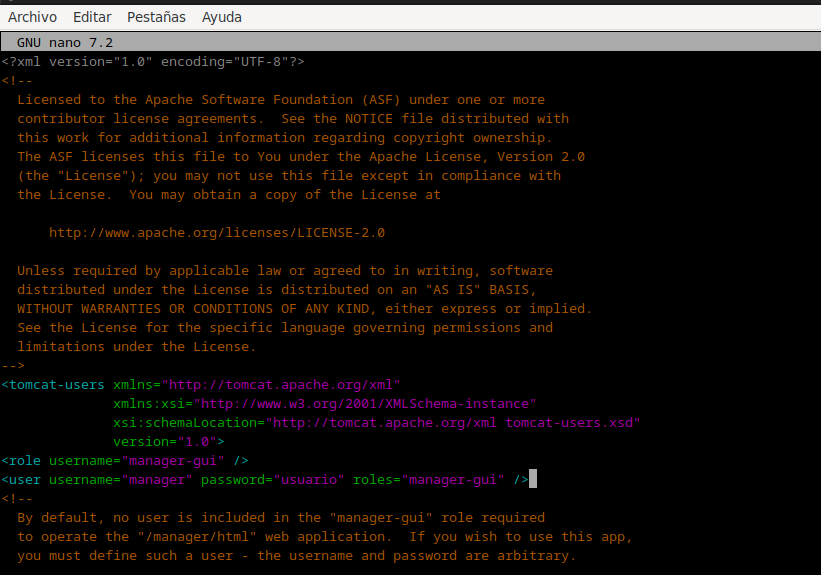

Ahora que tomcat ya está instalado y nuestro usuario **manager-gui** creado, comprobamos que esta instalado correctamente a través de los comandos:<br>
`sudo systemctl start tomcat10`<br>
`sudo systemctl status tomcat10`<br>
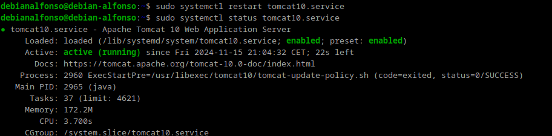

Si todo ha ido bien, accedemos en el navegador a la dirección `localhost:8080/manager/html`, donde debe aparecernos algo así:<br>
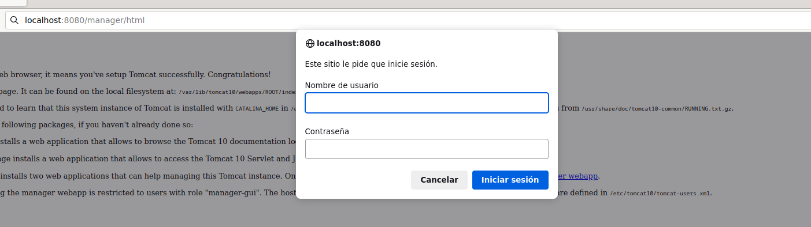

Al iniciar sesión, deberá aparecernos esta pantalla.<br>
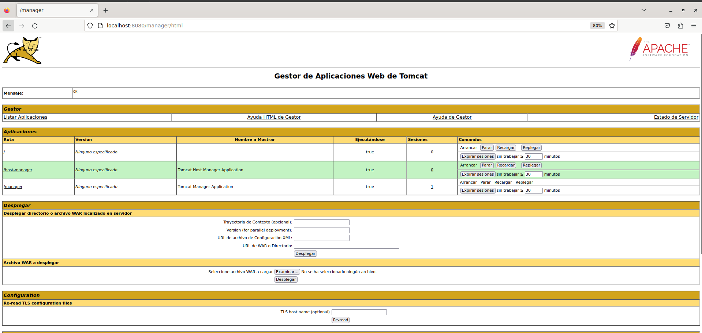

## 2.- Despliegue manual mediante la GUI de administración

Ahora vamos a realizar un despliegue de una aplicación **.WAR**, para ello:

1. Iniciamos sesión con el usuario previamente creado.
2. Buscamos el apartado que nos permite desplegar una aplicación:<br>
   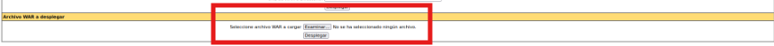
3. Buscamos la sección que nos permite desplegar un **WAR** manualmente y seleccionamos nuestro archivo. En mi caso el siguiente archivo: https://tomcat.apache.org/tomcat-6.0-doc/appdev/sample/<br>
   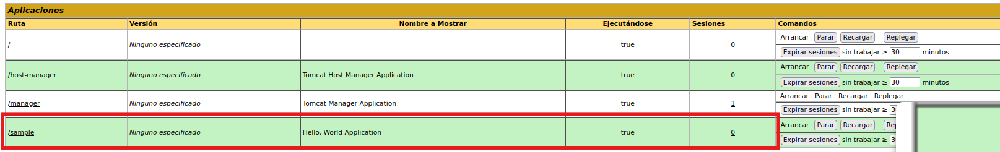
4. Por último accedemos a `localhost:8080/sample` y veremos el contenido de nuestro **.war** y se vería algo así:<br>
   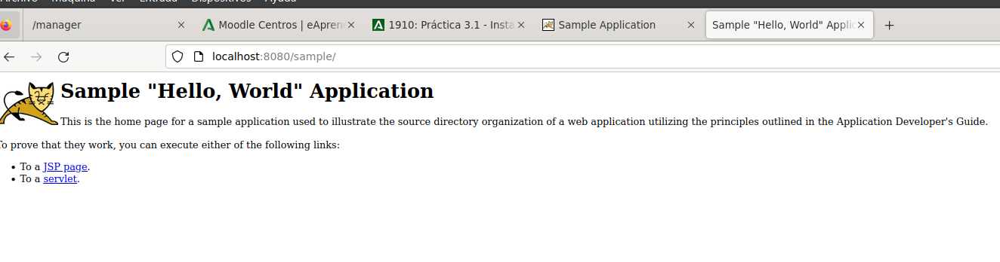

## 3.- Despliegue con Maven

Ahora desplegaremos una aplicación realizada con **Maven**, para ello deberemos:

1. Actualizar los repositorios con `sudo apt update`.<br>
   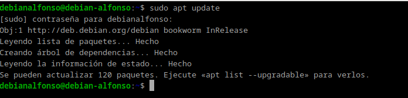

2. Instalamos **Maven** con `sudo apt install maven`.<br>
   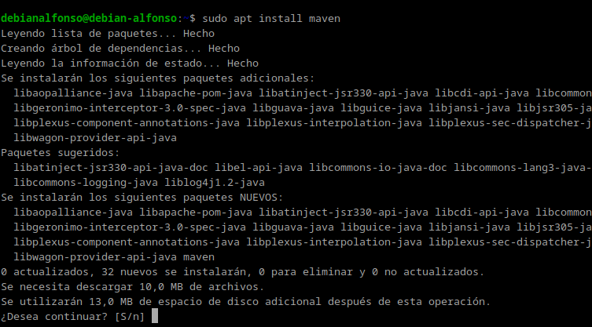

3. xxComprobamos que **Maven** se ha instalado correctamente viendo la versión instalada con el comando `mvn --v`.<br>
   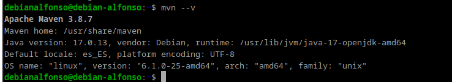

### 3.1.- Configuración de Maven

1. Por temas de seguridad, deberemos tener 2 usuarios, uno que tenga el rol de `manager-script` y otro que tenga `manager-gui`. Para ello, modificaremos el archivo de usuarios de **Tomcat** con <br>
   `sudo nano /etc/tomcat10/tomcat-users.xml`.<br>
   

2. Añadimos un nuevo **rol** para **manager-script** y el nuevo usuario, donde le asignaremos una contraseña que nosotros queramos.<br>
   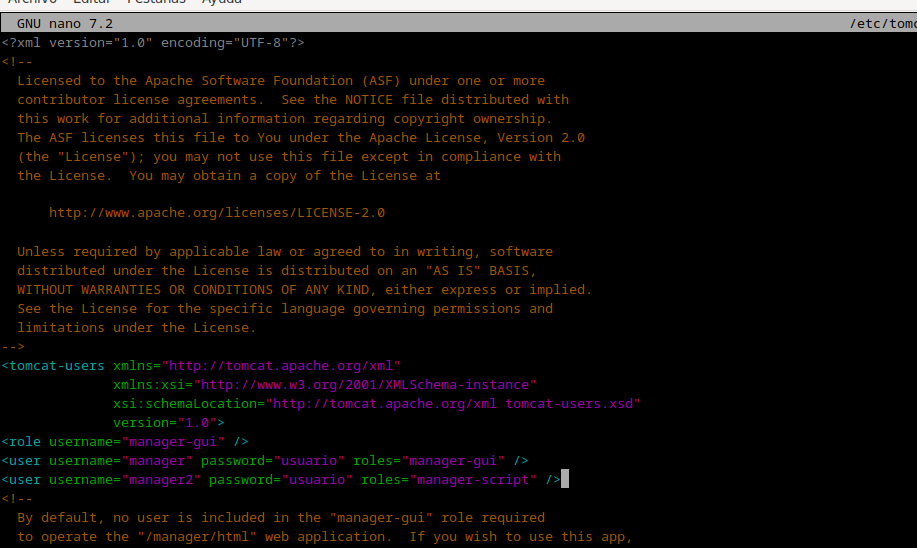
   Guardamos los cambios con `Ctrl + O` y salimos con `Ctrl + X`.

3. Ahora editamos el archivo `etc/maven/settings.xml` para indicarle a Maven, un identificador para el servidor sobre el que vamos a desplegar.<br>
   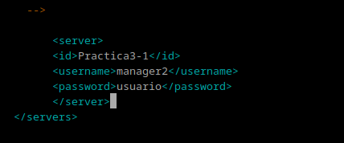

4. Modificamos el **POM** del proyecto para que haga referencia a que el despliegue se realice con el plugin de **Maven**. Para esto, clonaremos un repositorio de github con el comando <br>
   `git clone https://github.com/cameronmcnz/rock-paper-scissors.git`<br>
   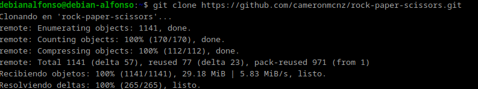

5. Nos siutuamos dentro del proyecto que hemos creado con:<br>
   `cd rock-paper-scissors`<br>
   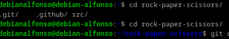

6. Cambiamos de rama: <br>
   `git checkout patch-1`<br>
   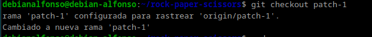

7. Tras esto, editamos el archivo **POM** con el comando <br>
   `sudo nano pom.xml`.<br>
   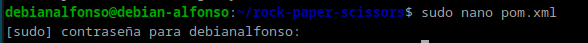

8. Añadimos el siguiente bloque<br>

```
        <plugin>
        <groupId>org.apache.tomcat.maven</groupId>
        <artifactId>tomcat7-maven-plugin</artifactId>
        <version>2.2</version>
        <configuration>
            <url>http://localhost:8080/manager/text</url>
            <server>IdDeTuServer</server>
            <path>/myapp</path>
        </configuration>
        </plugin>
```

9. Quedaría de la siguiente forma:<br>
   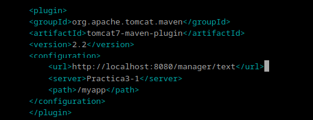

10. Hacemos un **deploy** con el comando <br>
    `mvn tomcat7:deploy`<br>
    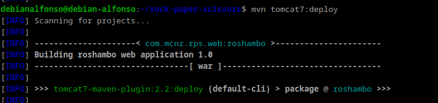

    Si todo ha ido bien, nos aparecerá un mensaje de color **verde** que pondrá **Build Success**, indicandonos que se ha desplegado correctamente:<br>
    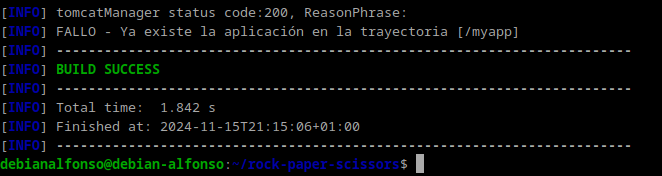

11. Por último, accedemos a nuestro navegador a la dirección `localhost:8080/tuPath`, donde **tuPath** es el **path** que hayas configurado en el **pom.xml** del proyecto, y deberiamos ver lo siguiente:<br>
    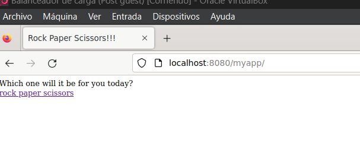

## 4.- Cuestiones

### 4.1.- Habéis visto que los archivos de configuración que hemos tocado contienen contraseñas en texto plano, por lo que cualquiera con acceso a ellos obtendría las credenciales de nuestras herramientas.<br> En principio esto representa un gran riesgo de seguridad, ¿sabrías razonar o averigüar por qué esto está diseñado de esta forma?

Esta diseñado de esta manera por simplicidad y compatibilidad ya que **Tomcat** no incluye por defecto un sistema que cifre o gestione las contraseñas. Esto es un gran problema de seguridad ya que cualquier persona podría acceder a los datos sin estar autorizadas.
Una solución para cifrar las contraseñas y resolver este problema de seguridad sería a través del la herramienta `Apache Tomcat Jasypt`.
