# Práctica 3.2: Despliegue de aplicaciones con Node Express

El primer paso para esta práctica sera parar el servidor **Tomcat**, ya que si no, este nos dará problemas, para ello lo paramos con el comando: <br>
`sudo systemctl stop tomcat10`
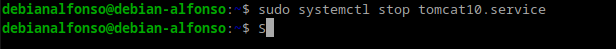

## 1.- Instalación de Node.js, Express y test de la primera aplicación

Para instalar **NodeJS**, el primer paso es actualizar los paquetes del sistema mediante un `sudo apt update`.<br>
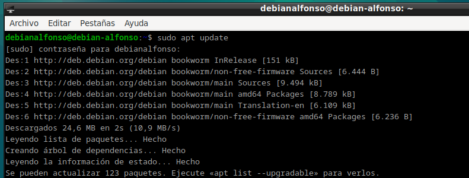

Tras actualizar los paquetes del sistema, instalamos **NodeJS** con el comando `sudo apt -y install nodejs npm`.<br>
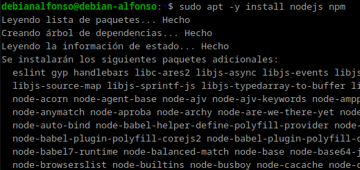

Cuando lo tengamos instalado, instalamos tambien **ExpressJS** con el comando `sudo npm install -g express`.<br>
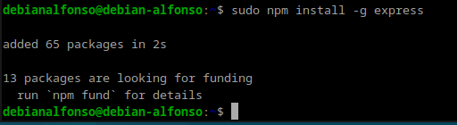

Ahora creamos un nuevo directorio con `mkdir` donde crearemos nuestra primera aplicacion de prueba. Despues nos meteremos dentro de la carpeta con `cd` e inicializamos el proyecto con el comando `npm init -y`.<br>
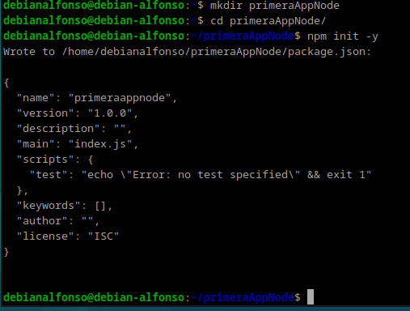

Ahora instalamos **ExpressJS** localmente en este proyecto con el comando `npm install express`.<br>
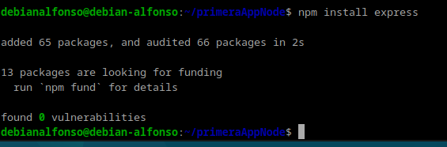

Tras eso creamos un nuevo fichero con `sudo nano app.js` donde configuraremos nuestra primera app y añadimos el siguiente bloque:<br>

```
const express = require('express')
const app = express()
const port = 3000

app.get('/', (req, res) => {
    res.send('Hello. Welcome to this blog')
})

app.listen(port, () => {
    console.log(`Example app listening at http://localhost:${port}`)
})
```

Quedaria de la siguiente forma:
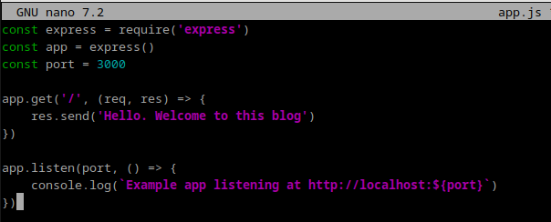

Y por ultimo corremos la aplicación `node app.js` y deberiamos ver en la consola el siguiente mensaje: <br>
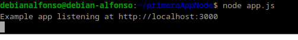

Y si accedemos al navegador veremos el contenido del archivo: <br>


## 2.- Despliegue de una nueva aplicación

Para este paso, clonaremos un repositorio de **github** de un proyecto ya creado con el comaando<br>
`git clone https://github.com/contentful/the-example-app.nodejs.git`<br>
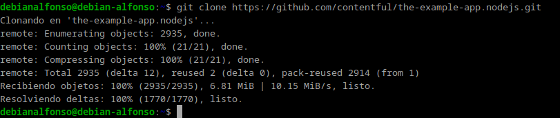

Nos metemos dentro del directorio con `cd the-example-app.nodejs` e instalamos las librerias neecesarias con `npm install`<br>
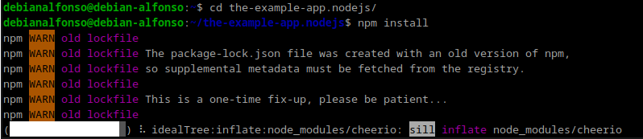

Cuando se complete la instalaciun de las librerias, podremos iniciar la aplicacion con el comando `npm run start:dev`<br>
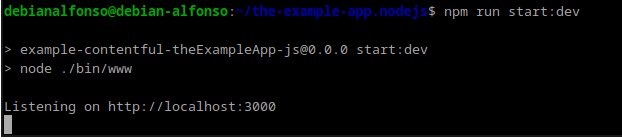

Nos metemos en el navegador y vemos el contenido:<br>
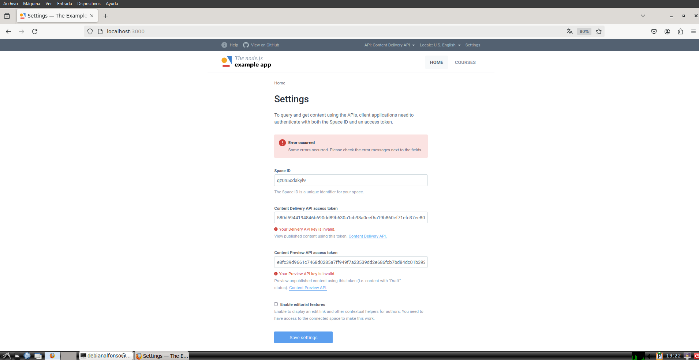

## 3.- Cuestiones

1. <b>Cuando ejecutáis el comando npm run start:dev, lo que estáis haciendo es ejecutar un script. ¿Donde podemos ver que script se está ejecutando?</b><br>
   En el fichero **package.json**. En este fichero estan establecidos todos los comanmdos disponibles relaacionados con la aplicacion.
   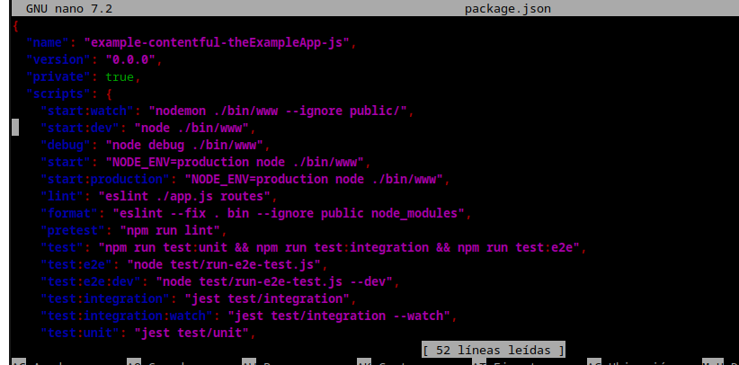
   <b>¿Qué comando está ejecutando?</b><br>
   Esta ejecutando **node ./bin/www**.

# Parte 2.- Despliegue con Netlify

Para comenzar con el despliegue en Netlify, empezaremos clonando un nuevo repositorio de **github** con `git clone`, que será `https://github.com/StackAbuse/color-shades-generator`<br>
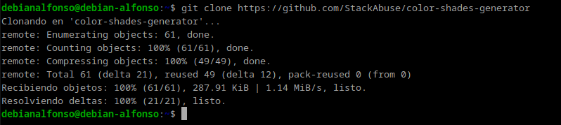

Accedemos al repositorio que acabamos de crear con `cd` e instalamos los módulos necesarios de **netlify** con el comando `sudo npm install netlify-cli -g`<br>
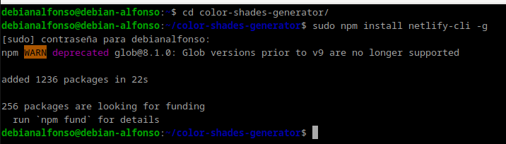

El siguiente paso será crearnos una cuenta en **Netlify** y generar un **token**. Después de registrarnos veremos la siguiente pantalla: <br>
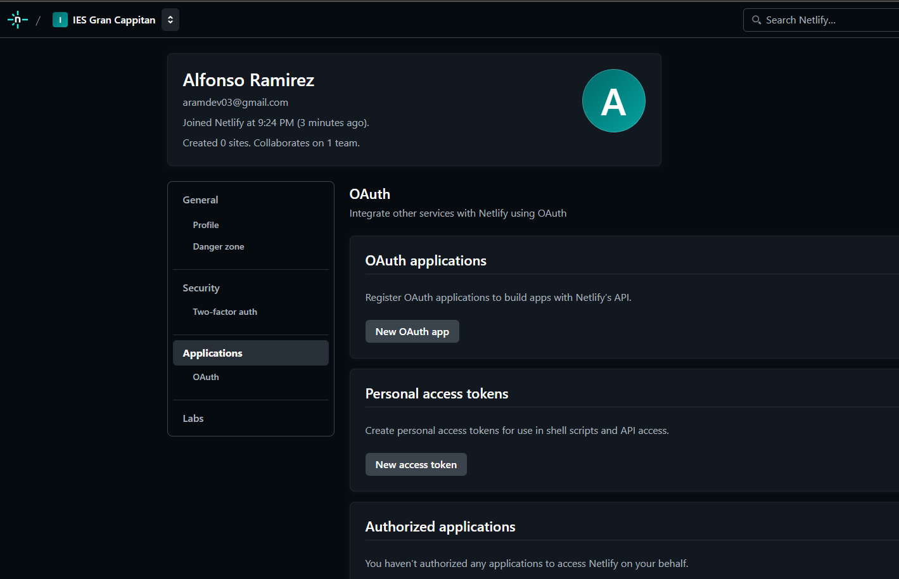

Pulsamos en **New access token** en el apartado de **Personal access tokens** y seguimos los siguientes pasos:<br>
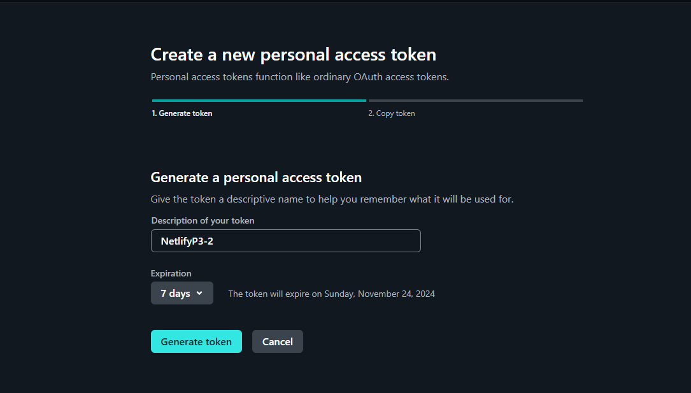

Tras eso, pulsamos en `Generate Token` y ya tendremos nuestro token disponible. El siguiente paso es exportar nuestro token almancenandolo en una variable, eso lo hacemos con el comando: <br>
`export NETLIFY_AU $Token`.<br>
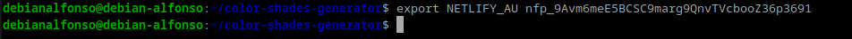

Ahora ya podremos loguearnos con `netlify login`. Tras poner este comando se nos abrirá el navegador pidiendo que autoricemos, pulsamos en autorizar y nos aparecerá lo siguiente en la terminal: <br>
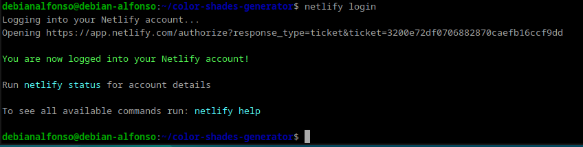

Primero, deberemos instalar todas las dependencias con el comando `npm install`<br>
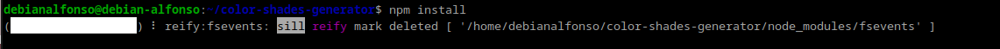

Y cuando ya las tengamos instaladas hacemos un `npm run build`<br>
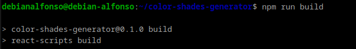

Tras esto, ya podemos hacer un `netlify deploy` para desplegar nuestra aplicación. <br>

1. Seleccionamos la opcion de `Crear y configurar un nuevo sitio`.
2. Seleccionamos el `Equipo`.
3. Asignamos un nombre.
4. Asignamos la ruta de despliegue del proyecto clonado, es decir, `./build`.
   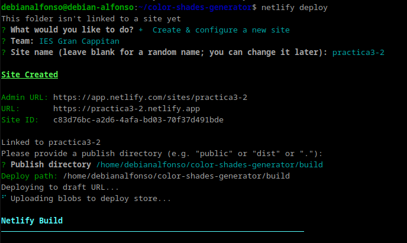

Si todo ha ido bien, nos apareceran estos mensajes: <br>
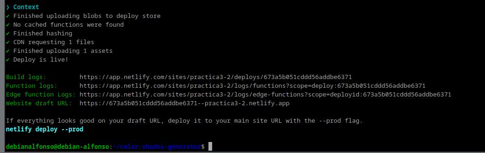

Cogemos la direccion del apartado `Website draft URL` y comprobamos que se vea el contenido:<br>
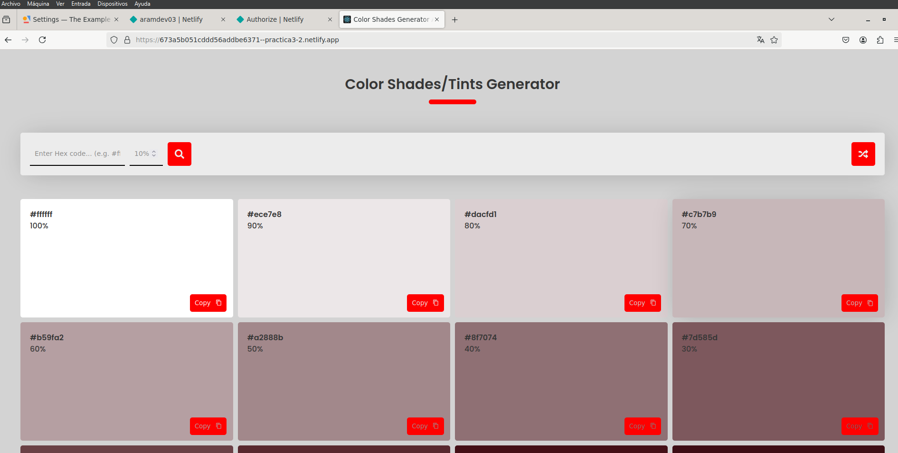

Ahora realizaremos el despliegue a producción con el comando: `netlify deploy --prod`<br>
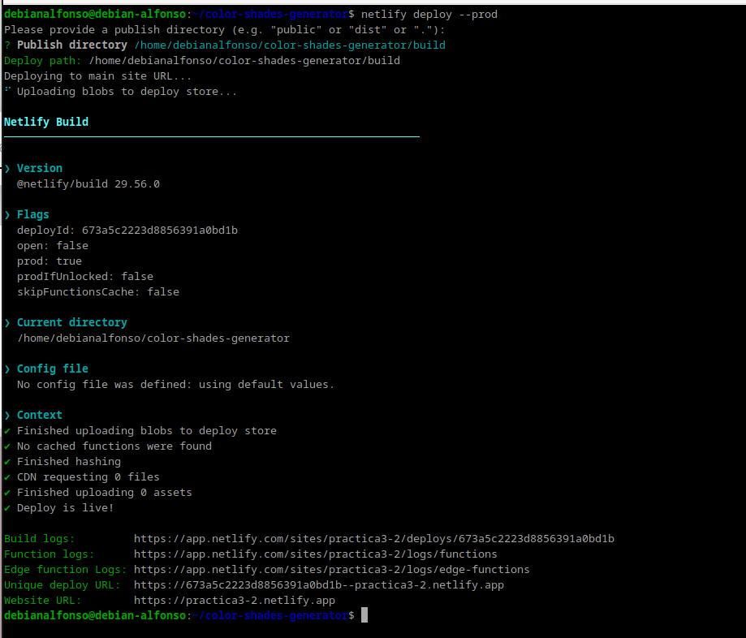

Cogemos el último enlace y comprobamos que se ve el contenido:<br>
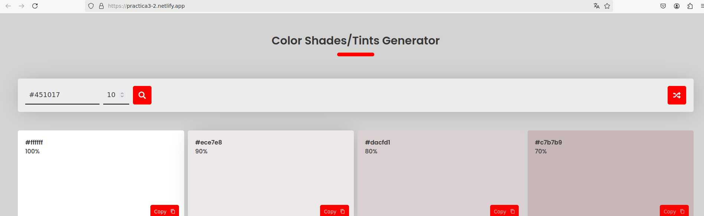

## 2.1.- Despliegue mediante conexión con Github

Para realizar este paso, vamos a eliminar el despliegue que habíamos creado anteriormente.<br>
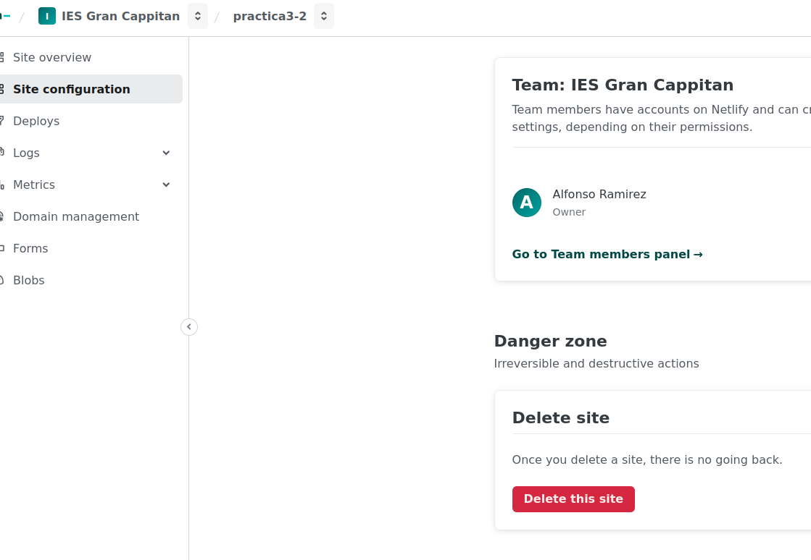
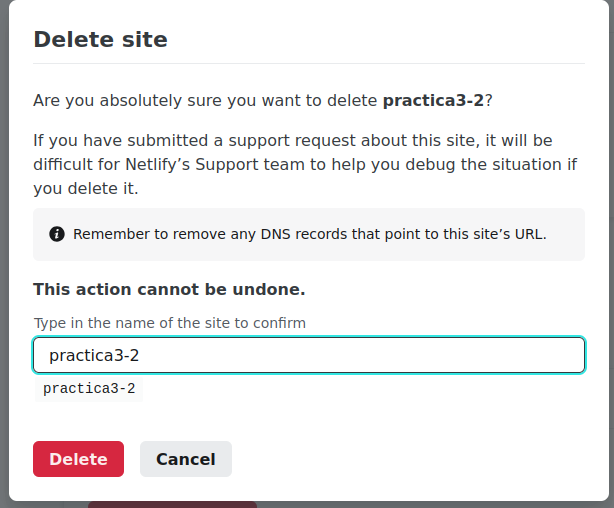

Ahora eliminamos el repositorio que clonamos anteriormente con el comando `rm -rf color-shades-generator`:<br>
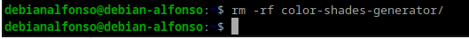

Tras estos pasos, importamos un archivo **.zip** de un repositorio a través del comando: <br>
`wget https://github.com/StackAbuse/color-shades-generator/archive/refs/heads/main.zip`<br>
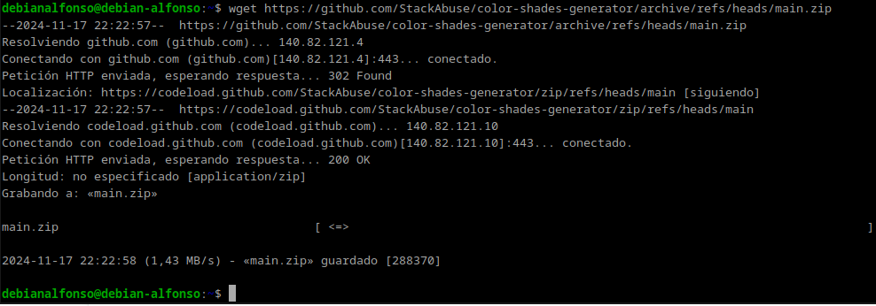

Tras importar el archivo, creamos un nuevo directorio con `mkdir` donde descomprimiremos el archivo con el comando `sudo unzip main.zip -d $NombreDirectorio`.<br>
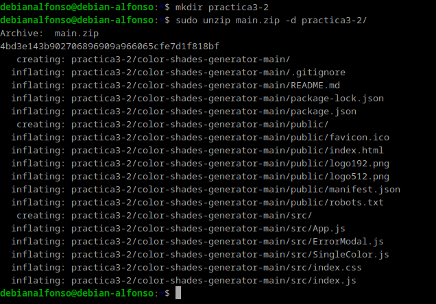

Ahora accedemos al directorio y creamos un nuevo repositorio en Github:
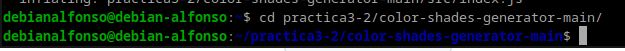
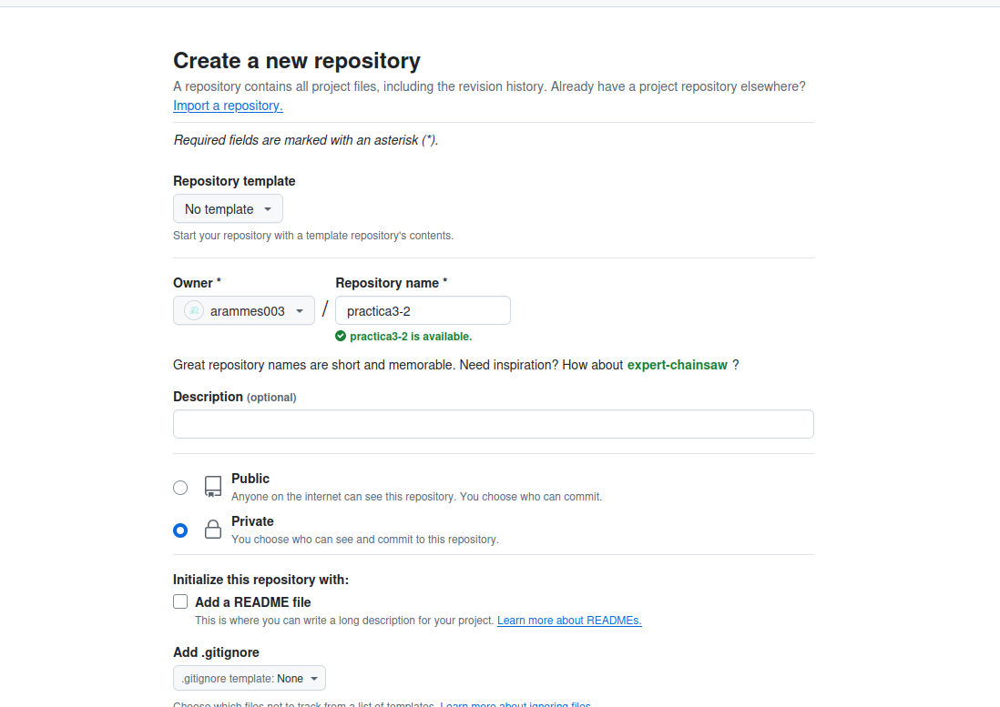

Tras esto, seguimos los siguientes comandos:<br>

```
sudo git init
sudo git add .
sudo git commit -m "Subiendo el codigo"
sudo git branch -M main
```

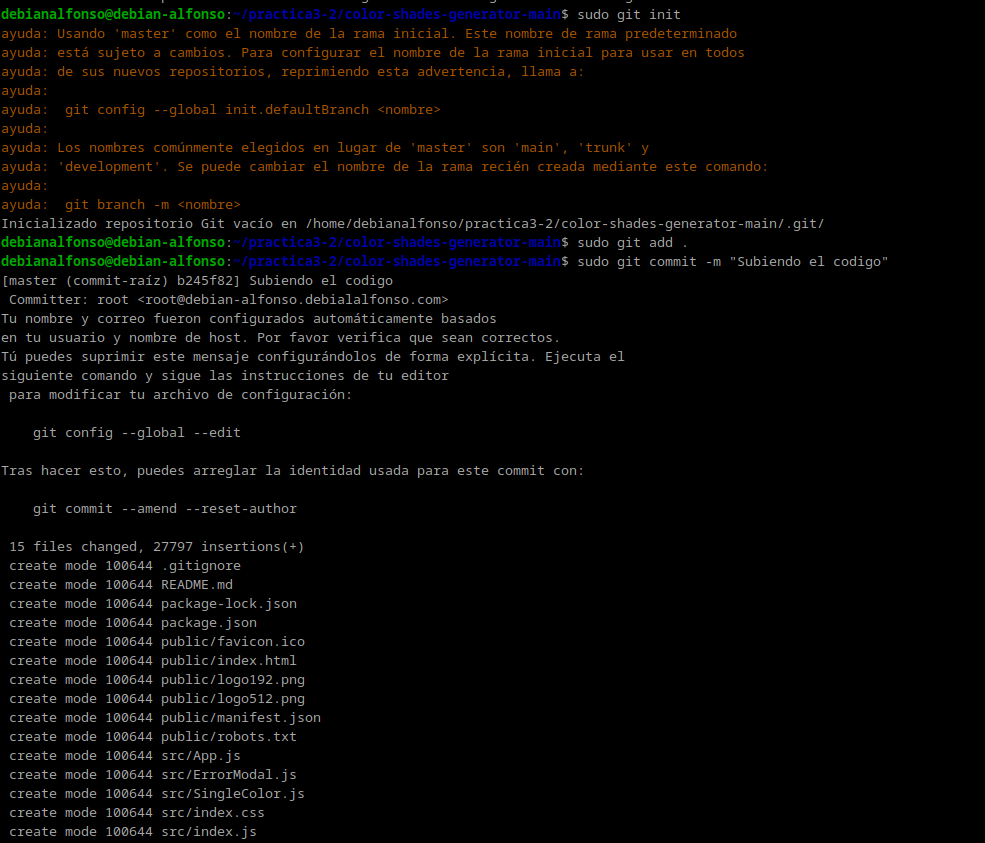
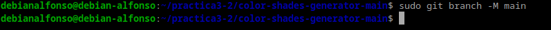

Y ahora solo queda referenciar la carpeta al repositorio, para ello usamos los siguientes comandos: <br>

```
sudo git remote add origin https://github.com/arammes003/practica3-2.git
sudo git push -u origin main
```


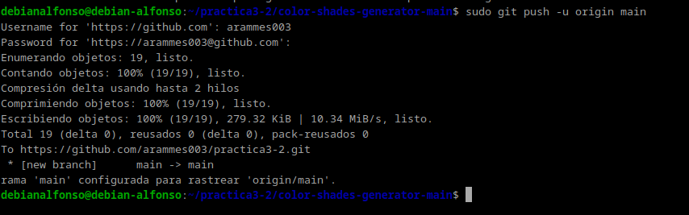

Ahora que ya está enlazado el código a **Github**, entraremos en el sitio web de **Netlify** y desde el dashboard le daremos a importar un proyecto existente de `git`.<br>
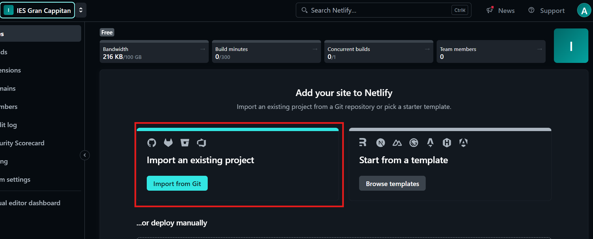

Le indicamos concretamente que sea de **Github**:<br>
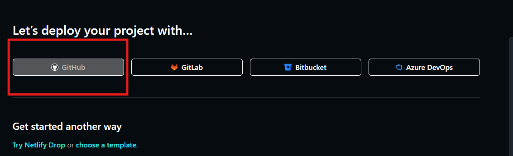

Y nos saltará una ventana pidiendo que autoricemos a **Netlify** a acceder a nuestros repositorios de **Github**:
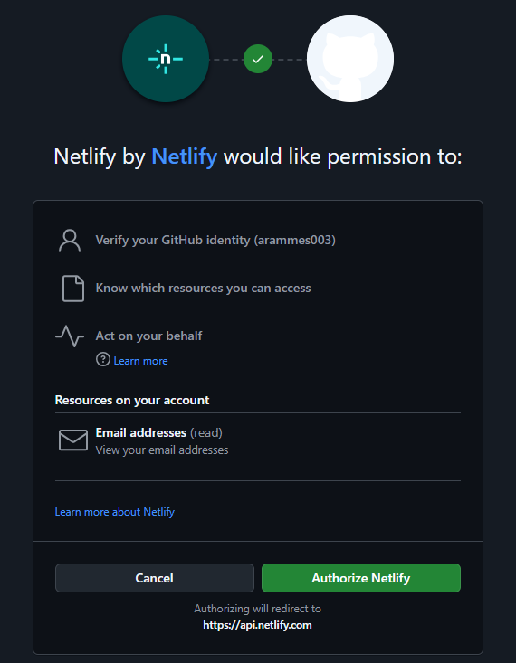

Luego le indicamos que no acceda a todos nuestros repositorios, si no sólo al repositorio de la práctica.<br>

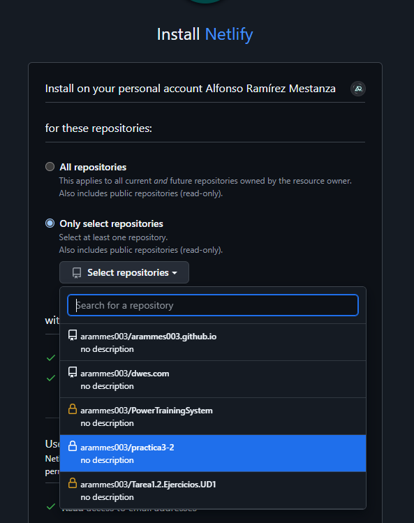

El próximo paso es desplegar la aplicación. <br>
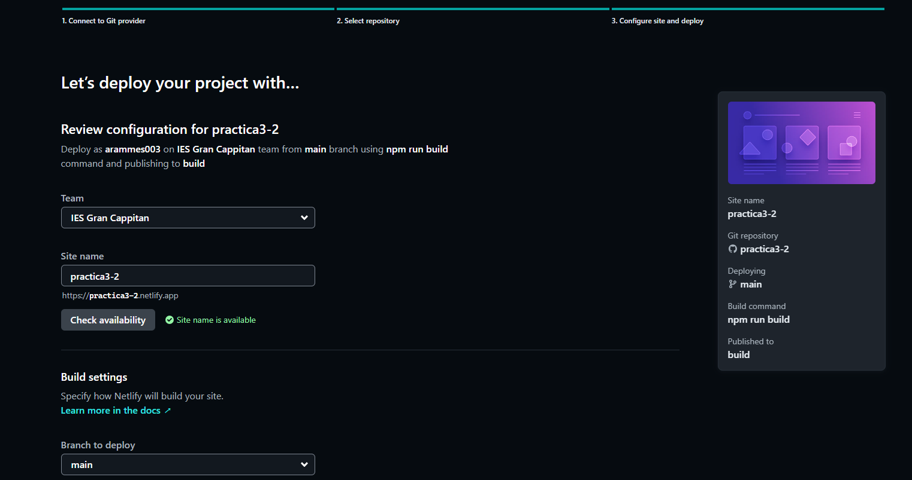

**IMPORTANTE** Tras el deploy, deberemos cambiar el nombre de la aplicación por nombre-practica3-4.<br>
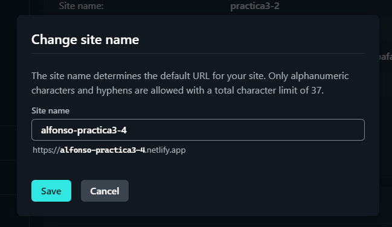

- Ahora vamos a comprobar que el nombre se ha cambiado correctamente, para ello dentro de la carpeta `public` encontramos el archivo `robots.txt` cuyo objetivo es indicar a los rastreadores de los buscadores a que URLs del sitio pueden acceder.<br>
  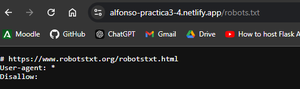

- Dentro de la carpeta `public`, utilizaremos un editor de texto para modificar el archivo `robots.txt` y pondremos nuestro nombre y apellido. <br>
  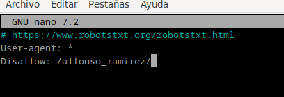

- Hacemos un nuevo commit para que se apliquen los cambios de manera automática. <br>
  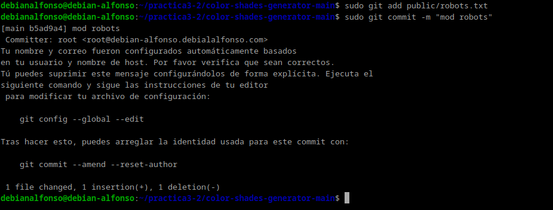
  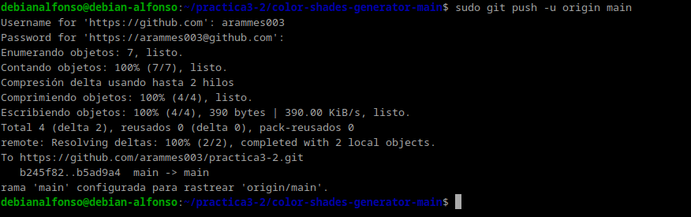

Y lo podremos comprobar en nuestra página de **Netlify** tras realizar el push. <br>
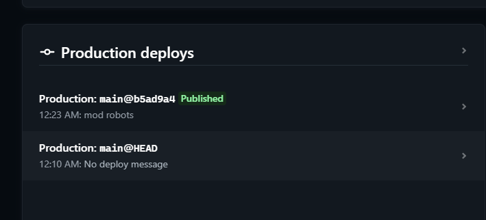

Y tras ello, también lo comprobamos en el navegador web.
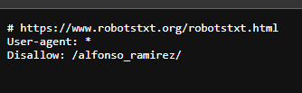

## 3.- Cuestiones

1. <b>Investiga y explica que es un Dyno en terminología Heroku.</b><br>

   Es una unidad de ejecución ligera que se utiliza para ejecutar aplicaciones en la plataforma.

2. <b>En Heroku no todo es de color de rosa, tiene sus limitaciones y desventajas. Busca, investiga y explica algunas de ellas detalladamente. </b><br>

   Tiene costos elevados: Escalar aplicaciones en Heroku puede volverse caro, especialmente al usar múltiples Dynos o bases de datos grandes​.

   Limitaciones del plan gratuito: Restricciones en horas de uso, suspensión tras inactividad, y bajo rendimiento, lo que lo hace poco ideal para producción.​

   Rendimiento variable: No es óptimo para aplicaciones con alto tráfico o necesidades avanzadas sin costosos upgrades​.

   Falta de soporte avanzado: Configuraciones complejas o tecnologías modernas como Jamstack no están tan bien soportadas como en otras plataformas como AWS o Vercel​.

   Dependencia del ecosistema: Migrar desde Heroku puede ser complicado y costoso​.
