# Práctica 3.3.- Despliegue de una aplicación Flask

Antes de empezar con el despliegue, nos conectaremos mediante **SSH** desde nuestra máquina a la máquina **Debian** mediante el comando `ssh nombreUsuarioDebian@direccionIpDebian`, de la siguiente manera:

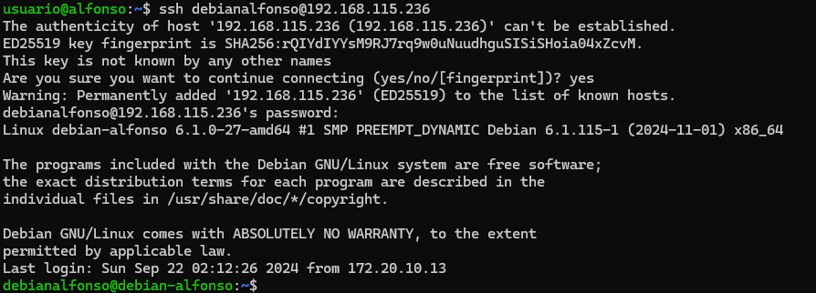

# 1.- Procedimiento para el despliegue

Para realizar el despligue de una aplicación **Flask** seguiremos una serie de pasos:

1. Actualizamos los repositorios de paquetes del sistema con `sudo apt update`.<br>
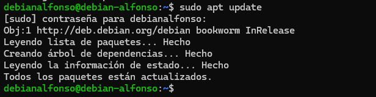

2. Instalamos el gestor de paquetes de **Python** con `sudo apt install python3-pip`.<br>
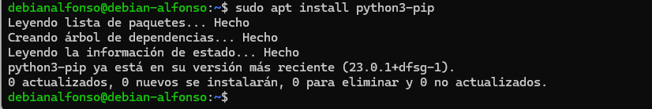

3. Instalamos el paquete **pipenv** que se encarga de gestionar los entornos virtuales con <br> `sudo apt install pipenv`.<br>
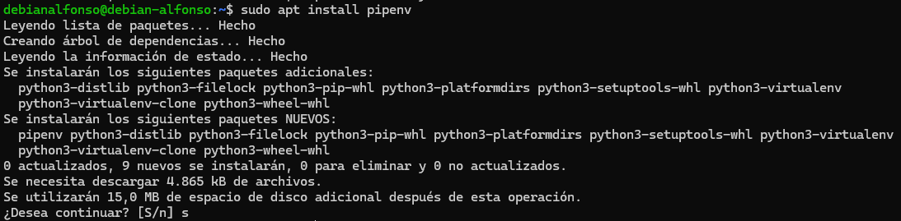

4. Comprobamos que está bien instalado mostrando su vesión con `pipenv --version`.<br>
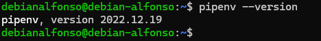

5. Creamos el directorio donde almacenaremos nuestro proyecto con <br> `sudo mkdir /var/www/nombreAplicacion`.<br>
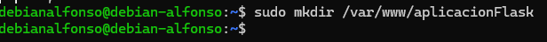

6. Como lo creamos con `sudo`, los permisos pertenecen al usuario `root` del sistema:<br>
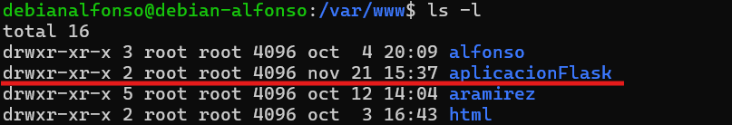

7. Hay que cambiarle los permisos para que pertenezcan a nuestro usuario (**debianalfonso** en mi caso) y pertenezca al grupo **www-data** con el siguiente comando <br> `sudo chwn -r USUARIO:www-data /var/www/nombreAplicacion`<br>
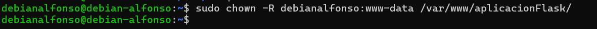

8. Establecemos los permisos adecuados para que pueda ser leído por todo el mundo con `sudo chmod -R 775 /var/www/nombreAplicacion`.<br>


9. Dentro del directorio de nuestra aplicación, creamos un archivo oculto `.env` que contendrá las variables de entorno con el comando `touch .env`.<br>
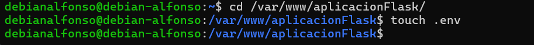

10. Editamos el archivo y añadimos las variables, indicando cuál es el archivo `.py` de la aplicación y el entorno, que en nuestro caso será **production**. Para editarlo usamos el comando: `sudo nano .env` y después verificamos los cambios con `cat .env`.<br>
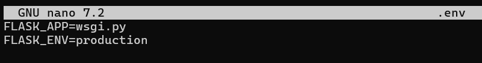
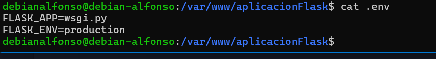

11. Iniciamos el entorno virtual mediante `pipenv shell`. **Pipenv** cargará las variables de entorno desde el fichero `.env` de forma automática.<br>
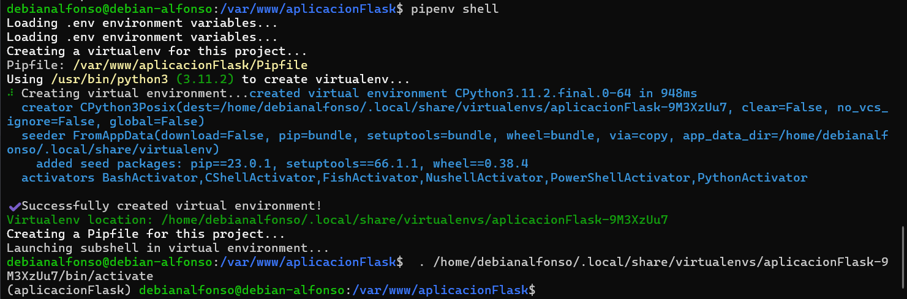

12. Ahora usamos `pipenv install flask gunicorn` para instalar las dependencias necesarias para nuestro proyecto.<br>
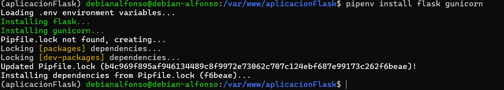

13. Ahora vamos a crear nuestra aplicación **Flask** lo más rápido posible. Para ello crearemos dos archivos, `application.py` y `wsgi.py` con este contenido respectivamente, mediante el comando `touch application.py wsgi.py` <br>


14. Ahora añadimos el contenido a cada archivo.<br>

Archivo **application.py**:
```
from flask import Flask

app = Flask(__name__)

@app.route('/')
def index():
        return '<h1>Aplicacion desplegada</h1>'
```
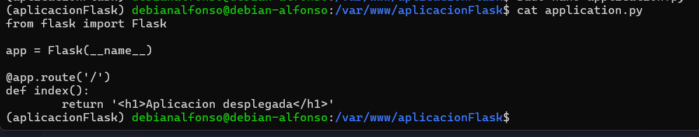

Archivo **wsgi.py**:
```
from application import app

if __name__ == '__main__':
        app.run(debug=False)

```
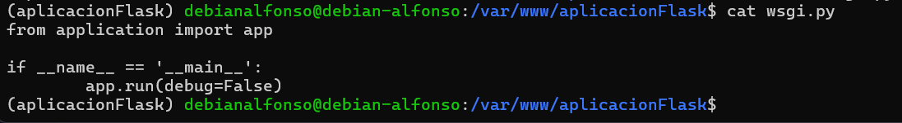

15. Ahora iniciamos nuestra aplicación con `flask run --host '0.0.0.0'` a modo de comprobación con el servidor web integrado en Flask. Si especificamos la dirección `0.0.0.0` lo que estamos diciendo al servidor es que escuche a todas sus interfaces en caso de tenerlas. 
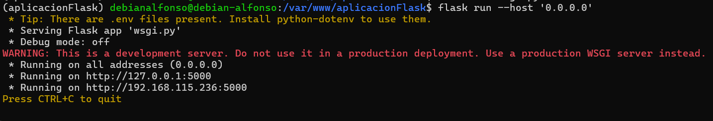

16. Ahora accedemos desde nuestro navegador a la dirección IP `http://IP-maq-virtual:5000` y deberíamos ver lo siguiente:
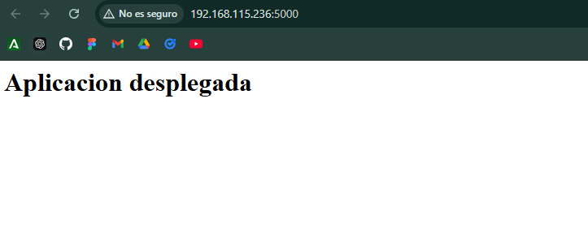

17. Tras esto, paramos el servidor con `CTRL + C`.

18. Ahora comprobaremos que **Gunicor** funciona correctamente mediante el comando `gunicorn -workers 4 --bind 0.0.0.0:5000 wsgi:app`. Si con el servidor de desarrollo no tuvimos ningun problema, deberiamos verlo perfectamente en nuestro navegador:<br>
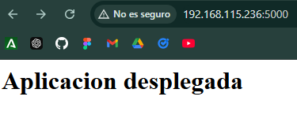

19. Todavía dentro del entorno virtual, debemos obtener la ruta desde donde se ejecuta **gunicorn** para poder configurar más adelante un servicio del sistema con el comando `which gunicorn`:<br>
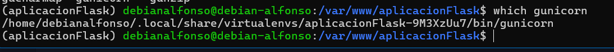

20. Por último, salimos del entorno virtual con `deactivate`.<br>
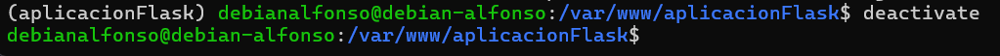

# 2.- Despliegue con Nginx

Iniciamos Nginx y comprobamos que su estado sea activo:<br>
```
sudo systemctl start nginx

sudo systemctl status nginx
```
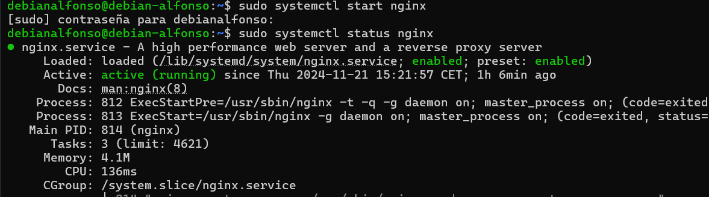

2. Creamos un archivo con `sudo nano /etc/systemd/system/nombreArchivo` para que `systemd` corra **Gunicorn** como un servicio más del sistema:<br>
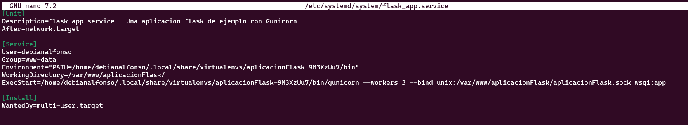

3. Ahora habilitamos el servicio con `systemctl enable nombreServicio` y lo iniciamos con `systemctl start nombreServicio`.<br>
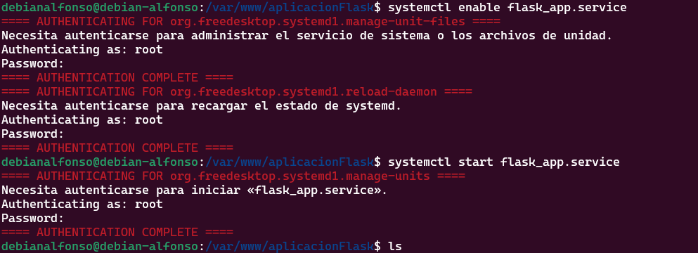

4. Ahora crearemos un archivo de configuración en **Nginx** con `sudo nano /etc/nginx/sites-available/nombreAplicacion` y ponemos lo siguiente:<br>
```
server {
    listen 80;
    server_name mi_aplicacion www.mi_aplicacion;

    access_log /var/log/nginx/mi_aplicacion.access.log;
    error_log /var/log/nginx/mi_aplicacion.error.log;

    location / { 
            include proxy_params;
            proxy_pass http://unix:/var/www/nombre_aplicacion/nombre_aplicacion.sock;
    }
}   
```
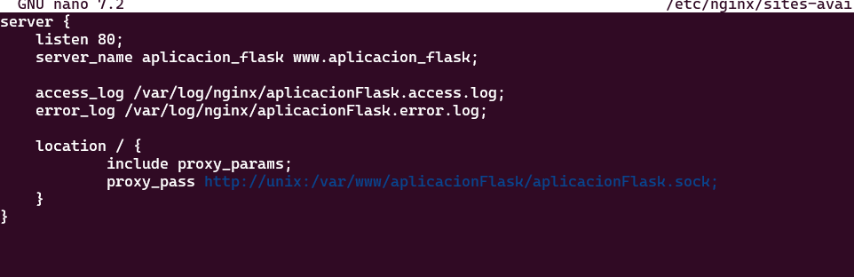

5. Ahora creamos un enlace simbólico con `sudo ln -s /etc/nginx/sites-available/aplicacionFlask /etc/nginx/sites-enabled/` y nos aseguramos que se ha creado el enlace con `ls -l /etc/nginx/sites-enabled/ | grep aplicacionFlask`.<br>
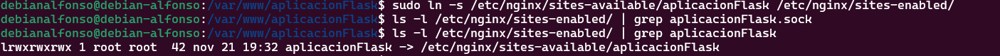

6. Comprobamos que el archivo de configuración no contiene errores, reiniciamos **Nginx** y comprobamos que este activo:<br>

```
nginx -t

sudo systemctl restart nginx

sudo systemctl status nginx
```


8. Ahora la única manera de acceder a nuestra aplicación es mediante el `server_name`. Para ello, editamos el archivo `/etc/hosts` de nuestra máquina para que asocie la IP de la máquina virtual a nuestro `server_name`.<br>


9. El último paso es acceder mediante nuestro navegador: <br>
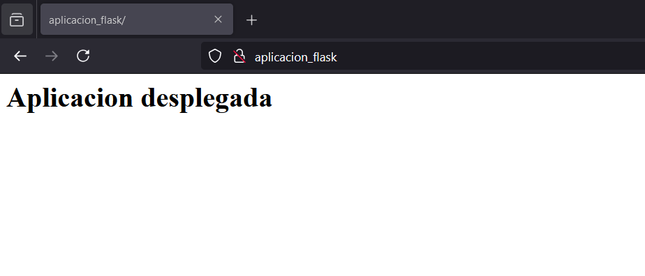

# 3.- Ejercicio
Repite todo el proceso con la aplicación del siguiente repositorio: https://github.com/raul-profesor/Practica-3.5.

Clonamos el repositorio en nuestro direectorio `/var/www` con el comando `sudo git clone https://github.com/raul-profesor/Practica-3.5`.<br>
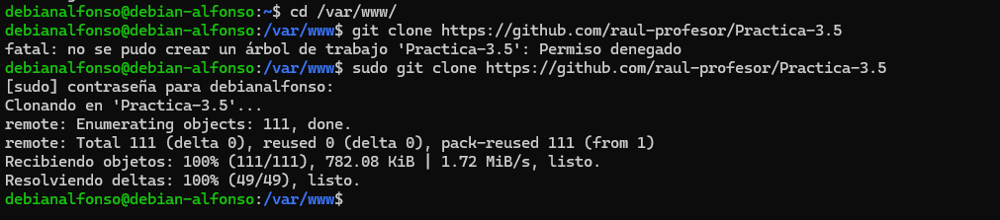

Cambiamos el dueño a nuestro usuario con el comando `sudo chown -R USUARIO:www-data /var/www/nombreAplicacion`.<br>
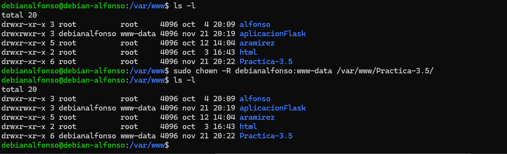

Establecemos los permisos adecuados con `chmod -R 775 /var/www/nombreAplicacion`. <br>
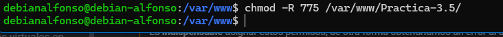

Creamos un archivo oculto `.env` dentro del directorio de nuestra aplicación con `touch .env`.<br>
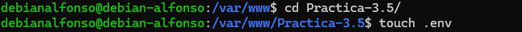

Editamos el archivo con `sudo nano .env` y después vemos los cambios con `cat .env`.<br>
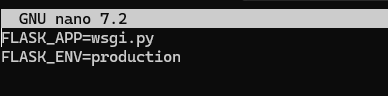
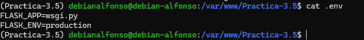

Ahora iniciamos nuestro entorno virtual con `pipenv shell` para que cargue las variables de entorno desde el fichero `.env`.<br>
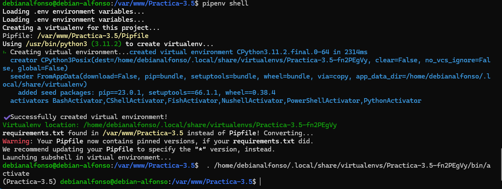

Ahora instalamos las dependencias  con `pipenv install -r requirements.txt`.<br>
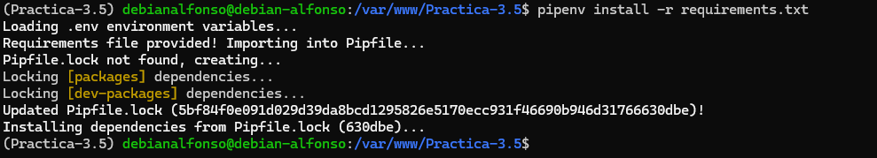

Instalamos `gunicorn` con el comando `pipenv install flask gunicorn`.<br>
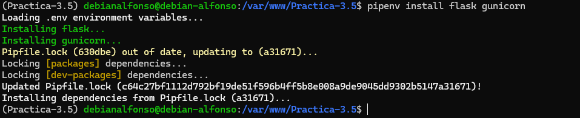

Creamos un archivo `wsgi.py` que contendrá lo siguiente:<br>
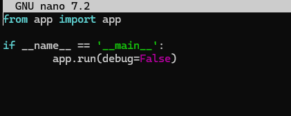

Por último, corremos nuestra aplicación con `flask run --host '0.0.0.0'`;
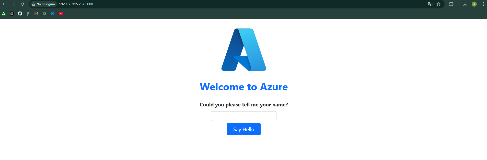

Y comprobamos que podemos acceder mediante `gunicorn --workers 4 --bind 0.0.0.0:8000 wsgi:app`.<br>
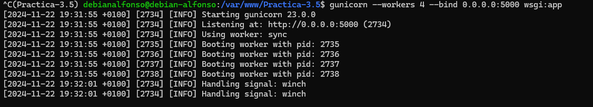
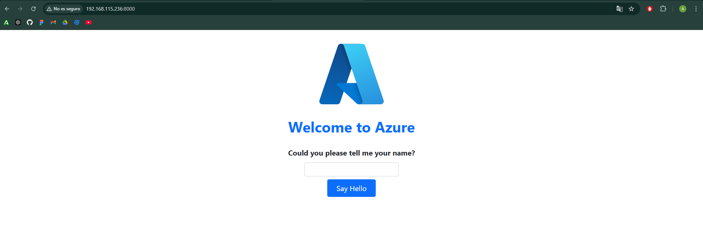

Usamos el comando `which gunicorn` para poder configurar más tarde un servicio.<br>
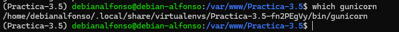

Ya podemos salir del entorno virtual con `deactivate`.<br>
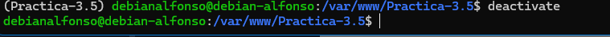

# 3.1.- Nginx
Ahora vamos a desplegarla en **Nginx**, para ello:

1. Creamos un archivo para que `systemd` corra **Gunicorn** como un servicio más: <br>
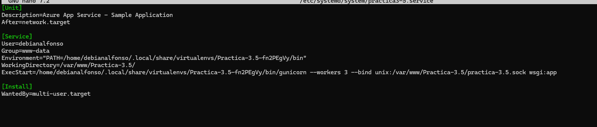

2. Ahora habilitamos el servicio con `systemctl enable nombreServicio` y lo iniciamos con `systemctl start nombreServicio`.<br>
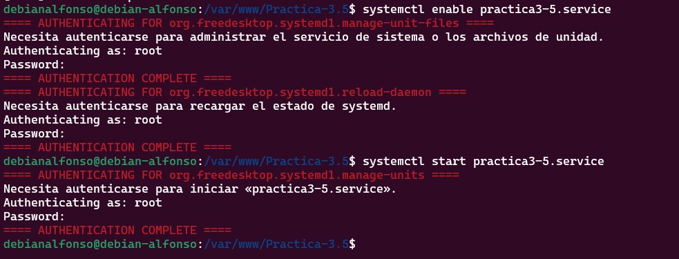

3. Creamos un archivo donde configuraremos el sitio web de **Nginx** con `sudo nano /etc/nginx/sites-available/nombreAplicacion`.<br>
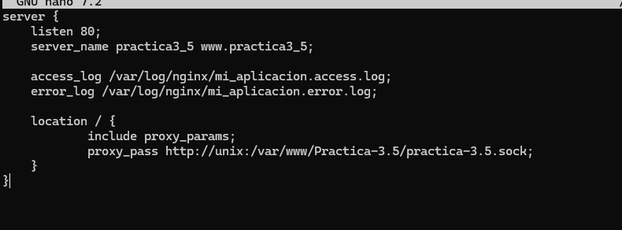

4. Creamos un enlace simbólico con `sudo ln -s /etc/nginx/sites-available/nombreAplicacion /etc/nginx/sites-enabled/`.<br>
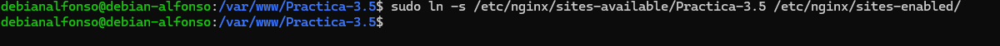

5. Nos aseguramos que se ha creado con `ls -l /etc/nginx/sites-enabled | grep nombreAplicacion`.<br>
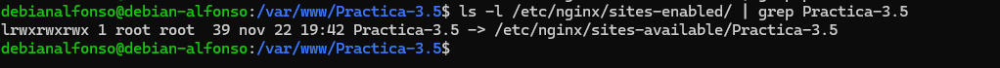

6. Comprobamos que **Nginx** no contiene errores con `nginx -t`, lo reiniciamos con `sudo systemctl restart nginx` y vemos su estado con `sudo systemctl status nginx`. <br>
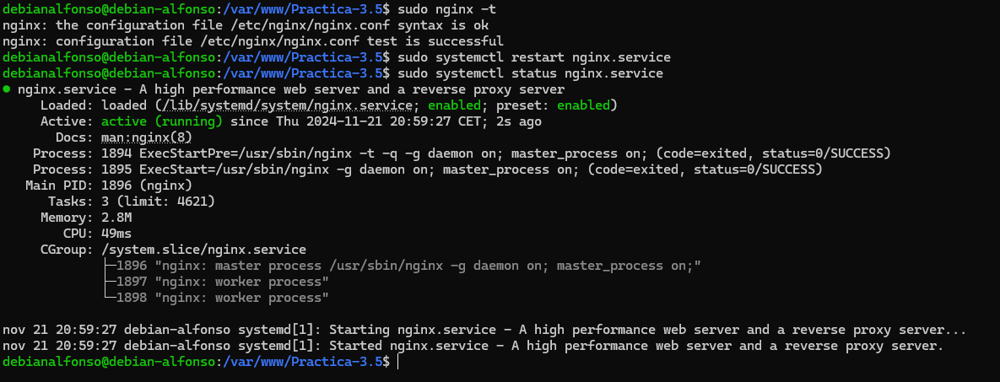

7. Lo último que tendremos que hacer es editar el archivo `/etc/hosts` para asociar la IP de la máquina a nuestro `server_name`.<br>


8. Accedemos al navegador y si todo ha ido bien veremos el siguiente contenido:<br>
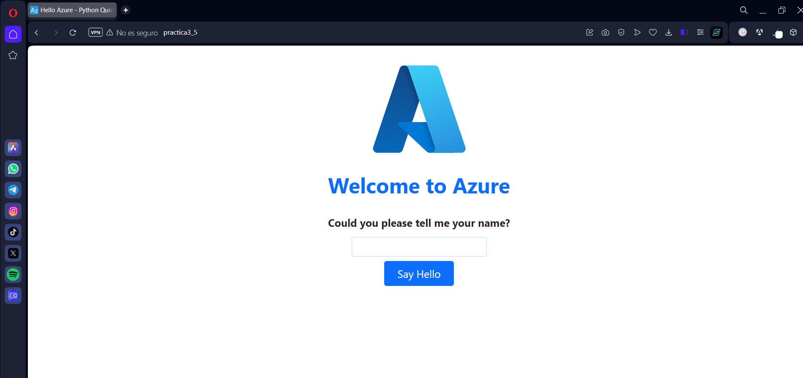
# 4.- Cuestiones

## 4.1.- Busca, lee, entiende y explica qué es y para que sirve un servidor WSGI.

Un servidor WSGI es un estándar que define cómo los servidores web deben comunicarse con las aplicaciones web Python. Permite que aplicaciones como Flask o Django procesen solicitudes HTTP y generen respuestas.  Sirve para:
- Conectar la aplicación Python con servidores web como NGINX o Apache.
- Procesar solicitudes HTTP y devolver respuestas a los usuarios.
- Mejorar el rendimiento mediante la gestión de múltiples procesos de trabajo (workers).