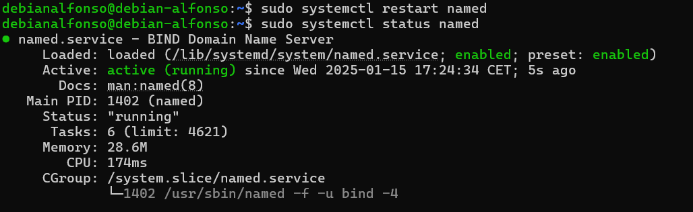

# Práctica 4.1.- Configuración de un servidor DNS

Antes de empezar, deberemos asegurarnos de que no hay ninguna entrada en nuestro archivo `/etc/hosts` para asegurarnos que la resolución de nombres va a nuestro servidor **DNS**.


Podemos comentarlas como yo he hecho, o eliminarlas.

También, iniciaremos sesión por SSH desde nuestra máquina física a nuestro servidor Debian:


## 1.- Instalación de servidor DNS

Para instalar nuestro servidor DNS, usaremos los repositorios oficiales a través del comando `sudo apt-get install bind9 bind9utils bind9-doc`.


## 2.- Configuración del servidor

Como solo usaremos **IPv4**, modificaremos el archivo general de configuración que se encuentra en `/etc/default/named` con `sudo nano`.


Cuando se abra lo unico que deberemos modificar para indicarle que solo use **IPv4** es la línea `OPTIONS="-u bind"` dónde solo tendremos que poner lo siguiente:


Guardamos los caambios y consultamos la confiuguración principal `named.conf` que se encuentra en el directorio `/etc/bind`, deberemos ver lo siguiente:

Los 3 includes que aparecen hacen referencia a los archivos donde deberemos realizar nuestra configuración.

## 2.1.- Configuración _named.conf.options_

Antes de empezar con la configuración, se recomienda hacer una copia de seguridad del archivo de configuración antes de realizar cambios sobre el archivo, para ello usamos el comand `sudo cp /etc/bind/named.conf.options /etc/bind/named.conf.options.backup`.


Ahora editamos el archivo `named.conf.options`, con `sudo nano /etc/bind/named.conf.options`, nos deberá aparecer esta ventana:


- Por motivos de seguridad, incluiremos una lista de acceso para que solo puedan acceder los hosts que nosotros queramos, en mi caso, será `192.168.X.0/24`, para que tenga acceso cualquier host de la red. Para ello, antes del bloque `options{...}`, añadimos algo así:

```
acl permitidos {
        TuDireccionIp/MascaraDeRed
}

```

**X** es el terer byte de tu ip, en mi caso será **116**.


Si nos fijamos en la primera línea de configuración de opciones, nos aparece por defecto el directorio donde se guardarán las zonas, que es `/var/cache/bind`, es decir, viene pre configurado para ser un **DNS Caché**.

- El siguiente paso será anular las consultas de **IPv6**, puesto que no vamos a utilizarlo, para ello bajamos a la última línea de configuración de opciones y comentamos con una doble barra `//`.
- Tambien permitiremos solo las consultas recursivas.
- No permitiremos tranferencias.
- Configuraremos el servidor para que escuche consultas DNS por el puerto 53. Quedaría así la nueva configuración.

```
        allow-recursion {confiables;};
        allow-transfe{none;};
        listen-on port 53{192.168.116.118;};
        recursion yes;


        //========================================================================
        // If BIND logs error messages about the root key being expired,
        // you will need to update your keys.  See https://www.isc.org/bind-keys
        //========================================================================
        dnssec-validation auto;

        //listen-on-v6 { any; };
```


Guardamos cambios y salimos del archivo.

- Lo siguiente es comprobar si la configuración es correcta con `sudo named-checkconf`:
  
  Si no aparece nada es que todo esta correctamente configurado, si no, nos aparecería un mensaje de error.

- Reiniciamos el servidor con `sudo systemctl restart named` y comprobamos el estado con `sudo systemctl status named`;
  
  Si todo esta correcto nos aparecera un mensaje indicando que esta **activo**.

## 2.2.- Configuración _named.conf.local_

Para ello, lo que haremos es declarar una zona llamada `deaw.es`. Dentro configuraremos los aspectos de nuestras zonas, que por ahora será lo siguiente:

```
zone "deaw.es" {
        type master;
        file "/etc/bind/db.deaw.es";
}
```

Aquí indicamos que el servidor DNS de nuestra zona es maestro y la ubicación de la zona que la crearemos más adelante. El archivo quedaría de la siguiente forma:


## 2.3.- Creación del archivo de zona

Para ello accedemos a `/etc/bind/db.deaw.es` y ponemos el siguiente contenido:

```
$TTL 604800
@       IN      SOA     debian.deaw.es. admin.deaw.es. (
                2022112001 ;Serial
                3600       ;Refresh
                1800       ;Retry
                604800     ;Expire
                86400      ;Minimum TTL
        )

        IN NS debian.deaw.es.

debian IN A 192.168.X.X //IP DE TU SERVIDOR
```

Quedaría de la siguiente manera:


## 2.4.- Creación del archivo de zona para la resolución inversa

Para este paso accedemos de nuevo a `named.conf.local` donde crearemos la siguiente configuración:

```
zone "X.168.192.in-addr.arpa" {
        type master;
        file "/etc/bind/db.X.168.192";
};
```

En la **X** pondremos nuestro 3º byte de la dirección IP, por ejemplo: `192.168.116.168`, colocamos `116`.


Y creamos otro archivo de configuración en `/etc/bind/db.X.168.192` donde `X`, es el 3º byte de tu IP.

```
$TTL 604800
@       IN      SOA     debian.deaw.es. admin.deaw.es. (
                ; Cualquier valor numérico es OK para el serial
                ; pero recomendado: [AñoMesDiaVersión]
                2025011601 ;Serial
                3600       ;Refresh
                1800       ;Retry
                604800     ;Expire
                86400      ;Minimum TTL
        )

@ IN NS debian.deaw.es.

debian IN A 192.168.116.168
```


Comprobamos si la configuración es correcta con `sudo named-checkconf`:


## 2.5.- Comprobación de las configuraciones

Comprobamos la configuración de la resolución directa con `sudo named-checkzone db.deaw.es db.X.168.192`:


Y para comprobar la configuración de la zona de resolución inversa `sudo named-checkzone db.X.168.192 db.deaw.es`


Si todo esta bien aparecerá un mensaje de **OK**. Reiniciamos el servicio y comprobamos el estado con:

```
sudo systemctl restart named
sudo systemctl status named
```


## 2.6.- Comprobaciones de las resoluciones y de las consultas.

Primero, deberemos configurar nuestro cliente modificando el archivo `/etc/resolv.conf` con la IP del servidor como servidor DNS. Quedaría así:


Con el comando `dig debian.deaw.es` y `dig -x 192.168.116.168` podemos comprobar las resoluciones directas e inversas que hemos configurado anteriormente.


También podemos comprobarlo con `nslookup debian.deaw.es` y `nslookup 192.168.X.X`, donde las `X`, son tu dirección IP del servidor:


# 3.- Cuestiones

## 3.1.- ¿Qué pasará si un cliente de una red diferente a la tuya intenta hacer uso de tu DNS de alguna manera, le funcionará?¿Por qué, en qué parte de la configuración puede verse?

No funcionará porque en la configuración se ha definido la directiva `listen-on port 53 {192.168.116.118;};`, esto quiere decir que el servidor solo escucha en esa dirección IP de la red local. Además, la directiva `allow-recursion {confiables;};` solo permite que los clientes que estan en ese grupo puedan hacer consultas recursivas.

## 3.2.- ¿Por qué tenemos que permitir las consultas recursivas en la configuración?

Porque las consultas recursivas permiten que el servidor DNS resuelva nombres de dominio completos cuando se solicita un dominio que no está en esa misma máquina. Sin no fuese recursivo, el servidor solo respondería a consultas sobre los dominios que administra.

## 3.3.- El servidor DNS que acabáis de montar, ¿es autoritativo?¿Por qué?

Sí, porque hemos definido zonas primarias de `type master;`.

## 3.4.- ¿Dónde podemos encontrar la directiva $ORIGIN y para qué sirve?

La directiva `$ORIGIN` se encuentra en los archivos de zona de un servidor DNS y sirve para establecer un dominio base para los registros de la zona, evitando que sea necesario escribir el nombre de dominio completo en cada registro.

## 3.5.- ¿Una zona es idéntico a un dominio?

No. Un `dominio` es un nombre dentro del sistema DNS y una `zona` es una parte de un dominio gestionada por un servidor DNS específico.

## 3.6.- ¿Pueden editarse los archivos de zona de un servidor esclavo/secundario?

No, ya que estos archivos se obtienen mediante transferencias de zona desde el servidor primario.

## 3.7.- ¿Por qué podría querer tener más de un servidor esclavo para una misma zona?

Para mejorar la redundancia y la disponibilidad, así si falla algún servidor secundario, los demás seguiránn respondiendo las consultas.

## 3.8.- ¿Cuántos servidores raíz existen?

Hay 13 servidores raíz de la A a la M y cada uno esta respaldado por múltiples servidores.

## 3.9.- ¿Qué es una consulta iterativa de referencia?

Es una consulta en la que el servidor DNS no puede resuelve la consulta por completo y este responde con una referencia al siguiente servidor que debe consultarse.

## 3.10.- En una resolución inversa, ¿a qué nombre se mapearía la dirección IP 172.16.34.56?

56 IN PTR ejercicio10.com.
