# Ejercicios Git y Github I

## 1.- Crear repositorio DEAW

1. El primer paso para realizar esta práctica será crear un nuevo repositorio en Github llamado `DEAW`;
   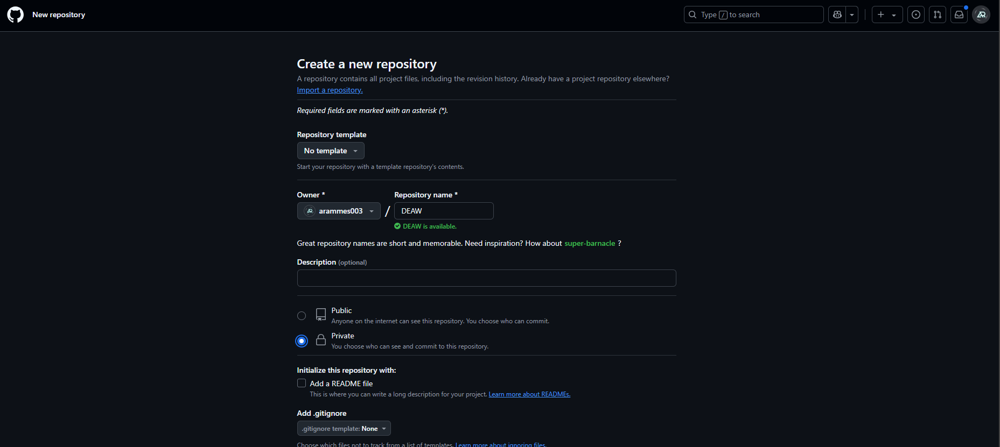
2. Clonamos el repositorio en nuestro sistema local con el enlace que nos genera el repositorio con `git clone https://github.com/TuUsuarioDeGit/DEAW.git`.
   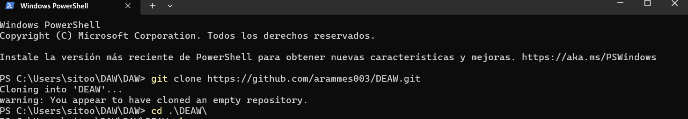

## 2.- Crear un README

En este paso lo único que tenemos que hacer es crear un README.md con `sudo nano`.
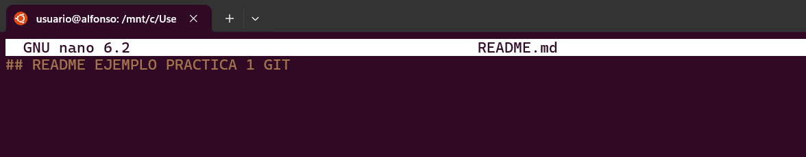

## 3.- Commit inicial

Realizamos un commit con el comentario `Comenzamos con los ejercicios de Git` con los siguientes comandos:

```bash
    git add README.md
    git commit -m "Comenzamos con los ejercicios de Git"
```

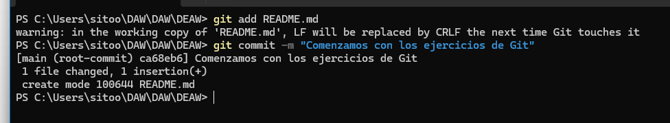

## 4.- Push inicial

1. Subimos los cambios al repositorio remoto con el comando `git push -u origin main`.
   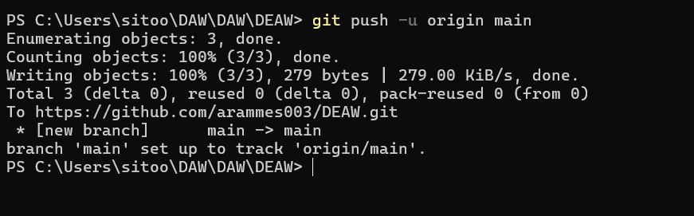

2. Accedemos a nuestra cuenta de **GitHub** y comprobamos que se han subido los cambios.
   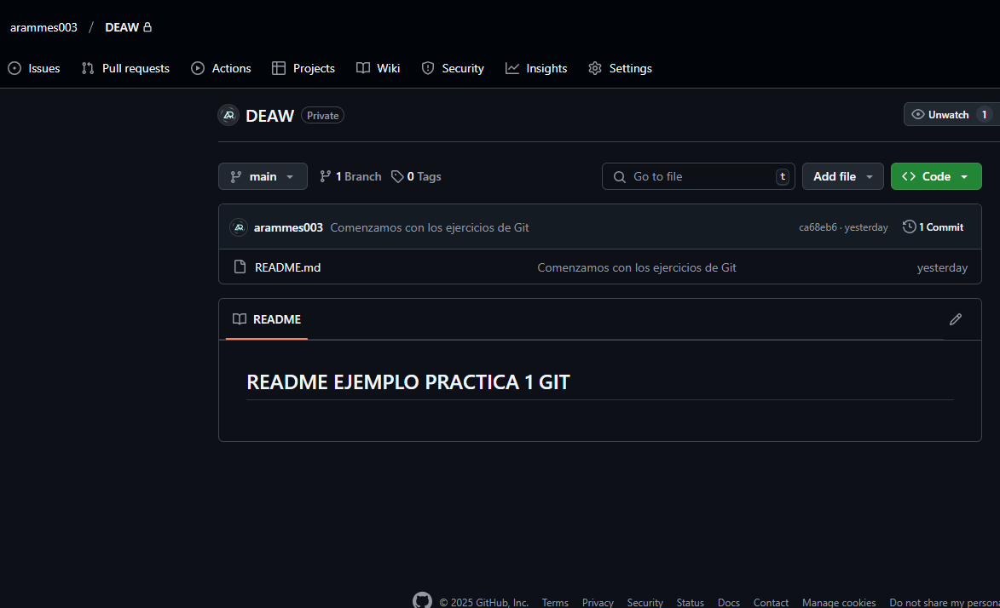

## 5.- Ignorar archivos

1. Creamos un archivo local llamado `privado.txt` dentro de nuestro repositorio con `nano privado.txt`.
   

2. Creamos una carpeta llamada `privada` con `mkdir privada`.
   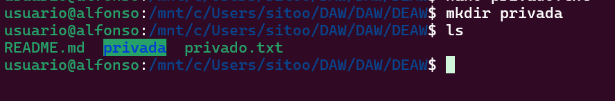
3. Ignoramos la subida del directorio y del fichero creando un fichero `nano .gitignore` dónde pondremos lo siguiente:

```bash
privado.txt
privada
```

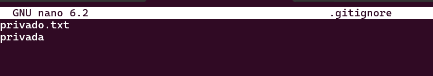

## 6.- Añadir fichero 1.txt

Para añadir un fichero al repositorio local tenemos que hacer lo siguiente:

1. Debemos crear el fichero con `nano 1.txt`.
   

2. Añadimos el fichero con `git add 1.txt`.
   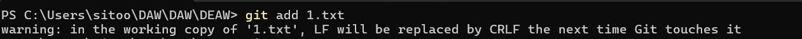

3. Vemos el estado de git con `git status`.
   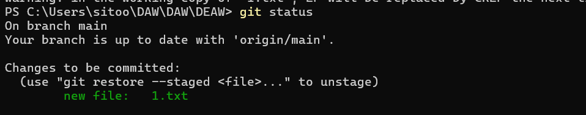

## 7.- Crear el tag v0.1

1. Creamos el tag con `git tag v0.1`.
   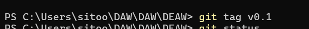

## 8.- Subir el tag v0.1

1. Creamos un commit con `git commit -m "Texto Descriptivo";
   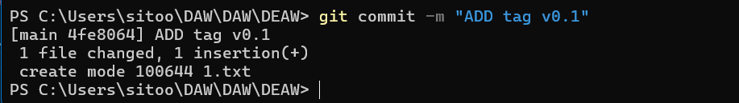

## 9.- Cuenta de GitHub

### 9.1.- Actualizar foto de perfil

Para ello, seguimos los siguientes pasos:

1. Entramos en github.
2. En la parte superior derecha encontramos un logo que es nuestro perfil.
3. Clicamos en tu perfil
4. Pulsamos sobre la imagen que sale y nos sale la opcion de cambiar avatar.
   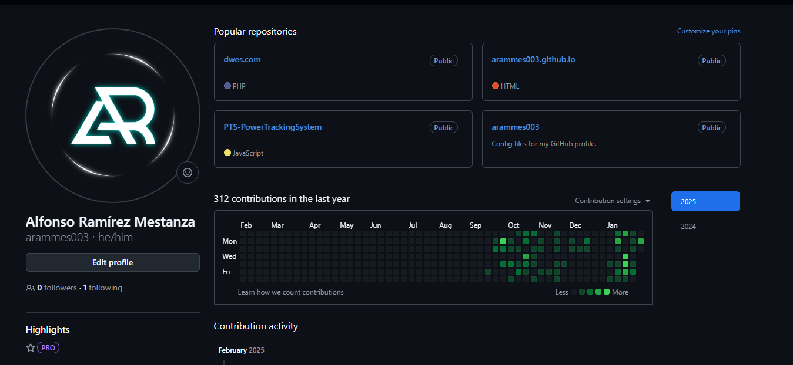

### 9.2.- Activar factor de doble autenticación

1. Accedemos a configuración.
2. Clicamos en contraseña y autenticación y pulsamos el boton de activar.
   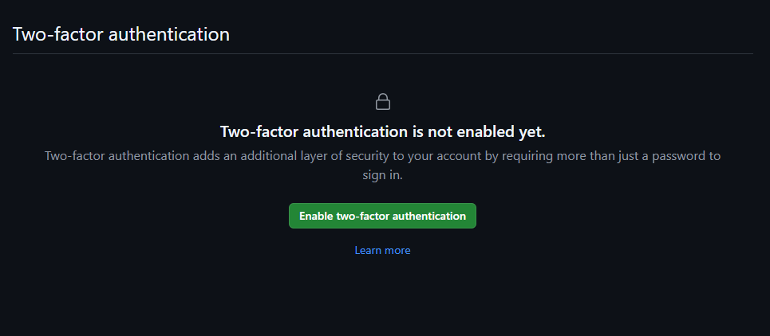
3. Nos pide nuestra contraseña de Github.
4. Seguimos una serie de pasos para activarlo.
5. Cuando acabemos nos aparecerá esta pantalla.
   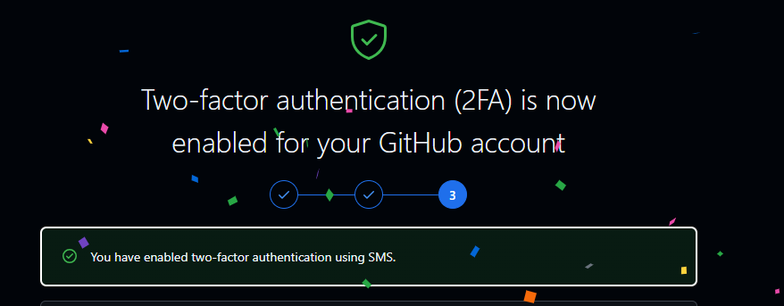
6. Ya tendríamos activado nuestro doble factor de autenticación.
   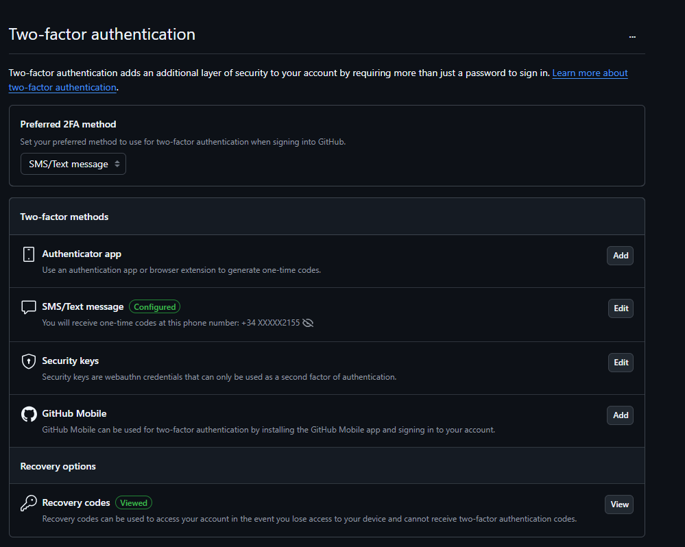

## 10.- Uso social de GitHub

### 10.1.- Seguir a 2 compañeros de clase

Para ello buscamos el nombre en la lupa.
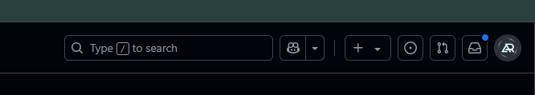

Y clicamos en seguir.
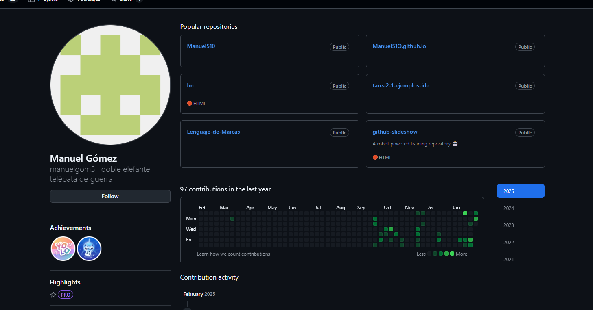
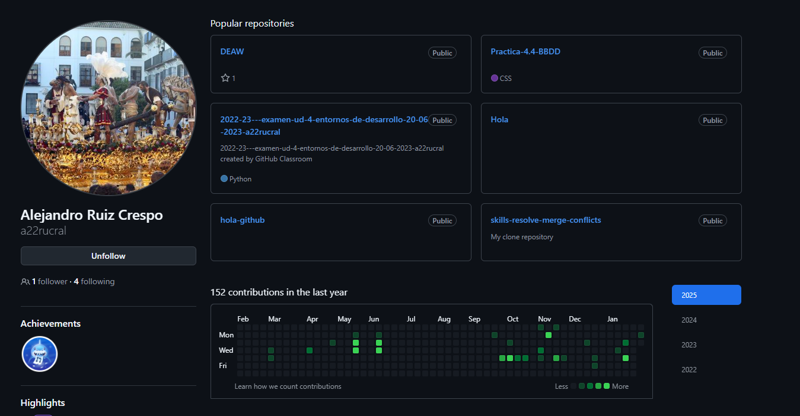

Desde nuestro perfil podemos ver a quien seguimos.
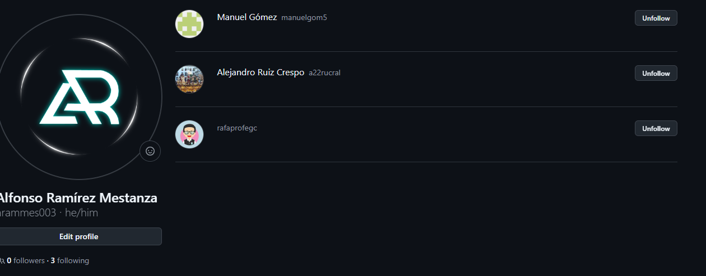

### 10.2.- Añadir una estrella a los repositorios DEAW de tus compañeros.

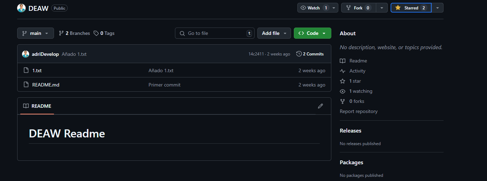

## 11.- Crear una tabla

Crear una tabla en el fichero `README.md` con la información de algunos de tus compañeros.
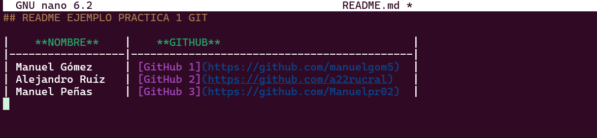

Añadimos el fichero a stash con `git add README.md`
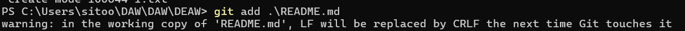

Creamos un commit con los cambios`git commit -m "Tabla en Git"`.
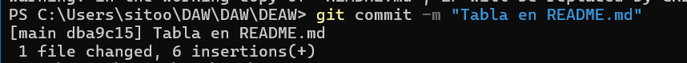

Subimos los cambios con `git push -u origin main`.
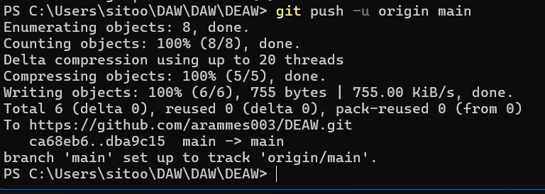

## 12.- Colaboradores

Aquí invitamos a un compañero a ser colaborador, para ello:

1. Accedemos al repositorio.
2. Accedemos a la configuración del repositorio.
3. Pulsamos en colabordores.
4. Pulsamos en añadir colabordores.
   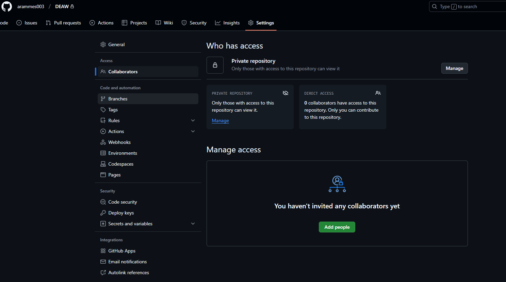
5. Añadimos el nombre de la persona.
   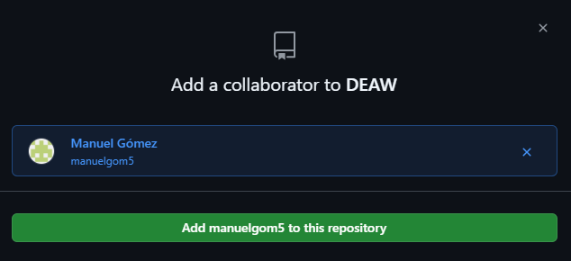
6. Le invitamos.
   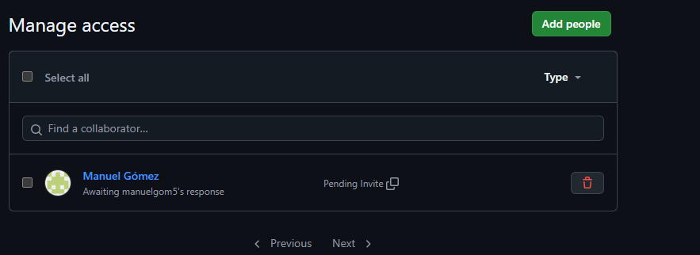

## 13.- Crear una rama v0.2

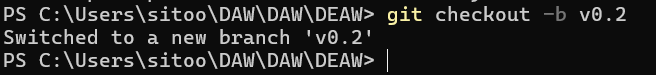

## 14.- Añadir fichero 2.txt

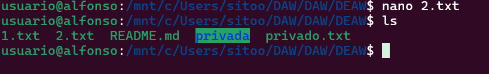

## 15.- Crear rama remota v0.2

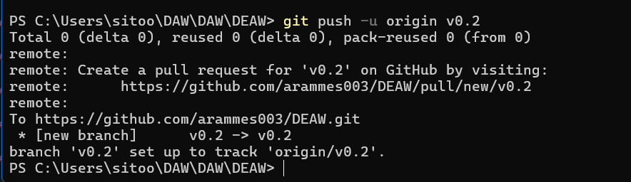
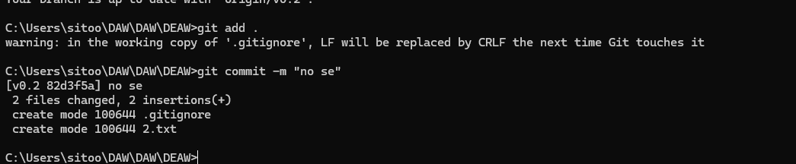
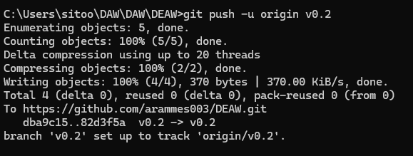

## 16.- Merge directo

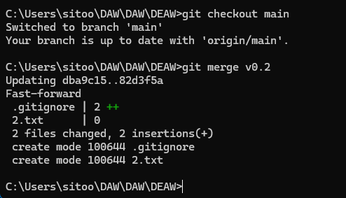

## 17.- Merge con conflicto

Para esto, ambas ramas tendrán que modificar el mismo archivo, para ello, modificaremos el fichero **1.txt**.

1. Desde la rama `main`, pondremos un texto, en mi caso **main**;
   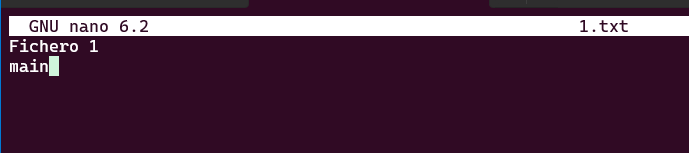
2. Hacemos commit:
   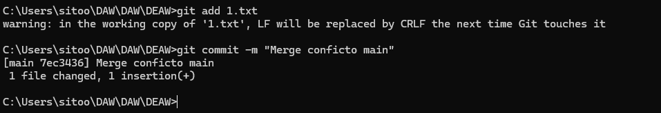
   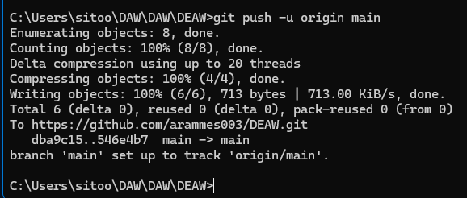

3. Desde la rama `v0.2`, pondremos **v0.2**;
   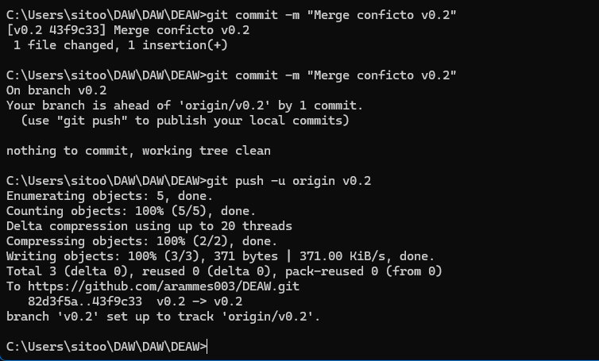

4. Hacemos un merge desde main:

## 18.- Listado de ramas

## 19.- Arreglar conflicto

## 20.- Borrar rama

## 21.- Listado de cambios
