# Práctica 6.1.- Dockerización del despliegue de una aplicación Node.js

## 1.- ¿Por qué dockerizar?

1. Permite una configuración rápida del entorno de forma local, ya que si todos los servicios están implementados en contenedores, es muy rápida la configuración del entorno.

2. Evitas gran parte de los problemas de desarrollo que provienen de la configuración de cada integrante del equipo de desarrollo tienen de su entorno.

3. Despliegues más rápidos.

4. Mejor control de versiones ya que se puede etiquetar con **tags**

5. Rollbacks más fáciles ya que tienen las cosas muy controladas debido a la versión y así es más fácil revertir el código.

6. Fácil configuración de múltiples entornos permitiendo establecer un entorno local, de integración, de puesta en escena y de producción. Esto se hace más fácil ya que la mayoría de veces simplemente con un cambio de VARIABLES DE ENTORNO lo tendremos desplegado.

7. Apoyo de la comunidad existe una fuerte comunidad que contribuyen con grandes imágenes que pueden ser utilizadas para el desarrollo.

## 2.- Despliegue con Docker

Primero nos conectamos desde nuestra máquina local a la virtual mediante **ssh usuario@direccionIp**.

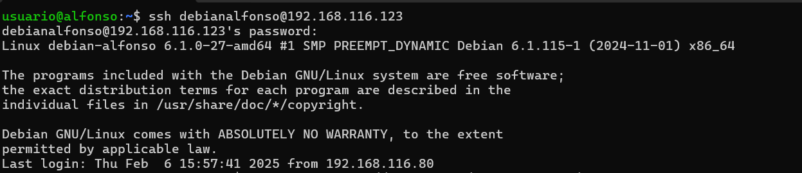

El primer paso será clonar el repositorio de git en caso de no tenerlo con: `git clone https://github.com/raul-profesor/DAW_practica_6.1_2024.git`.
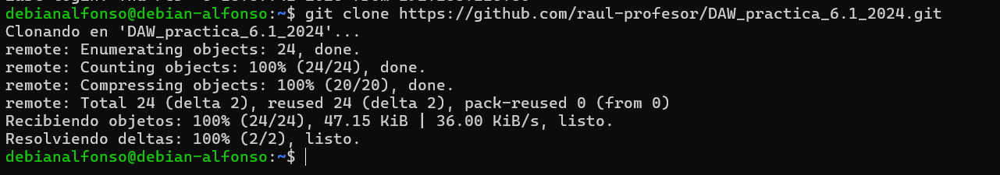

Después, entramos en la carpeta con `cd DAW_practica_6.1_2024` y `nano Dockerfile` para modificar los siguientes campos:

```bash
_____ node:18.16.0-alpine3.17

_____  mkdir -p /opt/app

_____ /opt/app #

_____ src/package.json src/package-lock.json .

_____ npm install

_____ src/ .

_____ 3000

_____ ["npm", "run", "start:dev"]
```

Después, completamos el fichero que debería quedar así:
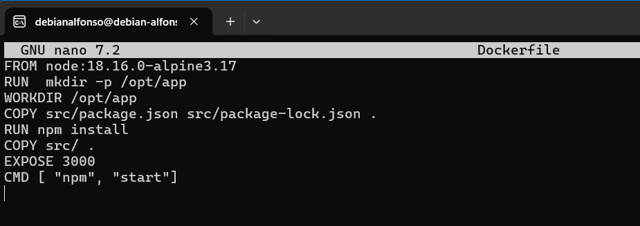

Ahora voy a explicar que es cada campo:

```bash
# Usamos la imagen de Node.js en Alpine
FROM node:18.16.0-alpine3.17

# Creamos el directorio de la aplicación
RUN mkdir -p /opt/app

# Definimos el directorio de trabajo
WORKDIR /opt/app

# Copiamos los archivos de las dependencias
COPY src/package.json src/package-lock.json ./

# Instalamos las dependencias
RUN npm install

# Copiamos el resto del código
COPY src/ .

# Usamos el puerto 3000 para acceder a la aplicación
EXPOSE 3000

# Comando por defecto para ejecutar la aplicación
CMD ["npm", "start"]
```

El siguiente paso es crear una build de la imagen de **Docker** con `docker build -t librodirecciones .`. Muy importante añadir el punto (.) al final para que se realice en el mismo directorio.
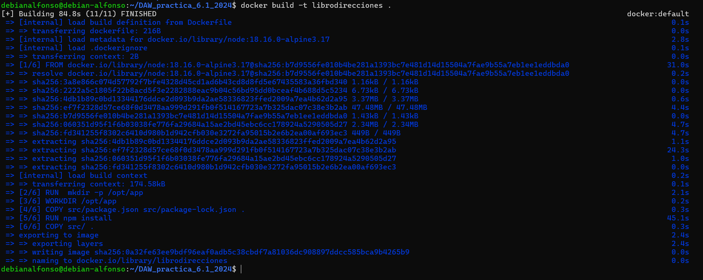

Por último iniciamos el contenedor con `docker run -p 3000:3000 -d librodirecciones`. Con el comando `-p`, indicamos que queremos que escuche todas las conexiones que ocurran desde el puerto 3000 y con la opción.
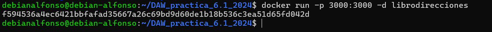

Accedemos desde nuestra máquina anfitriona a la dirección `direccionIpServidor:3000` y deberiamos ver lo siguiente:
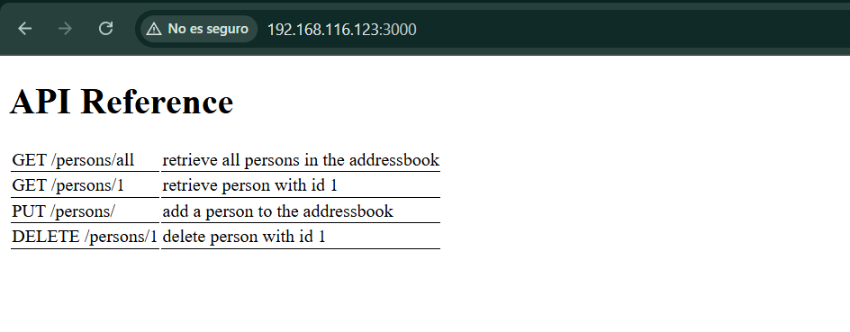

## 2.1.- Docker Compose

Este fichero sirve para gestionar aplicaciones en más de un contenedor, esto te permite:

- Iniciar y detener múltiples contenedores en secuencia.
- Conectar contenedores utilizando una red virtual.
- Manejar la persistencia de datos.
- Establecer variables de entorno.
- Construir o descargar imágenes de contenedores según sea necesario.

Este fichero tiene una extensión `YAML`, en nuestra aplicación es el siguiente:
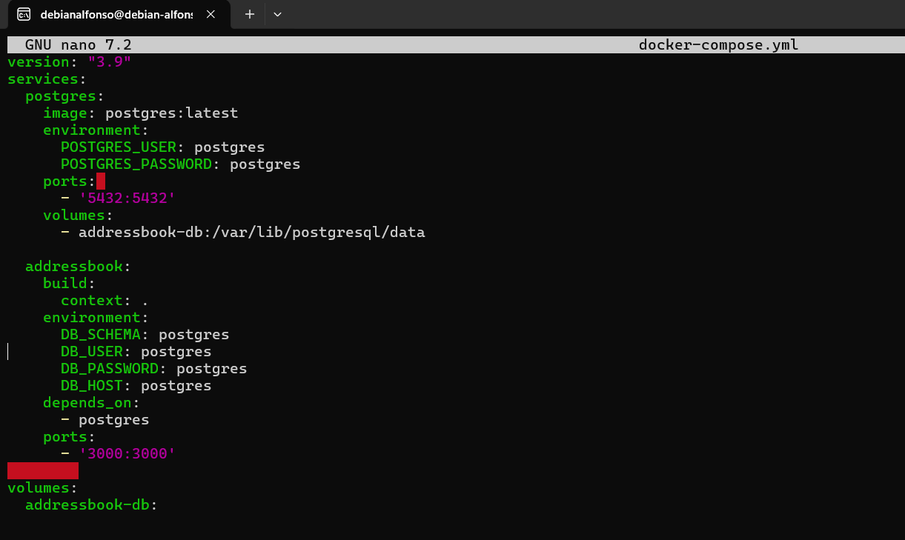

Para levantar nuestro docker-compose, simplemente lo hacemos con `docker compose run addressbook npm run migrate`. Con este comando se creará la base de datos con sus respectivas tablas.
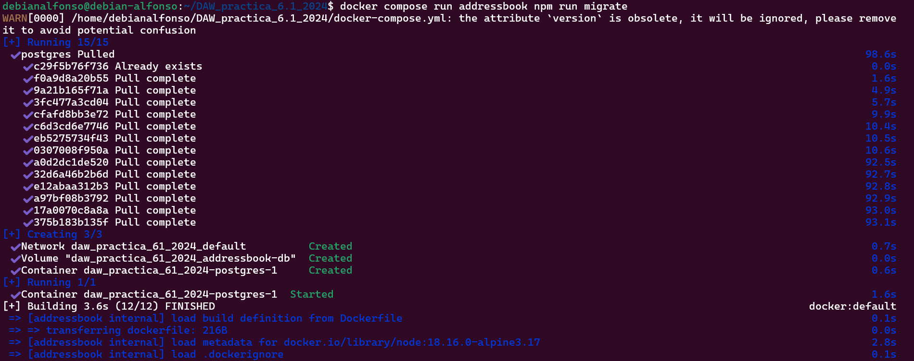
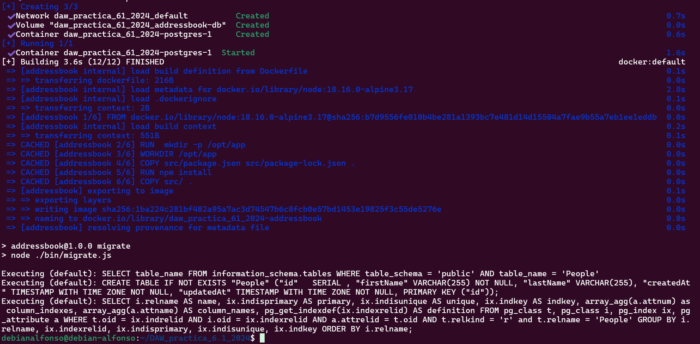

Y construimos los contenedores con `docker compose up --build -d`:
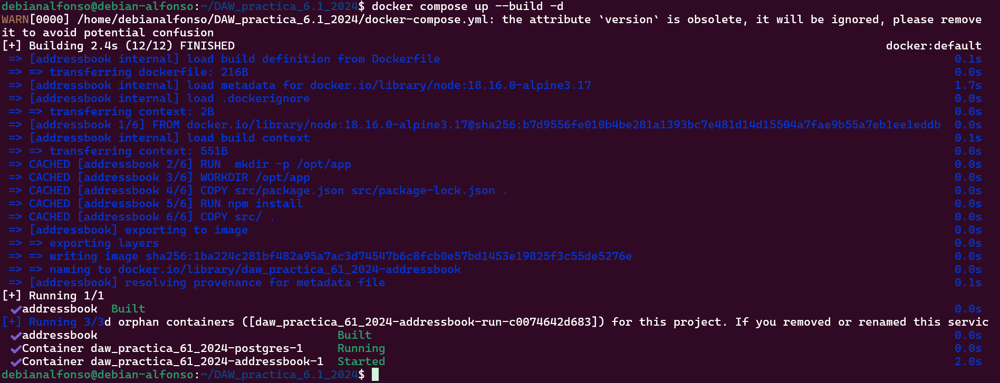

Levantamos el contenedor con `docker compose up -d`.
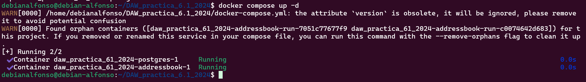

Podemos comprobar si los contenedores están levantados con `docker ps`;
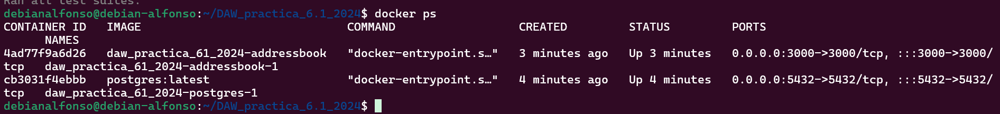

Hacemos unos test para comprobar que la aplicación funciona correctamente con `docker compose run addressbook npm test`. Este comando simulará ciertas peticiones de nuestra aplicación.
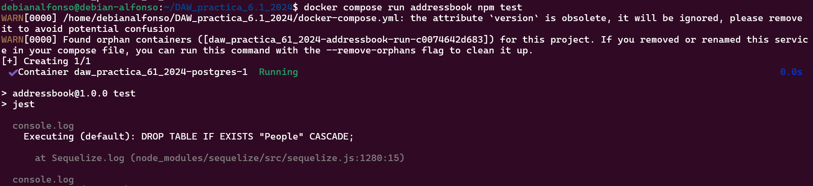
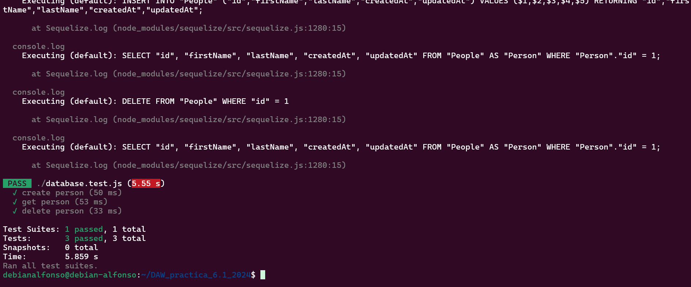

# 3.- Tarea

Probad que la aplicación junto con la BBDD funciona correctamente. El funcionamiento de la API es:

Para ello desde la terminal de nuestra máquina física hacemos las siguientes peticiones:

- `GET /persons/all` muestra todas las personas en el libro de direcciones.
  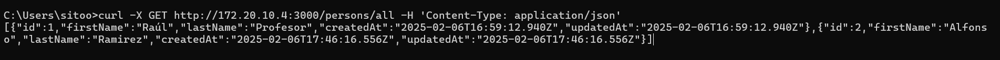

- `GET /persons/1` muestra la persona con el id 1.
  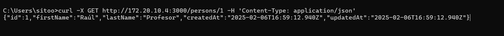

- `PUT /persons/` añade una persona al libro de direcciones.
  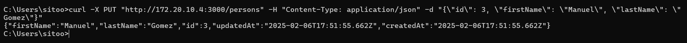

- `DELETE /persons/1` elimina a la persona con el id 1.
  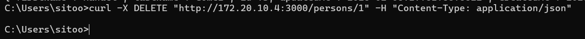
