# Práctica 6.2 - Despliegue de una aplicación PHP con Nginx y MySQL usando Docker y docker-compose

# 1.- Estructura de directorios

Cuando terminemos nuestra práctica, debería quedarnos la siguiente estructura:

```bash
/usuario/home/practica6-2/
├── docker-compose.yml
├── nginx
│   ├── default.conf
│   └── Dockerfile
├── php
│   └── Dockerfile
└── www
    └── html
        └── index.php
```

Para ello, empezamos creando todos los directorios y archivos de la siguiente forma:

```bash
mkdir practica6-2
cd practica6-2
touch docker-compose.yml
mkdir nginx
touch nginx/default.conf
touch nginx/Dockerfile
mkdir php
touch php/Dockerfile
mkdir www
mkdir www/html
touch www/html/index.php
```

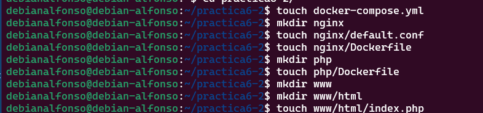

Ahora empezamos con la creación de cada archivo

# 2.- Creación de un contenedor Nginx

El primer paso será crear un contenedor de Nginx dentro de nuestro directorio `/practica6-2/docker-compose.yml` que permita gestionar nuestra aplicación PHP. Para ello lo editamos con `nano docker-compose.yml` y añadimos lo siguiente:

```bash
services:
    nginx:
      ./assets/practica6-2/image: nginx:latest
      container_name: nginx-container
      ports:
        - 80:80
```

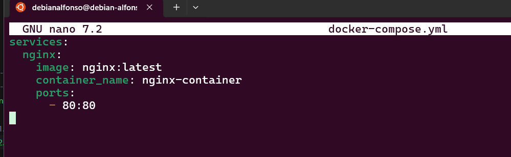

Con esto, creamos un archivo que se encarga de crear un contenedor de Nginx, que escuchará por el puerto 80 del contenedor y de nuestra máquina.

Guardamos los cambios y el siguiente paso es iniciar el proceso con `sudo docker-compose up -d`;
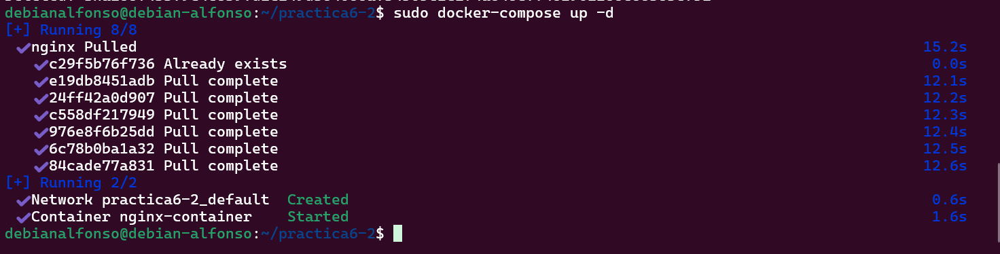

Tras la instalación, comprobamos si el contenedor esta activo con `docker ps`:
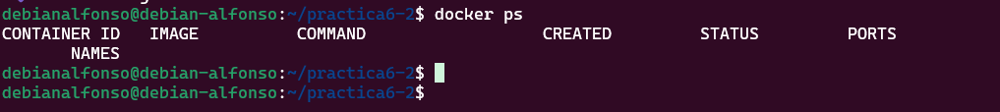

Ahora comprobamos que se ha creado el contenedor correctamente abriendo un navegador desde nuestra máquina física y accedemos a `http://IP_Maquina_Debian`, deberiamos ver un mensaje dando la bienvenida a Nginx:
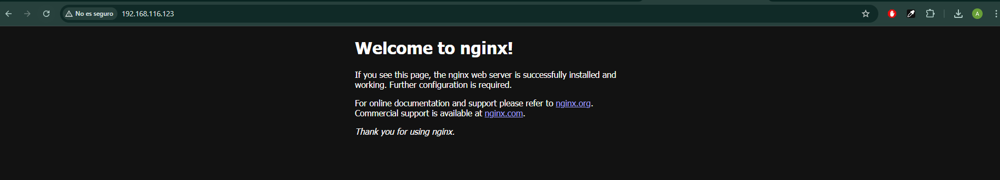

# 3.- Creación de un contenedor PHP

Ahora editamos el archivo `index.php` creado anteriormente, o si no lo has creado, lo creas en el directorio `/www/html/index.php` y añadimos lo siguiente:

```html
<!DOCTYPE html>
<head>
  <title>¡Hola mundo!</title>
</head>

<body>
  <h1>¡Hola mundo!</h1>
  <p><?php echo 'Estamos corriendo PHP, version: ' . phpversion(); ?></p>
</body>
```

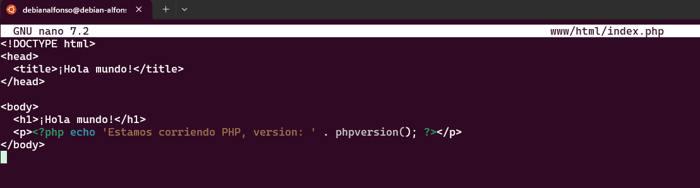

Guardamos el archivo y ahora editamos el archivo de configuración por defecto para que Nginx pueda correr nuestra aplicación, si no lo habias creado anteriormente, creamos el directorio nginx con `mkdir /practica6-2/nginx` y el archivo `nano practica6-2/nginx/default.conf`.

Dentro ponemos la siguiente configuración:

```bash
server {

     listen 80 default_server;
     root /var/www/html;
     index index.html index.php;

     charset utf-8;

     location / {
      try_files $uri $uri/ /index.php?$query_string;
     }

     location = /favicon.ico { access_log off; log_not_found off; }
     location = /robots.txt { access_log off; log_not_found off; }

     access_log off;
     error_log /var/log/nginx/error.log error;

     sendfile off;

     client_max_body_size 100m;

     location ~ .php$ {
      fastcgi_split_path_info ^(.+.php)(/.+)$;
      fastcgi_pass php:9000;
      fastcgi_index index.php;
      include fastcgi_params;
      fastcgi_param SCRIPT_FILENAME $document_root$fastcgi_script_name;
      fastcgi_intercept_errors off;
      fastcgi_buffer_size 16k;
      fastcgi_buffers 4 16k;
    }

     location ~ /.ht {
      deny all;
     }
    }
```

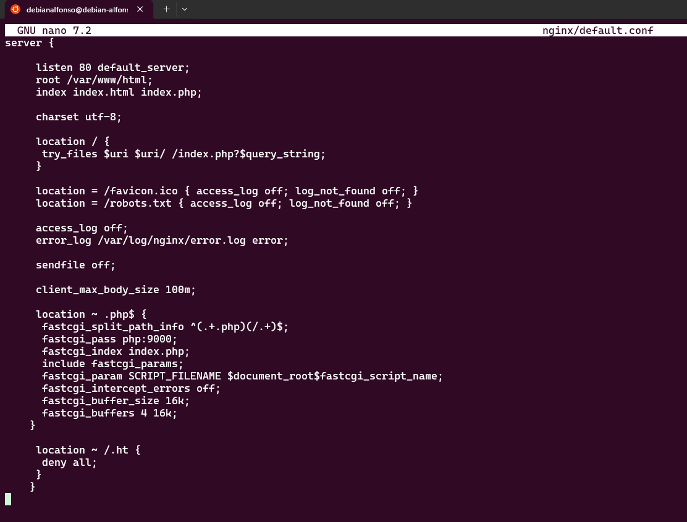

Guardamos el archivo y ahora editamos el archivo `Dockerfile`, que si no lo hemos creado antes, lo creamos con `nano /practica6-2/nginx/Dockerfile`. Y dentro del archivo ponemos lo siguiente:
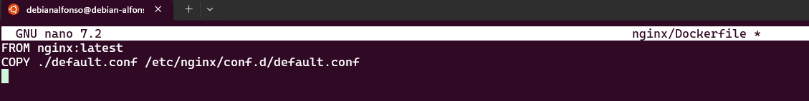

Perfecto, tras ese paso modificamos el archivo `docker-compose.yml` donde crearemos un nuevo contenedor PHP en el puerto 9000, que a su vez esté enlazado con el contenedor nginx, añadimos lo siguiente al fichero que anteriormente ya creamos:

```bash
services:
  nginx:
    build: ./nginx/
    container_name: nginx-container
    ports:
      - 80:80
    links:
      - php
    volumes:
      - ./www/html/:/var/www/html/

  php:
    ./assets/practica6-2/image: php:7.0-fpm
    container_name: php-container
    expose:
      - 9000
    volumes:
      - ./www/html/:/var/www/html/
```

Quedaría así:
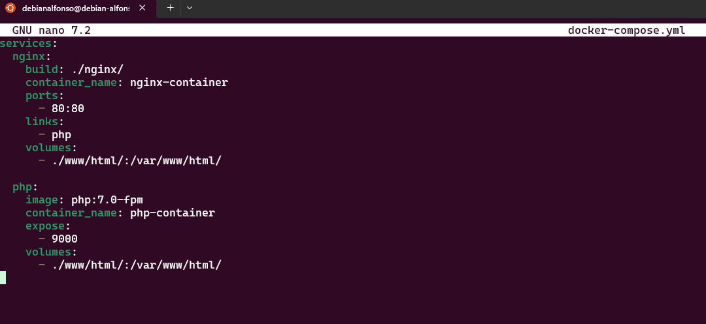

El siguiente paso será ejecutar otro `docker-compose up -d` para que se cree el nuevo contenedor y se modifique el anterior, muy importante ejecutarlo en el directorio donde está el archivo `docker-compose.yml`, que en este caso es `/practica6-2/docker-compose.yml`;
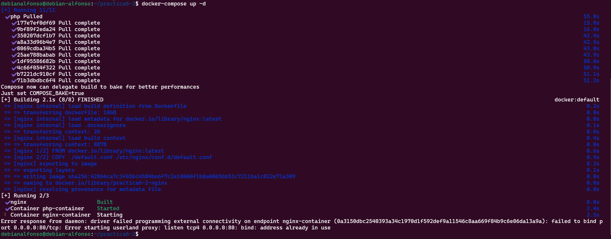

En este caso nos ha dado un error de que el puerto 80 ya está en uso, para solucionarlo, ejecutamos el comando ` sudo lsof -i :80`, este comando nos muestra los procesos que están usando ese puerto:
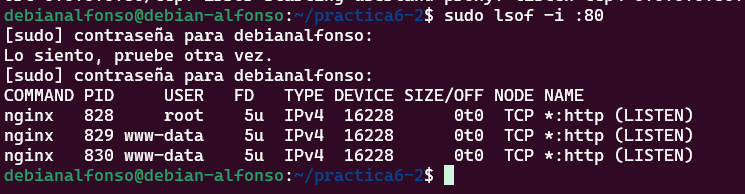

Cogemos el **PID** del proceso general y ejecutamos un `sudo kill PID`:


Tras ejecutar esto, hacemos otro `docker-compose up -d` para asegurarnos de que se ha creado correctamente:
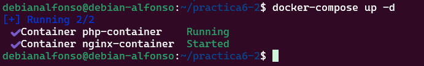

Ejecutamos un `docker ps` para ver los contenedores que están activos:
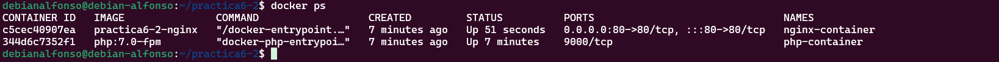

Ahora volvemos a acceder a `http://IP_Maquina_Debian` y deberemos ver el mensaje que pusimos en nuestro `index.php`
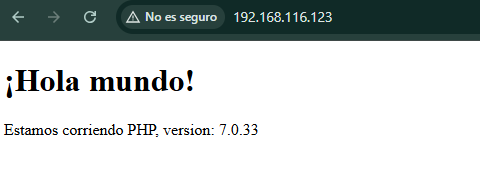

# 4.- Creación de un contenedor para datos

En este paso crearemos un contenedor independiente que se encargará de guardar todos los datos el cuál enlazamos con los demás contenedores. Para ello, editamos otra vez el fichero `docker-compose.yml` y añadimos lo siguiente:

```bash
services:
    nginx:
    build: ./nginx/
    container_name: nginx-container
    ports:
        - 80:80
    links:
        - php
    volumes_from:
        - app-data

    php:
    ./assets/practica6-2/image: php:7.0-fpm
    container_name: php-container
    expose:
        - 9000
    volumes_from:
        - app-data

    app-data:
    ./assets/practica6-2/image: php:7.0-fpm
    container_name: app-data-container
    volumes:
        - ./www/html/:/var/www/html/
    command: "true"
```

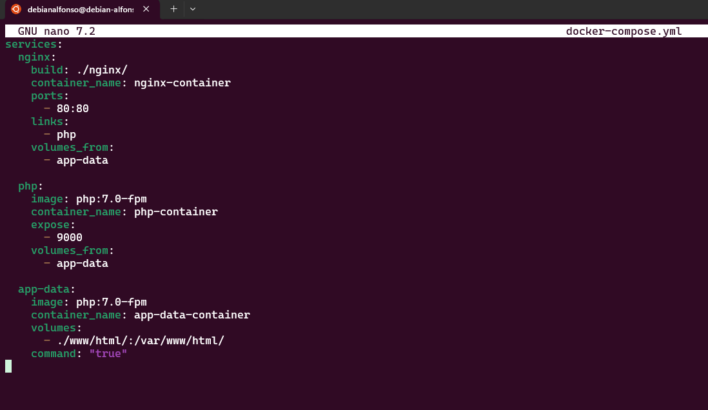

Ejecutamos otro `docker-compose up -d`.
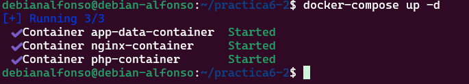

Y verificamos que estan activos, deberiamos ver algo como lo siguiente:
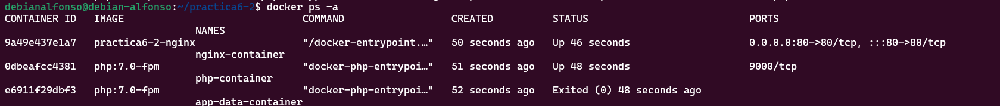

# 5.- Creación de un contenedor MySQL

Ahora vamos a crear un contenedor MySQL el cuál enlazaremos con los demás contenedores que hemos creado. Para esto, el primer paso será modificar la imagen PHP de nuestro Docker, instalando la extensión de MySQL para PHP, para ello, editamos el archivo `practica6-2/php/Dockerfile` y ponemos lo siguiente:

```bash
FROM php:7.0-fpm
RUN docker-php-ext-install pdo_mysql
```

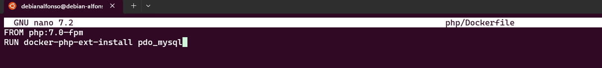

Tras esto, volvemos a editar el fichero `docker-compose.yml` para crear un contenedor MySQL y otro que contenga toda la información de la base de datos y las tablas, es decir, todos los datos. Dejaremos el fichero de la siguiente forma:

```bash
services:
  nginx:
    build: ./nginx/
    container_name: nginx-container
    ports:
      - 80:80
    links:
      - php
    volumes_from:
      - app-data
  php:
    build: ./php/
    container_name: php-container
    expose:
      - 9000
    links:
      - mysql
    volumes_from:
      - app-data

  app-data:
    ./assets/practica6-2/image: php:7.0-fpm
    container_name: app-data-container
    volumes:
      - ./www/html/:/var/www/html/
    command: "true"

  mysql:
    ./assets/practica6-2/image: mysql:5.7
    container_name: mysql-container
    volumes_from:
      - mysql-data
    environment:
      MYSQL_ROOT_PASSWORD: secret
      MYSQL_DATABASE: mydb
      MYSQL_USER: myuser
      MYSQL_PASSWORD: password

  mysql-data:
    ./assets/practica6-2/image: mysql:5.7
    container_name: mysql-data-container
    volumes:
      - /var/lib/mysql
    command: "true"
```

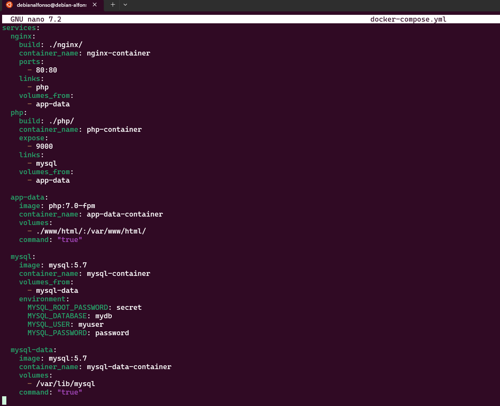

Cuando ya tengamos guardados los cambios, procedemos a editar el archivo `index.php` incluyendo cambios para comprobar que se conecta correctamente a la base de datos.

Deberá verse así:

```html
     <!DOCTYPE html>
     <head>
      <title>¡Hola mundo!</title>
     </head>

     <body>
      <h1>¡Hola mundo!</h1>
      <p><?php echo 'Estamos corriendo PHP, version: ' . phpversion(); ?></p>
      <?
       $database ="mydb";
       $user = "myuser";
       $password = "password";
       $host = "mysql";

       $connection = new PDO("mysql:host={$host};dbname={$database};charset=utf8", $user, $password);
       $query = $connection->query("SELECT TABLE_NAME FROM information_schema.TABLES WHERE TABLE_TYPE='BASE TABLE'");
       $tables = $query->fetchAll(PDO::FETCH_COLUMN);

        if (empty($tables)) {
          echo "<p>No hay tablas en la base de datos \"{$database}\".</p>";
        } else {
          echo "<p>La base de datos \"{$database}\" tiene las siguientes tablas:</p>";
          echo "<ul>";
            foreach ($tables as $table) {
              echo "<li>{$table}</li>";
            }
          echo "</ul>";
        }
        ?>
    </body>
</html>
```

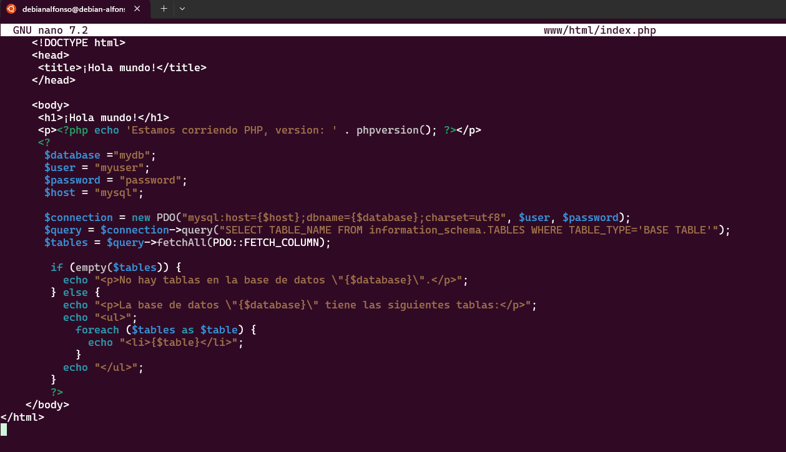

Tras guardar estos cambios, volvemos a lanzar los contenedores otra vez con `docker-compose up -d`.
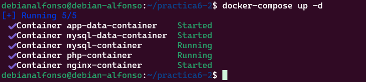

Y comprobamos que se están ejecutando con `docker ps -a`:
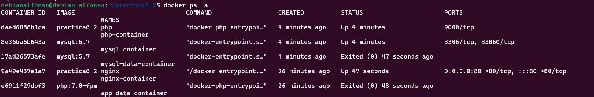

# 6.- Verificación de conexión a la base de datos

Accedemos a `http://Ip_Maquina_Debian` y deberemos ver lo siguiente:
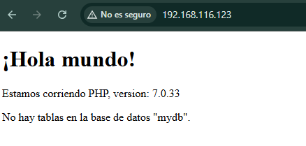

Como se puede ver no aparecen tablas para la base de datos, esto se debe a que las tablas no son visibles para un usuario normal, por lo que debemos cambiar el `$user` por `root` y `$password` por `secret` en el archivo `index.php`, quedaría así:

```html
     <!DOCTYPE html>
     <head>
      <title>¡Hola mundo!</title>
     </head>

     <body>
      <h1>¡Hola mundo!</h1>
      <p><?php echo 'Estamos corriendo PHP, version: ' . phpversion(); ?></p>
      <?
       $database ="mydb";
       $user = "root";
       $password = "secret";
       $host = "mysql";

       $connection = new PDO("mysql:host={$host};dbname={$database};charset=utf8", $user, $password);
       $query = $connection->query("SELECT TABLE_NAME FROM information_schema.TABLES WHERE TABLE_TYPE='BASE TABLE'");
       $tables = $query->fetchAll(PDO::FETCH_COLUMN);

        if (empty($tables)) {
          echo "<p>No hay tablas en la base de datos \"{$database}\".</p>";
        } else {
          echo "<p>La base de datos \"{$database}\" tiene las siguientes tablas:</p>";
          echo "<ul>";
            foreach ($tables as $table) {
              echo "<li>{$table}</li>";
            }
          echo "</ul>";
        }
        ?>
    </body>
</html>
```

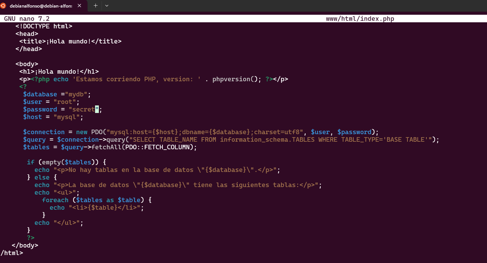

Tras guardar los cambios, volvemos a acceder al navegador y veremos como aparecen todas las tablas:
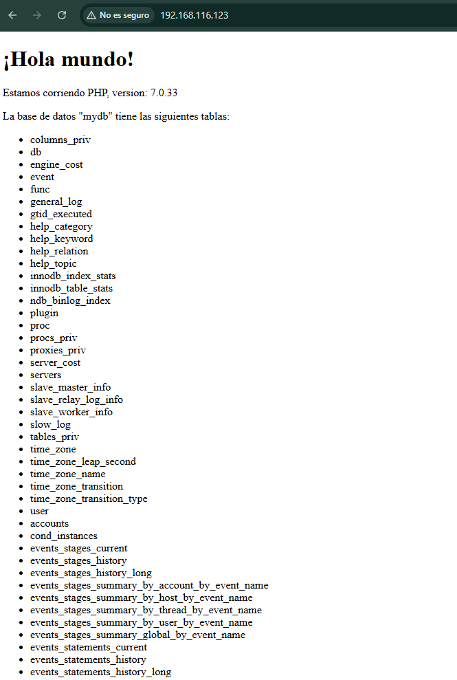

# 7.- Esquema de la infraestructura completa de contenedores

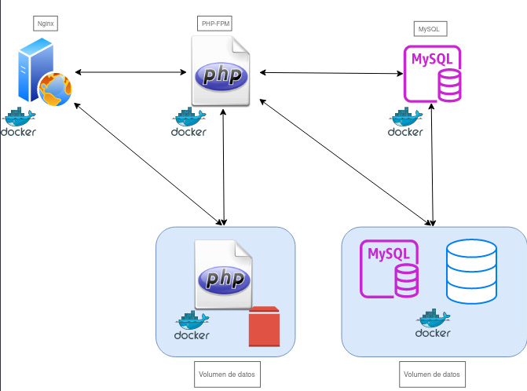
