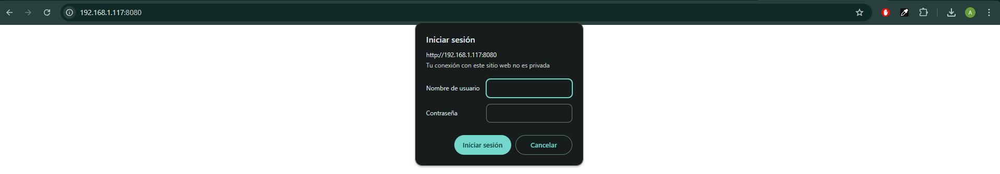

# Práctica 6.3 - Despliegue de servidores web con usuarios autenticados mediante LDAP usando Docker y docker-compose

## 1.- Despliegue con Docker de NGINX + demonio de autenticación LDAP + OpenLDAP

1. En primer lugar debemos conectarnos mediante SSH a nuestra máquina Debian con el comando `ssh nombreDebian@direccionIpDebian`.
   

2. Para la creación de esta práctica crearemos un directorio, en mi caso llamado **practica6-3**:
   

3. El primer paso para realizar este despliegue, será crear un directorio dentro del que hemos creado anteriormente llamado `app`:
   

4. El segundo paso es crear un fichero con `nano nombreHtml.html` que contenga un **html** sencillo, dentro del directorio `app` que acabamos de crear:

```html
<html>
  <body>
    <h1>¡Hola Mundo!</h1>
  </body>
</html>
```


5. Después, creamos otro directorio por ejemplo **conf** en la ruta `practica6-3/conf` donde guardemos la configuración de **Nginx**.
   

6. Y creamos un fichero llamado **ldap_nginx.conf** con la siguiente configuración:

```bash
    server {
      listen 8080;

      location = / {
         auth_request /auth-proxy;
      }

      location = /auth-proxy {
         internal;

         proxy_pass http://nginx-ldap:8888;

         # URL y puerto para conectarse al servidor LDAP
         proxy_set_header X-Ldap-URL "ldap://openldap:1389";

         # Base DN
         proxy_set_header X-Ldap-BaseDN "dc=example,dc=org";

         # Bind DN
         proxy_set_header X-Ldap-BindDN "cn=admin,dc=example,dc=org";

         # Bind password
         proxy_set_header X-Ldap-BindPass "adminpassword";
      }
   }
```

En este fichero básicamente configuramos lo siguiente:

- Escuchamos las peticiones a través del puerto 8080.
- Que cuando se acceda al sitio web, se solicite autorización en el directorio del sitio web llamado /auth-proxy
- Se crea un nuevo location para ese directorio /auth-proxy y que es donde se realizará la configuración de cómo conectarnos a nuestro openldap, de acuerdo con la documentación oficial de Nginx a propósito de su módulo de autenticación:
- Se indica la URL de nuestro openldap (es el nombre del contenedor que hemos levantado, ya que Docker tiene un DNS propio entre sus contenedores).
- El DN (Nombre distinguido) base sobre el que se realizarán las búsquedas en openldap.
- El usuario y contraseña con el que nos conectaremos.


7. Y creamos el `docker-compose.yml` en la ruta `practica6-3` que contiene toda la información para desplegar un contenedor de LDAP:

```bash
version: '2'

services:
  nginx-ldap:
    ./assets/practica6-3/image: bitnami/nginx-ldap-auth-daemon-archived
    ports:
      - 8888:8888
  nginx: #
    ./assets/practica6-3/image: bitnami/nginx
    ports:
     - 8080:8080
    volumes:
     - ./app:/app
     - ./conf/ldap_nginx.conf:/opt/bitnami/nginx/conf/server_blocks/ldap_nginx.conf
  openldap:
    ./assets/practica6-3/image: bitnami/openldap
    ports:
      - '1389:1389'
    environment:
      - LDAP_ADMIN_USERNAME=admin
      - LDAP_ADMIN_PASSWORD=adminpassword
      - LDAP_USERS=customuser
      - LDAP_PASSWORDS=custompassword
```


8. Y ejecutamos un `docker-compose up -d` para crear el contenedor con el servicio:
   

9. En caso de que el puerto ya este en uso de anteriores prácticas, lo que debemos hacer es identificar los procesos que lo están usando mediante el comando `sudo lsof -i :8080` y matarlo con `sudo kill numeroPID`:
   

10. Volvemos a ejecutar el `docker compose up -d` para asegurarnos de que los contenedores se han creado correctamente:
    

11. Ahora, desde nuestra máquina accedemos a `http://IpMaquinaDebian:8080` y deberá aparecernos un mensaje de alerta para identificarnos con las credenciales asignadas anteriormente en el fichero **docker-compose.yml** :
    

12. Después de poner el usuario y contraseña debemos ver el contenido del archivo html que creamos anteriormente:
    

## 2.- Despliegue con Docker de PHP + Apache con autenticación LDAP

1. Dentro del directorio `practica6-3`, creamos un fichero llamado `index.php` con el siguiente mensaje:

```php
<?php
    echo 'Ey, hola usuario autenticado por LDAP!';
?>
```


2. Tras esto, creamos un directorio llamado `Docker` dentro de `practica6-3` y dentro un archivo `Dockerfile` con el siguiente contenido:

```bash
# Imagen base sobre la que vamos a trabajar
FROM php:7-apache

# Activamos el módulo LDAP de Apache ejecutand el siguiente comando
RUN a2enmod authnz_ldap

# Añadimos las reglas/configuración de LDAP al directorio conf-enabled de Apache
# (crearemos este archivo en el siguiente paso)
COPY docker/ldap-demo.conf /etc/apache2/conf-enabled/

# Añadimos ayuda de depuración (debugging) en la configuración de apache
# En caso de necesitarlo, lo descomentamos para ejecutar el siguiente comando
# ____ echo "LogLevel debug" >> apache2.conf

# Establecemos el directorio de trabajo adecuado
WORKDIR /var/www/html/demo


# Configuramos Apache para usar la configuración ldap definida arriba, la copiamos de nuestro ordenador al contenedor
COPY docker/.htaccess ./.htaccess

#  Copiamos los archivos del proyecto que necesitamos, al contenedor
COPY index.php ./
```


3. Ahora, dentro del directorio `Docker`, creamos otro fichero que va a contener la configuración LDAP, llamado `ldap-demo.conf`. Dentro del fichero vamos a establecer los criterios de conexión con el contenedor que hemos creado de `OpenLDAP, contraseña y URL`.

```bash
PassEnv LDAP_BIND_ON
PassEnv LDAP_PASSWORD
PassEnv LDAP_URL
<AuthnProviderAlias ldap demo>
    AuthLDAPBindDN ${LDAP_BIND_ON}
    AuthLDAPBindPassword ${LDAP_PASSWORD}
    AuthLDAPURL ${LDAP_URL}
</AuthnProviderAlias>
```


Gracias a las directivas `PassEnv`, podemos omitir la declaración de nuestras credenciales y pasarlas como variables de entorno en el momento de iniciar la imagen del contenedor.

4. Tras esto, creamos otro archivo en el directorio `docker` llamado `.htaccess` con lo siguiente:

```bash
# .Docker/.htaccess
AuthBasicProvider demo
AuthType Basic
AuthName "Protected Area"
Require valid-user
```


5. Al haber realizado todos estos pasos y comprobar que los datos son correctos, ejecutamos el comando `docker build . -t docker-ldap -f ./docker/Dockerfile` para construir la imagen:
   

6. Si todo ha ido bien, podremos levantar el contenedor con el comando:

```bash
docker run \
 -p 3000:80 \
 --name ldap_demo \
 -e LDAP_BIND_ON='uid=admin,cn=users,cn=accounts,dc=demo1,dc=freeipa,dc=org' \
 -e LDAP_PASSWORD='Secret123' \
 -e LDAP_URL='LDAP://ipa.demo1.freeipa.org' \
 docker-ldap
```


7. Por último, accedemos a `http://IpMaquina:3000/demo` desde nuestra máquina y deberemos ver un mensaje solicitando las creedenciales que hemos puesto para levantar el contenedor para loguearnos en el servidor openldap:

```bash
Usuario: admin
Password: Secret123
```


8. Tras loguearnos, veremos el contenido del archivo .php que creamos:
   

9. Nuestro directorio debe haber quedado de la siguiente forma:
   
