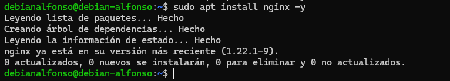
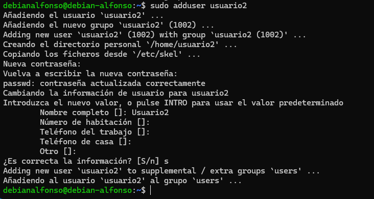
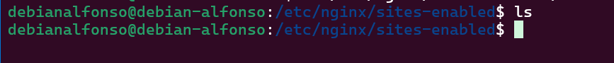
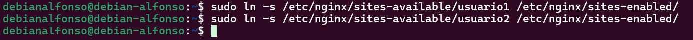
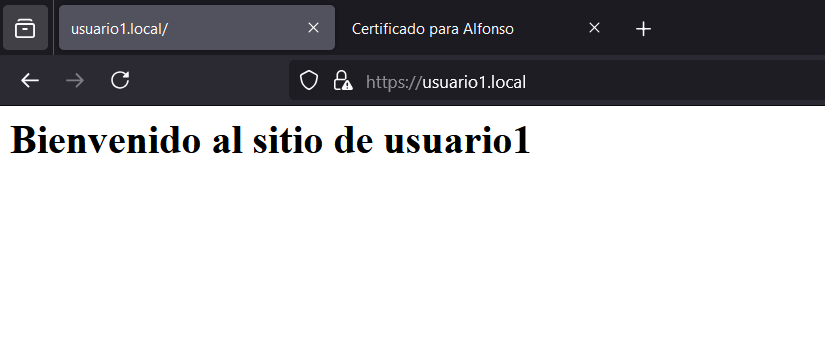

# Práctica de Amplicación.- Configuración de un servidor Nginx con Hosts Virtuales y directorios de usuario

El fin de esta práctica es configurar un servidor Nginx que utilice hosts virtuales para alojar múltiples sitios web en un mismo servidor y que a su vez, cada host virtual apunte al directorio **public_html** de distintos usuarios del sistema operativo Debian. De esta manera, cada usuario podrá gestionar su propio sitio web desde su carpeta personal.

Antes de empezar a seguir los pasos para esta configuración, nos conectaremos mediante `SSH` desde nuestra máquina a la máquina Debian. Para ello usamos el comando `ssh nombreUsuario@direccionIP`.<br>


# 1.- Instalación de Nginx

El primer paso para instalar **nginx** es actualizar los repositorios del sistema mediante `sudo apt update` y `sudo apt upgrade`.<br>


Para instalar nginx usamos el comando `sudo apt install nginx -y`. <br>


Iniciamos el servicio con `sudo systemctl start nginx` y despues verificamos que esté funcionando correctamente con `sudo systemctl status nginx`.<br>


Si esta todo bien, veremos un mensaje en color **verde**, que pondra `active(running)`.

# 2.- Creación de usuarios del sistema.

En este paso, crearemos dos usuarios con contraseñas seguras con el comando `sudo adduser nombreUsuario`, en mi caso sera `usuario` y ` usuario2`.<br>



# 3.- Estructura de carpetas y Archivos.

1. El primer paso será crear la carpeta `public_html` en los directorios de cada usuario con `sudo mkdir /home/nombreUsuario/public_html`.<br>
   

2. Después, asignamos los permisos a cada usuario sobre su directorio con el comando `sudo chown -R nombreUsuario:nombreUsuario /home/nombreUsuario/public_html` y `sudo chmod 755 /home/nombreUsuario`. Este proceso hay que hacerlo con ambos usuarios.<br>
   

3. Por último, creamos una página web de prueba en la carpeta `public_html` de cada usuario. Para ello, cambiamos de usuario con `su nombreUsuario` y creamos el archivo de la página web con el comando `echo "<h1>Bienvenido al sitio de nombreUsuario</h1>" > /home/nombreUsuario/public_html/index.html`. Este proceso lo repetimos con ambos usuarios.
   
   

# 4.- Configuración básica de Nginx

En este paso borraremos los sitios habilitados en nuestro servidor de **Nginx** para evitar posibles conflictos. En caso de haber hecho una instalación limpia, solamente tendremos que borrar `default` con el comando `sudo rm /etc/nginx/sites-enabled/default`.<br>


Podemos verificar si se ha borrado correctamente con el comando `ls`.<br>


# 5.- Creación de host virtuales

## 5.1.- Creación de archivos de configuración

Aquí crearemos dos archivos de configuración de host virtual en `/etc/nginx/sites-available/`, uno para cada usuario. Para ello usamos el comando `sudo nano /etc/nginx/sites-available/nombreDescriptivo`.<br>

Se nos abrirá una ventana vacía donde tendremos que implementar la siguiente configuración: <br>

```
server {
    listen 80;
    server_name usuario1.local;

    root /home/usuario1/public_html;
    index index.html;

    location / {
        try_files $uri $uri/ =404;
    }
}
```


Ahora realizamos los mismos pasos para el segundo usuario.<br>


## 5.2.- Habilitar los enlaces simbólicos

En este paso crearemos los enlaces simbólicos de ambas páginas con `sudo ln -s sudo ln -s /etc/nginx/sites-available/nombreUsuario /etc/nginx/sites-enabled/`. Con este comando habilitamos nuestra página.<br>


Verificamos la configuracion con `sudo nginx -t` para asegurarnos que no hay errores.<br>


Y por ultimo, reiniciamos **Nginx** con `sudo systemctl restart nginx`.<br>


# 6.- Configuración del archivo host

Para que nuestras páginas funcionen, deberemos editar nuestro fichero `hosts` en tu sistema local para poder resolver los dominios creados y así poder acceder. En Windows, editamos `C:\Windows\System32\drivers\etc\hosts.` y ponemos lo siguiente:<br>


Guardamos los cambios y accedemos a nuestro navegador para ver el contenido: <br>


# 7.- Implementación de conexión segura

Ahora que sabemos que podemos acceder a nuestros sitios webs, los modificaremos para acceder mediante `HTTPS`, para ello, lo primero que tendremos que hacer es generar un `certificado SSL`, para ello lo primero que hacemos es crearnos un directorio donde guardarlos con `sudo mkdir /etc/nginx/ssl`.<br>


Después, nos creamos nuestro certificado ssl con: <br>

```
sudo openssl req -x509 -nodes -days 365 -newkey rsa:2048 \
  -keyout /etc/nginx/ssl/nginx-selfsigned.key \
  -out /etc/nginx/ssl/nginx-selfsigned.crt
```

En el proceso de creación, nos pedirá distintos datos para la creación del certificado.<br>


## 7.1.- Modificación de los archivos de configuración

Ahora actualizamos la configuración de los hosts virtuales con `sudo nano /etc/nginx/sites-available/nombreArchivo` donde introduciremos una nueva sección para agregar el bloque `HTTPS`.<br>

```
server {
    listen 443 ssl;
    server_name usuario1.local;

    ssl_certificate /etc/nginx/ssl/nginx-selfsigned.crt;
    ssl_certificate_key /etc/nginx/ssl/nginx-selfsigned.key;

    root /home/usuario1/public_html;
    index index.html;

    location / {
        try_files $uri $uri/ =404;
    }
}
```

Quedaría de la siguiente manera:<br>


Ahora repetimos el proceso con el otro archivo de configuración.<br>


Verrificamos la configuración de **Nginx** con `sudo nginx -t` y lo reiniciamos con `sudo systemctl restart nginx`.<br>


Lo último es probar los cambios, para ello accedemos a nuestro navegador y visitamos `https://usuario1.local` y `https://usuario2.local`. Al ser un certificado autofirmado, al entrar en la página nos aparecerá la siguiente pantalla, donde necesitaremos aceptar los riesgos para poder acceder. <br>


Y ya podriamos ver el contenido.<br>


Si queremos ver el certificado, clicamos en el candado que aparece al lado de la **url** y veremos la información.<br>

