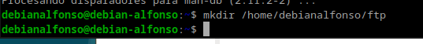
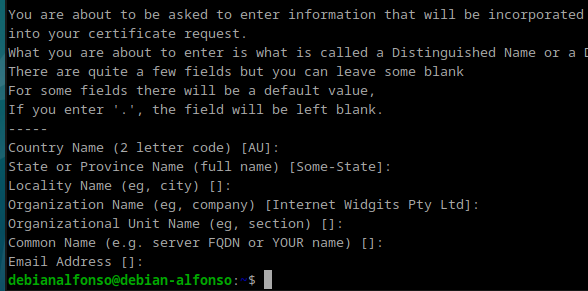
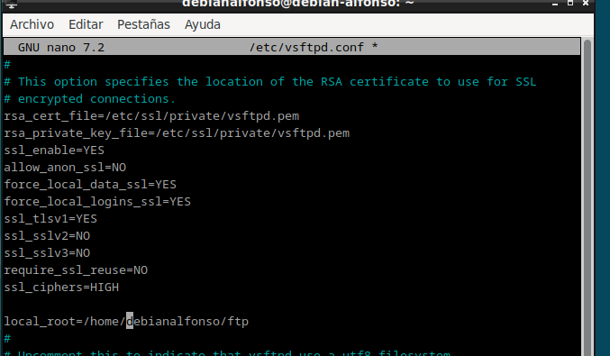
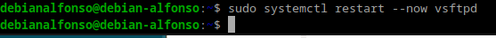
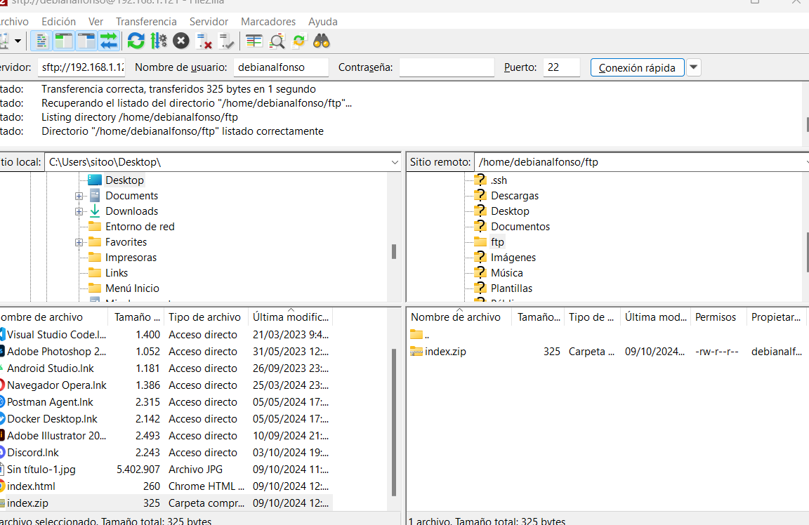
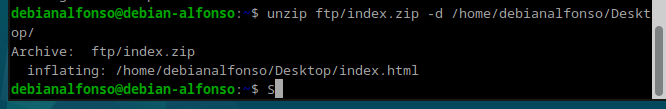

# Practica 2.1 - Instalación y configuración de un servidor web Nginx

## 1.- Instalación servidor

Para instalar el servidor de **NGINX** en nuestra máquina **Debian**, lo primero que tendremos que hacer es actualizar los repositorios con:
`sudo apt update`<br>

<center></center><br>
Después lo que tenemos que hacer es instalar el paquete correspondiente para instalar nginx:
`sudo apt install nginx`<br>

<center></center><br>
Cuando estemos en el proceso de instalación aparecerá un mensaje de '¿Desea continuar? [S/n]', en el cuál le deberemos decir que sí.<br>

Ahora tendremos que comprobar que **nginx** se ha instalado y este funcionando correctamente con el comando:
`systemctl status nginx`

<center></center>
<br>
Si todo está correcto, veremos un mensaje en verde: `active (running)`

## 2.- Creación de las carpeta del sitio web

Al igual que en Apache, todos los archivos que formarán parte de un sitio web se organiza en carpetas. Normalmente, estas carpetas van dentro de la ubicación `\var\www`.<br>
Ahora crearemos la carpeta de nuestro sitio web dentro de la ruta mencionada anteriormente con el siguiente comando: <br>
`sudo mkdir -p /var/www/nombre_web/html`<br>

- Donde `nombre_web` pondremos el nombre que queremos del sitio web sin espacios.<br>

  <center></center>

Ahora accedemos a esa carpeta:<br>

<center></center>

Dentro de esa carpeta, deberemos clonar el siguiente repositorio de github: `https://github.com/cloudacademy/static-website-example`, en caso de no tener **git** instalado lo instalamos con `sudo apt install git`. <br>

<center></center>

Ahora clonamos el repositorio con el comando `sudo git clone https://github.com/cloudacademy/static-website-example`.<br>

<center></center>

Además, haremos que el propietario de los datos de esa carpeta sea del usuario www-data, que normalmente es el usuario del servicio web.
`sudo chown -R www-data:www-data /var/www/nombre_web/html`.<br>

<center></center>

Y le damos los permisos adecuados para que no nos de un error de acceso no autorizado al entrar en el sitio web con `sudo chmod -R 755 /var/www/nombre_web`.<br>

<center></center>

Ahora comprobamos que el servidor este funcionando y sirviendo páginas correctamente, para ello accedemos desde un navegador a: `http://IP-maq-virtual`.<br>

- Donde `IP-maq-virtual` es la dirección IP de tu máquina Debian. En caso de no saber cuál es, hacemos un `ip -a`.<br>

<center></center>

Ahora buscamos la dirección en el navegador de tu máquina física con `http://IP_maq_virtual` donde nos tendrá que aparecer la siguiente ventana:<br>

<center></center>

Esto significa que de momento todo esta funcionando correctamente.

# 3.- Configuración de servidor web NGINX

En **Nginx** hay dos rutas importantes. La primera es **`sites-available`**, que es donde se almacenan los archivos de configuración de los host virtuales. Es decir, cada uno de los sitios web que está almacenado en el servidor.<br>

Por otro lado, está **`sites-enabled`**, que contiene los archivos que almacenan la configuración de los sitios web que están habilitados.<br>

Por defecto, hay un archivo de configuración dentro de **`sites-available`**, que es la página web que hemos visto en el anterior paso.<br>

Para mostrar el contenido de nuetra web, debemos crear un bloque nuevo, para ello, crearemos un nuevo fichero de configuración en la ruta y con el comando siguiente: <br>
`sudo nano /etc/nginx/sites-available/tu_dominio`<br>

<center></center>

Y se nos abrirá esta ventana completamente vacía <br>

<center></center>

Dentro tendremos que poner este contenido para configurarlo correctamente:<br>

```
server {

        listen 80;
        listen [::]:80;
        root /ruta/absoluta/archivo/index;
        index index.html index.htm index.nginx-debian.html;
        server_name nombre_web;
        location / {
                try_files $uri $uri/ =404;
        }
}
```

En mi caso, la ruta será: `/var/www/html`, que es donde estan todos los archivos web y el nombre `alfonso2`.<br>

<center></center>

Para guardar los cambios hacemos `Ctrl + O` y después `Ctrl + X` para salir.<br>

Ahora crearemos un archivo simbólico entre el archivo que acabamos de crear y el de sitios habilitados, para que así, se de de alta automáticamente, para ello utilizaremos el siguiente comando: <br>
`sudo ln -s /etc/nginx/sites-available/nombre_web /etc/nginx/sites-enabled/`, donde:

- **`nombre_web`**, es el nombre que le dimos anteriormente al servidor.<br>

<center></center>

Por último, reiniciamos el servidor de **nginx** para que la configuración se aplique correctamente con: `sudo systemctl restart nginx`.<br>

Si no aparece ningún mensaje de error es que esta todo funcionando correctamente:<br>

<center></center>

Por seguridad, para comprobar que el servidor esta activo, ponemos `sudo systemctl status nginx`.<br>

<center></center>

Si todo está bien aparecera un mensaje en verde de: **`active (running)`**<br>

# 4.- Comprobaciones

Como aún no tenemos un servidor DNS que traduzca las IPs a nombres, deberemos hacerlo de forma manual **editando** nuestro archivo `/etc/hosts` de **nuestra máquina física** para que así asocie la IP de la máquina virtual a nuestro nombre del server.<br>

En caso de estar en **Linux**, modificaremos el archivo: `/etc/hosts`.<br>

Y en Windows: `C:\Windows\System32\drivers\etc\hosts`.

En esa línea añadimos la **dirección IP** junto al **nombre** de nuestro **servidor**, de la siguiente manera: `192.168.X.X nombre_web`;<br>

En caso de no saber la **direción IP** de vuestro servidor, ponemos en la **terminal** de nuestra máquina Debian `ip a`.<br>

<center></center>

Ahora, añadimos una línea con lo mencionado anteriormente.<br>

<center></center>

# 5.- FTP

En caso de querer tener varios sitios webs en el mismo servidor de **nginx**, tendremos que repetir todos los pasos anteriores con el nuevo nombre de dominio.

## 5.1.- Configurar servidor SFTP en Debian

En primer lugar, lo instalaremos desde los repositorios con estos comandos:<br>

`sudo apt-get update && sudo apt-get install vsftpd`<br>

<center></center>

Ahora creamos una carpeta en nuestro **home** de Debian con: <br>
`mkdir /home/nombre_usuario/ftp`, donde:

- `nombre_usuario` es el nombre del usuario en la máquina virtual.<br>

  <br>

Ahora creamos un certificados de seguridad necesario para aportar la capa de cifrado de nuestra conexión a través del comando:<br>
`sudo openssl req -x509 -nodes -days 365 -newkey rsa:2048 -keyout /etc/ssl/private/vsftpd.pem -out /etc/ssl/private/vsftpd.pem`<br>

<center></center>

Una vez puesto este comando, nos empezarán a hacer distintas preguntas, las cuales podemos dejar en blanco o responder, en mi caso las dejo en blanco.<br>

<center></center>

Una vez realizado este paso, configuraremos el archivo de configuración de **vsftpd** con el comando: `sudo nano /etc/vsftpd.conf`.

Primero buscamos estas líneas, las cuales tendremos que eliminar:

```
rsa_cert_file=/etc/ssl/certs/ssl-cert-snakeoil.pem
rsa_private_key_file=/etc/ssl/private/ssl-cert-snakeoil.key
ssl_enable=NO
```

<center></center>

Y ponemos lo siguiente: <br>

```
rsa_cert_file=/etc/ssl/private/vsftpd.pem
rsa_private_key_file=/etc/ssl/private/vsftpd.pem
ssl_enable=YES
allow_anon_ssl=NO
force_local_data_ssl=YES
force_local_logins_ssl=YES
ssl_tlsv1=YES
ssl_sslv2=NO
ssl_sslv3=NO
require_ssl_reuse=NO
ssl_ciphers=HIGH

local_root=/home/nombre_usuario/ftp
```

<center></center>

Cuando guardemos los cambios, reiniciamos el servicio para que la nueva configuración se habilite: `sudo systemctl restart --now vsftpd`. Si todo va bien, no nos aparecerá ningún mensaje:<br>

<center></center>

Tras acabar la configuración, podremos acceder a nuestro servidor mediante un cliente de FTP, en mi caso será **Filezilla**, el cuál podemos descargar en nuestra máquina física a través de este enlace: [FileZilla](https://filezilla-project.org). <br>

<center></center>

Cuando termine el proceso de instalación, iniciamos la aplicacion y nos encontraremos con la siguiente ventana:<br>

<center></center>

Deberemos configurarlo de la siguiente manera:

- **Servidor**, pondremos la dirección IP de la máquina Debian.
- **Nombre de usuario**, pondremos el nombre de usuario de Debian.
- **Contraseña**, pondremos la contraseña del usuario
- **Puerto**, será el 21 para conectarnos usando los certificados que hemos generado antes.<br>
  Quedaría de la siguiente manera:<br>

  <center></center>

  Ahora damos clic en **`Conexión rápida`** y nos saltará un aviso a propósito del certificado, pulsamos en aceptar ya que este peligro lo hemos generado nosotros mismos:<br>

  <center></center>

Una vez que ya estemos conectados, buscaremos en la sección izquierda de la pantalla la carpeta donde tengamos el **`.zip`** y en la parte derecha seleccionaremos la carpeta donde queremos subirla, haciendo doble click o utilizando el **`botón derecho > subir`**.

<center></center>

Otra opción es conectarnos mediante **SFTP**, que para ello tendriamos que:

- En servidor pondremos: **`sftp://dirección_ip`**
- Quitaremos la contraseña.
- Pondremos el puerto 22.

Quedaría de la siguiente manera:

<center></center>

Hacemos click en **`Conexión rápida`** y empezará a conectarnos con el servidor **Debian**. Devido a que estamos usando claves FTP para conectarnos, nos aparecerá un aviso parecido al que nos salía al conectarnos por primera vez por SSH a nuestra **Debian**, que aceptamos porque sabemos que no entraña ningún peligro en este caso:

<center></center>

Aquí nos conecta al `/home` del usuario, en vez de al `ftp`.
Como vemos si accedemos al directorio `/ftp`, aparece el archivo que hemos subido anteriormente.

<center></center>

Ahora vamos a descomprimir el archivo desde nuestra máquina **Debian**, para ello usamos el comando: `unzip nombre_archivo.zip -d /nombre/directorio`:

<center></center>

Una vez ese paso está completado, veremos que el archivo se encuentra en el directorio donde lo habíamos descomprimido, que en mi caso es en el escritorio.

<center></center>
