# Práctica 2.2 - Autenticación en Nginx

## Paquetes necesarios

En primer lugar vemos si tenemos instalado el paquete necesario para hacer autenticaciones: <br>
`dpkg -l | grep openssl`<br>

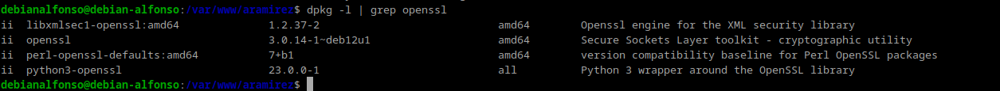
Si no lo tenemos instalados, tendriamos que hacerlo.

## 1.- Creación de usuarios y contraseñas para el acceso web

Creamos un archivo oculto llamado `.httpasswd` en el directorio de configuración del servidor `/etc/nginx` donde guardaremos nuestros usuarios y contraseñas: <br>

`sudo sh -c "echo -n 'vuestro_nombre:' >> /etc/nginx/.htpasswd"`

Y ahora creamos la contraseña cifrada para el usuario:<br>
`sudo sh -c "openssl passwd -apr1 >> /etc/nginx/.htpasswd"`<br>
Justo al poner el comando, nos pedirá que introduzcamos la contraseña.


Por cada usuario que queramos crear tenemos que seguir estos dos pasos.

Ahora, crearemos dos usuarios, uno con tu nombre y otro con tu primer apellido:

- Usuario 1:
  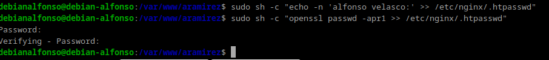

- Usuario 2:
  

Ahora comprobamos que se han creado correctamente con `cat /etc/nginx/.htpasswd`:

<center>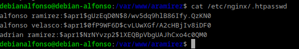</center>

## 2.- Configurando el servidor Nginx para usar autenticación básica

Para configurar el acesso al servidor web con autenticación, editaremos nuestro archivo donde se almacena el sitio con `sudo nano /etc/nginx/sites-available/nombre_web`.
Donde **nombre_web** es el nombre que le pusiste a tu servidor web anteriormente.´


En `location` añadiremos dos nuevas líneas:

- `auth_basic`, le pondremos el nombre a nuestro dominio que será mostrado al usuario al solicitar las credenciales.
- `auth_basic_user_file`, para que utilice el fichero que previamente hemos creado con los usuarios y sus respectivas contraseñas.

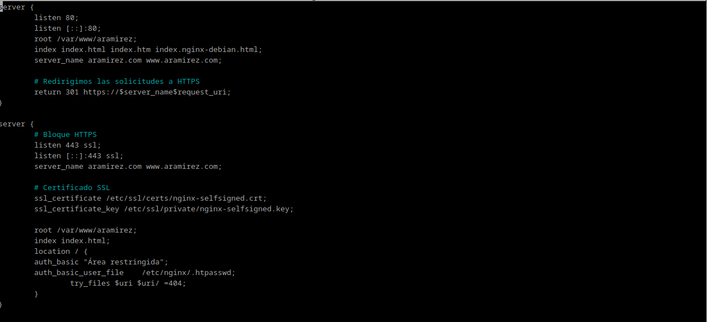
Una vez realizados esos cambios, reiniciamos el servicio para que aplique la configuración de acceso: `sudo systemctl restart nginx`.


Si todo va bien, no aparecerá ningún mensaje.

# 3.- Probando la nueva configuración

### Comprobación 1: Comprueba desde tu máquina física/anfitrión que puedes acceder a `http://nombre-sitio-web` y que se te solicita autenticación.

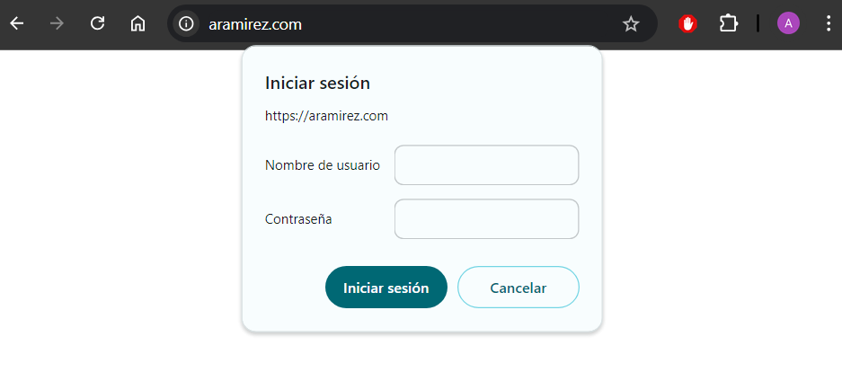

### Comprobación 2: Comprueba que si decides cancelar la autenticación, se te negará el acceso al sitio con un error. ¿Qué error es?

**Error 401: Authorization Required**.


## Tareas

### Tarea 1.- Intenta entrar primero con un usuario erróneo y luego con otro correcto. Puedes ver todos los sucesos y registros en los logs access.log y error.log <br> Adjunta una captura de pantalla de los logs donde se vea que intentas entrar primero con un usuario inválido y con otro válido. Indica dónde podemos ver los errores de usuario inválido o no encontrado, así como donde podemos ver el número de error que os aparecía antes.

Primero, hemos probado con el usuario `mario ayuso`, el cuál no existe en nuestro archivo `.htpasswd`. Y después con `alfonso ramirez`, que si existe en dicho fichero.

Accedemos al registro del fichero `error.log`, para comprobar que se ha guardado el registro del usuario que no existe intentando acceder con el comando: `sudo nano /var/log/nginx/error.log`.
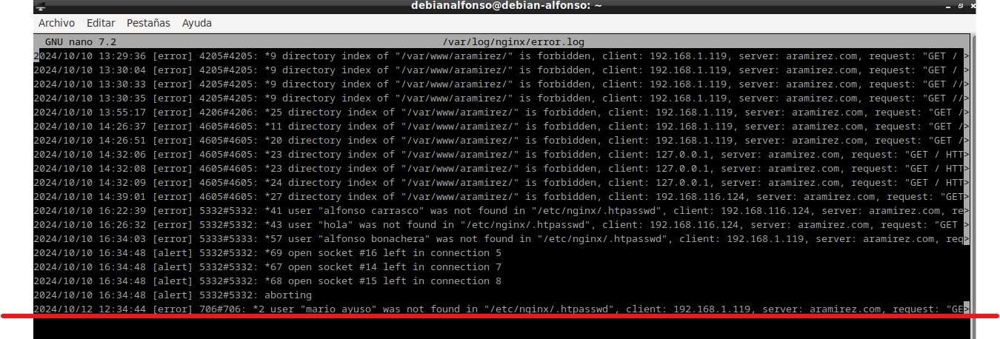
Como podemos ver, el último mensaje es de ese usuario intentando acceder al servidor web `aramirez.com` provocando un error.

Ahora accedemos al fichero `access.log` para comprobar los accesos de los distintos usuarios con `sudo nano /var/log/nginx/access.log`.

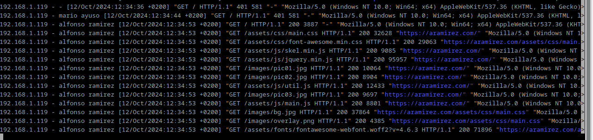

En primer lugar, encontramos el usuario inexistente `mario ayuso` que ha tenido un **Error 401** y seguidamente el usuario correcto `alfonso ramirez`, que vemos que ha tenido un **código 200**, es decir, se conecto existosamente.

### Tarea 2.- Borra las dos líneas que hacen referencia a la autenticación básica en el location del directorio raíz. Tras ello, añade un nuevo location debajo con la autenticación básica para el archivo/sección contact.html únicamente.

Debido a que la web que estamos utilizandos solo cuenta con un fichero **index.html**, duplicaremos este fichero renombrandolo como **contact.html** de la siguiente manera: <br> `sudo cp /var/www/aramirez/index.html /var/www/aramirez/contact.html`:


El siguiente paso será modificar el archivo del sitio web con `sudo nano /etc/nginx/sites-available/aramirez`.


Encontraremos esta configuración y quitamos las opciones de autorización de `location /` y creamos otro que sea: `location /contact.html` con la siguiente estructura:


Guardamos la configuración con `Ctrl + O` y salimos con `Ctrl + X`.

Ahora reiniciamos el servidor de **nginx** con `sudo systemctl restart nginx`
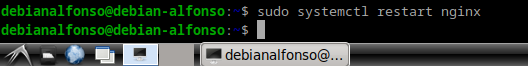

Por último, desde nuestra máquina física accedemos al sitio web `nombre_sitio/contact.html`, donde:

- **`nombre_sitio`**, es el nombre de nuestro sitio, que en mi caso es `aramirez`. Nos deberiamos encontrar con lo siguiente:
  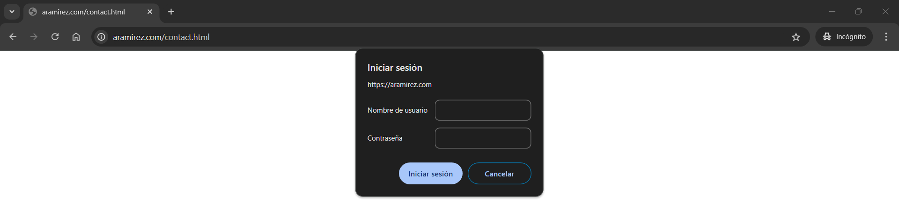

## 3.1.- Combinación de la autenticación básica con la restricción de acceso por IP

La autenticación básica HTTP puede ser combinada de forma efectiva con la restricción de acceso por dirección IP. Se puede implementar dos escenarios:<br>

- Un usuario debe estar autenticado y tener una IP válida.
- Un usuario debe de estar autenticado o tener una IP válida.

Se haría de la siguiente forma:

1. Permitir o denegar acceso sobre una IP concreta (**allows** y **deny**, respectivamente). Dentro del archivo de configuración de `sites-available`, que para modificarlo usamos el comando: `sudo nano /etc/nginx/sites-available/aramirez`. <br>

Dentro del archivo pondremos algo así:

Guardamos los cambios con `Ctrl + O` y salimos con `Ctrl + X`.

El acceso se garantizará a todas las IPs de `192.168.1.1/24`, excluyendo la dirección `192.168.1.119` (la de mi ordenador) y denegaremos el acceso a todo el mundo restante con `deny all`.

Ahora probaremos que nos ha bloqueado el acceso, pero primero, reiniciamos el servidor de **nginx** con `sudo systemctl restart nginx`:


**Importante** Hay que tener en cuenta que estas directivas se aplican en orden en el que se aparecen en el archivo.<br>

2. Combinar la restricción IP y la autenticación con la directiva **safely**

Si añadimos la directiva `satisfy all`, el acceso se permite si el cliente cumple ambas condiciones (Ip y usuario). Si añadimos la directiva `satisfy any`, permite el acceso si se cumple al menos una de las dos condiciones, por ejemplo:
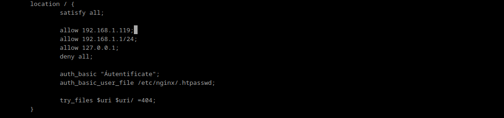

## Tareas

### Tarea 1.- Configura Nginx para que no deje acceder con la IP de la máquina anfitriona al directorio raíz de una de tus dos webs. Modifica su server block o archivo de configuración. Comprueba como se deniega el acceso:


Y como podemos ver al acceder al sitio web, nos aparecerá el mensaje **403 Forbidden**, que eso quiere decir que no tenemos acceso permitido, que era lo que queriamos comprobar.


Ahora comprobamos el archivo `error.log`:


### Tarea 2.- Configura Nginx para que desde tu máquina anfitriona se tenga que tener tanto una IP válida como un usuario válido, ambas cosas a la vez, y comprueba que sí puede acceder sin problemas


Ahora accedemos desde mi máquina anfitriona:
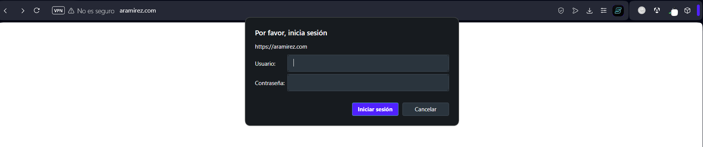

Como vemos nos pide autoización, cuando introduzcamos un usuario válido veremos la siguiente pantalla:


# Cuestiones Finales

### Cuestión 1.- Supongamos que yo soy el cliente con la IP 172.1.10.15 e intento acceder al directorio web_muy_guay de mi sitio web, equivocándome al poner el usuario y contraseña. ¿Podré acceder? ¿Por qué?

```
location /web_muy_guay {
  #...
  satisfy all;
  deny 172.1.10.6;
  allow 172.1.10.15;
  allow 172.1.3.14;
  deny all;
  auth_basic "Cuestión final 1";
  auth_basic_user_file conf/htpasswd;
}
```

No podrás acceder ya que a pesar de que tu dirección IP esté incluida en la lista de IPs permitidas, si te equivocas al introducir tu usuario y contraseña, existe la directiva de **`satisfy all`**, que significa que tanto la autenticación debe ser correcta y la IP debe tener permitido su acceso.

### Cuestión 2.- Supongamos que yo soy el cliente con la IP 172.1.10.15 e intento acceder al directorio web_muy_guay de mi sitio web, introduciendo correctamente usuario y contraseña. ¿Podré acceder? ¿Por qué?

```
    location /web_muy_guay {
    #...
    satisfy all;
    deny  all;
    deny  172.1.10.6;
    allow 172.1.10.15;
    allow 172.1.3.14;

    auth_basic "Cuestión final 2: The revenge";
    auth_basic_user_file conf/htpasswd;

}
```

No, ya que aunque tanto la **dirección IP** como las **credenciales** esten permitida y sean correctas respectivamente, el orden de las directivas de nginx son muy importantes y antes de permitir las **direcciones IP**, está denegandolas todas.

### Cuestión 3.- Supongamos que yo soy el cliente con la IP 172.1.10.15 e intento acceder al directorio web_muy_guay de mi sitio web, introduciendo correctamente usuario y contraseña. ¿Podré acceder? ¿Por qué?

```
    location /web_muy_guay {
    #...
    satisfy any;
    deny  172.1.10.6;
    deny 172.1.10.15;
    allow 172.1.3.14;

    auth_basic "Cuestión final 3: The final combat";
    auth_basic_user_file conf/htpasswd;

}
```

No, ya que con `**satisfy any**`, cualquiera de las condiciones que se cumpla permitiría el acceso a la web, pero en este caso no, ya que la dirección IP del cliente se encuentra con el acceso denegado y es prioritaria respecto a la autenticación.

### Cuestión 4.- A lo mejor no sabéis que tengo una web para documentar todas mis excursiones espaciales con Jeff, es esta: Jeff Bezos y yo<br>Supongamos que quiero restringir el acceso al directorio de proyectos porque es muy secreto, eso quiere decir añadir autenticación básica a la URL:Proyectos<br>Completa la configuración para conseguirlo:

```
    server {
        listen 80;
        listen [::]:80;
        root /var/www/freewebsitetemplates.com/preview/space-science;
        index index.html index.htm index.nginx-debian.html;
        server_name freewebsitetemplates.com www.freewebsitetemplates.com;
        location              {

            try_files $uri $uri/ =404;
        }
    }
```

Tendriamos que añadir en `location` las siguientes líneas:

```
location /projects.html {
      auth_basic "Accediendo a proyectos";
      auth_basic_user_file conf/.htpasswd;
}
```
