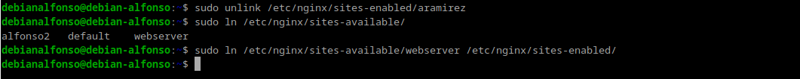
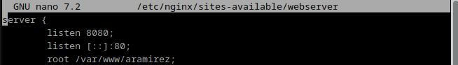
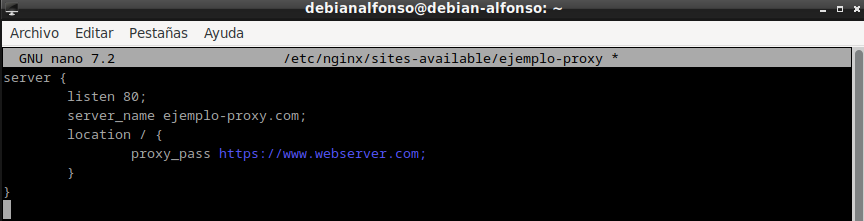
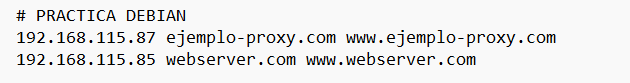
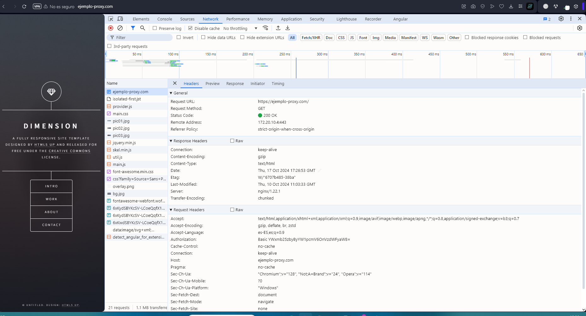
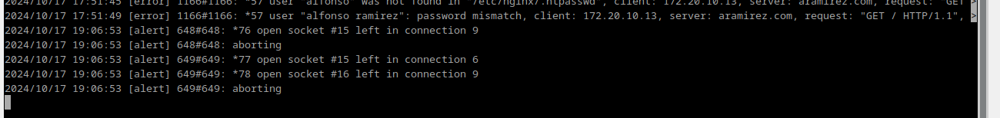
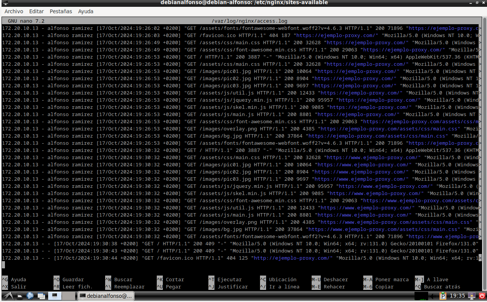
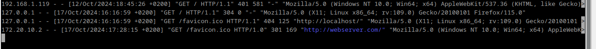
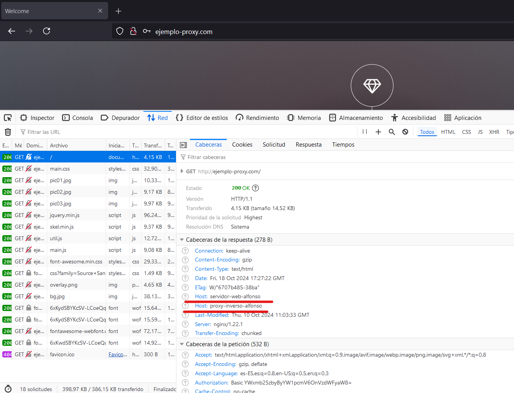

# Práctica 2.3.- Proxy inverso con Nginx

# 1. Configuración Nginx

## 1.1.- Servidor web

El primer paso para la realización de esta práctica es clonar la máquina **Debian** en la que tenemos instalado nuestro servidor de **Nginx**.

- Un servidor servirá los sitios webs que ya hemos configurado anteriormente.
- El nuevo servidor estará configurado como **`proxy inverso`**.
- Realizaremos las peticiones HTTP desde nuestra máquina física hacia el **proxy clonado**, que este nos redigirá hasta el servidor web original.

**IMPORTANTE** A la hora de clonar la máquina es importante `Generar nuevas direcciones MAC`, para poder comunicarnos entre las máquinas.

Después de clonar la máquina, la iniciaremos y haremos los siguientes cambios.

1. Cambiar el nombre de nuestra web por `webserver`, esto implica estos cambios:

- Cambiar el nombre del archivo de configuración de sitios disponibles en **Nginx**, para ello usamos `sudo mv /etc/nginx/sites-available/nombre_servidor /etc/nginx/sites-available/webserver`.
  
  Tras esto, accederemos al fichero de configuración con `sudo nano /etc/nginx/sites-available/webserver` para seguir realizando cambios.
  

- Eliminamos el enlace simbólico con el comando `unlink nombre_del_link` dentro de la carpeta `sites_enabled` y creamos el nuevo enlace para el nuevo nombre de archivo con `sudo ln /etc/nginx/sites-available/webserver /etc/nginx/sites-enabled/`.
  

2.  Ahora volvemos a configurar el archivo de configuración y cambiamos el puerto de escucha del `80` al `8080`.
    

3.  Reiniciamos **Nginx** con `sudo systemctl restart nginx`, si no aparece ningún mensaje significa que la configuración esta correcta.
    

## 1.2.- Proxy inverso

Iniciamos nuestra otra máquina **Debian**, es decir, donde configuraremos el proxy.
Para ello creamos un archivo de configuración en `sites-available` con el nombre `ejemplo_proxy` con `sudo nano /etc/nginx/sites-available/ejemplo_proxy`

Y ponemos la siguiente configuración:

- En `listen`, ponemos el puerto que queremos escuchar.
- En `server_name`, ponemos el nombre de nuestro dominio al que queremos acceder en el proxy.
- En `proxy_pass`, ponemos la dirección IP de la máquina que tiene alojada el servidor y el puerto al que queremos reenviar.
- Por último creamos un link simbólico con:  `sudo ln /etc/nginx/sites-available/ejemplo-proxy /etc/nginx/sites-enabled/`
  

# 2.- Comprobaciones

Editamos nuestro fichero `hosts` para añadir el sitio `ejemplo-proxy.com`:

Y ahora accedemos a nuestro sitio web mediante `ejemplo-proxy.com`, donde si todo va bien nos preguntará nuestro usuario y contraseña como en anteriores prácticas:

Y accedemos a la consola mediante la tecla **F12**, al apartado de red y vemos lo siguiente:

Aquí vemos que la respuesta de la petición es un código `200 OK`, también vemos las cabeceras que se incluyen en la petición del método **GET** y en la respuesta de la petición.

Ahora comprobamos los access.log en los dos servidores: 
**EJEMPLO_PROXY**

**WebServer**

# 3.- Añadiendo cabeceras

Además de haber mirado los logs, vamos a demostrar aún de forma más clara que la petición está pasando por el proxy inverso y que está llegando al servidor web y que vuelve por el mismo camino.

Para ello, añadiremos una cabecera en el fichero de configuración del **Proxy inverso** dentro de `location / {...}` añadimos esta directiva: `add_header Host nombre_del_host`, quedaría así:

El siguiente paso será reiniciar **nginx**:

Ahora comprobamos que podemos acceder al sitio web sin problemas y buscamos que el proxy inverso ha añadido la cabecera a la respuesta:

Y ahora hacemos el mismo paso en nuestro **WebServer**. Si todo esta correcto, aparecerán ambas cabeceras.

**IMPORTANTE** Para realizar estas comprobaciones es imprescindible tener marcado el **checkbox** de `Desactivar caché`, ya que si no se marca esta opción la página se guardará en la memoria caché del navegador y no recibiréis la respuesta del servidor.

